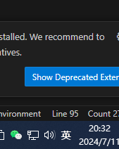

- 1万行的linux源码
- 多线程库
- wifi
- 通讯录
- tiklok绿屏
- usb设备

1. 
2. 
3. 
4. 
5. 
6. overseas++
7. bluetooth
8. 实习证明
9. 专利
10. 
11. 通讯录、通话记录、短信和国家语言匹配。
12. 输入法劫持。

今天没进度就问问周总

给测试一个完整的
给测试镜像需要确认

这个问题涉及到的技术问题是 **屏幕旋转同步** 。在云手机中运行某些应用（如游戏）时，应用可能会要求屏幕旋转以获得更好的视觉体验。然而，当前的问题是，尽管云手机的屏幕已经旋转，但客户端的屏幕仍然保持竖屏。我们需要解决的技术问题就是如何让客户端的屏幕能够跟随云手机的屏幕旋转,确保这个功能与各种不同的应用和游戏兼容.

我们要做这件事是为了提供更好的用户体验。这样可以确保用户在使用应用时能够获得最佳的视觉体验。

1. **开机时创建所有云机的对应设备文件** ：在宿主机开机时，会为每一个云机创建一个对应的设备文件。这个设备文件用于在云机和宿主机之间传递屏幕旋转的信息。
2. **云机开机时，从宿主机挂载映射自己的设备文件** ：当云机开机时，它会从宿主机挂载映射到自己的设备文件。这样，云机就可以通过这个设备文件与宿主机进行通信。
3. **云机系统屏幕旋转，触发回调函数** ：当云机系统的屏幕旋转时，会触发一个回调函数。这个回调函数是在 `WindowManagerService`或 `DisplayRotation`类中定义的。这个回调函数会在屏幕旋转时被调用，用于处理屏幕旋转的事件。
4. **往设备文件写入数据** ：在回调函数中，会往设备文件写入数据。这些数据包含了屏幕旋转的信息。这个过程是通过 `RotationPolicy`类中的方法实现的。
5. **steam程序监听到文件修改，发送旋转角度给客户端** ：在宿主机端，有一个steam程序会监听设备文件的修改。当它监听到设备文件被修改时，就知道云机系统的屏幕旋转了。然后，它会把旋转的角度发送给客户端。这个过程是通过 `SettingsObserver`类中的方法实现的。
6. **客户端发生响应旋转** ：客户端收到旋转角度后，会根据收到的角度进行相应的旋转。这样，客户端的屏幕就可以跟随云机系统的屏幕旋转。

---

- [Defect #485080: 在docker中安卓系统中用youtuble观看视频偶尔会出现花屏 - FAE 项目 - Rockchip Redmine (rock-chips.com)](https://redmine.rock-chips.com/issues/485080)
- WIKI
- 毕业论文
- anr
- usb
- 蓝牙栈不好跳过
- product
- 电话号码+86
- awsd和按键
- 有没有可以验证sim信息的东西

走的时候切换成海外镜像，清除在下载

- 新镜像adb不自启
- vpn报错
- 云伪装文档，默认设置
- 通讯录

遇到错误，首先看客户端，不要过度依赖Qt

修改

antserver:/ # getprop |grep docker
[ro.bootimage.build.fingerprint]: [rockchip/rk3588_docker/rk3588_docker:10/QD4A.200805.003/yb04031722:userdebug/release-keys]
[ro.build.description]: [rk3588_docker-userdebug 10 QD4A.200805.003 eng.yb.20240403.152657 release-keys]
[ro.build.display.id]: [rk3588_docker-userdebug 10 QD4A.200805.003 eng.yb.20240403.152657 release-keys]
[ro.build.flavor]: [rk3588_docker-userdebug]
[ro.build.product]: [rk3588_docker]
[ro.odm.build.fingerprint]: [rockchip/rk3588_docker/rk3588_docker:10/QD4A.200805.003/yb04031722:userdebug/release-keys]
[ro.product.build.fingerprint]: [rockchip/rk3588_docker/rk3588_docker:10/QD4A.200805.003/yb04031722:userdebug/release-keys]
[ro.product.device]: [rk3588_docker]
[ro.product.name]: [rk3588_docker]
[ro.product.odm.device]: [rk3588_docker]
[ro.product.odm.name]: [rk3588_docker]
[ro.product.product.device]: [rk3588_docker]
[ro.product.product.name]: [rk3588_docker]
[ro.product.system.device]: [rk3588_docker]
[ro.product.system.name]: [rk3588_docker]
[ro.product.vendor.device]: [rk3588_docker]
[ro.product.vendor.name]: [rk3588_docker]
[ro.system.build.fingerprint]: [rockchip/rk3588_docker/rk3588_docker:10/QD4A.200805.003/yb04031722:userdebug/release-keys]
[ro.vendor.build.fingerprint]: [rockchip/rk3588_docker/rk3588_docker:10/QD4A.200805.003/yb04031722:userdebug/release-keys]
antserver:/ #

