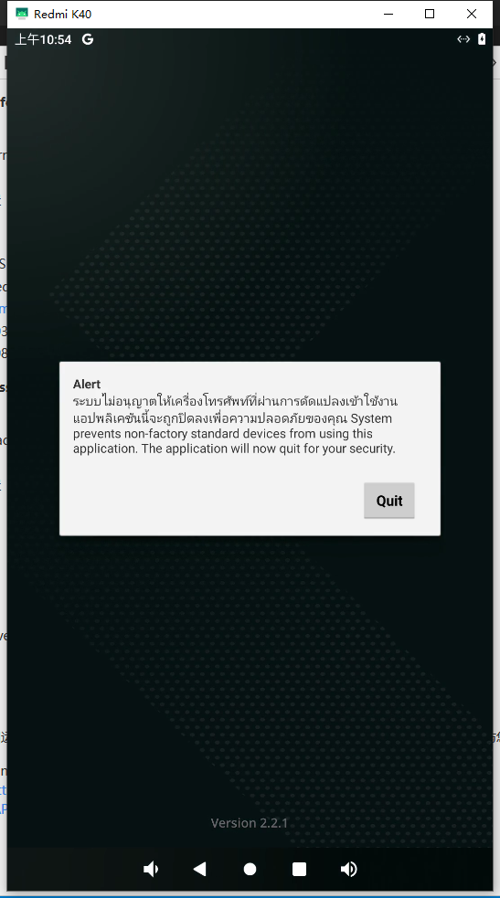

### APN

    在泰国，不同运营商的**4G 接入点名称（APN）** 可能会有所不同。以下是一些泰国主要运营商的 APN 设置：

1. **AIS（Advanced Info Service）** ：

* **Internet APN** ：
  * 名称：AIS Internet
  * APN：internet
  * 用户名：不设置
  * 密码：不设置
* **MMS APN** ：
  * 名称：AIS MMS
  * APN：multimedia
  * MMSC：[mms.mobilelife.co.th](http://mms.mobilelife.co.th/)
  * MMS 代理：203.170.229.34
  * MMS 端口：8080

1. **DTAC（Total Access Communication）** ：

* **Internet APN** ：
  * 名称：www.dtac.co.th
  * APN：internet
  * 用户名：不设置
  * 密码：不设置
* **MMS APN** ：
  * 名称：mms

1. **TrueMove H** ：

* **Internet APN** ：
  * 名称：TrueMove H Internet
  * APN：internet
  * 用户名：true
  * 密码：不设置

请注意，这些设置可能因运营商、手机型号和操作系统版本而异。如果您遇到连接问题，请确保您的 APN 设置与您所使用的运营商一致。📶

[^1^](https://www.apnsettings.org/thailand/ais-apn-settings/): [AIS 4G APN Settings Thailand](https://www.apnsettings.org/thailand/ais-apn-settings/)[^2^](https://www.apnsettings.org/thailand/dtac-apn-settings/): [DTAC 4G APN Settings Thailand](https://www.apnsettings.org/thailand/dtac-apn-settings/)[^3^](https://www.apnsettings.org/thailand/truemoveh-apn-settings/): [Truemove H 4G APN Settings Thailand](https://www.apnsettings.org/thailand/truemoveh-apn-settings/)

### Play下载的报错

