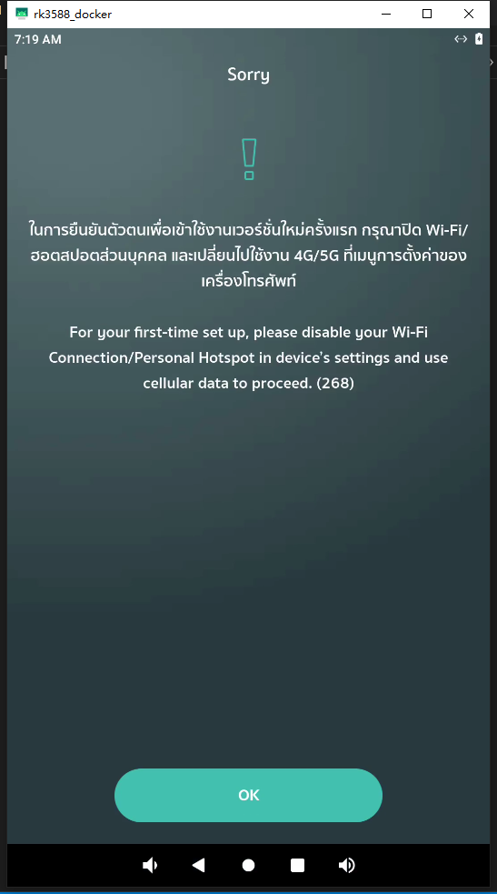
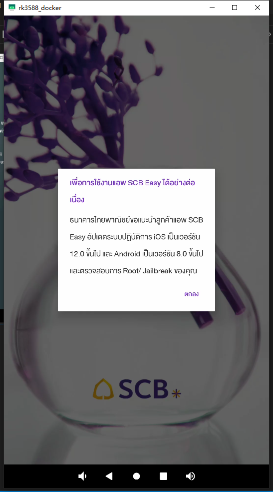
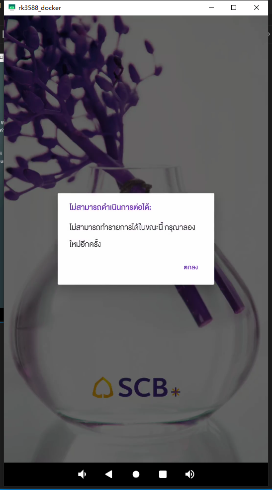
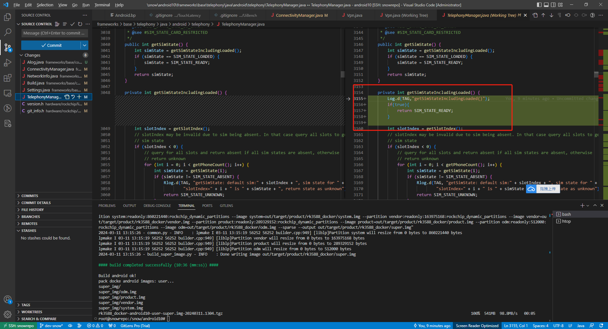

周总的机

1. 取消root
2. 抓一下包

ubuntu容器重启ssh失效

> sudo service ssh restart

### 任务

- 合并nowifi
- ~~获取所有apk~~
- no root和usb debug
- 

### 关闭root和关闭usb debug

    在 Android 10（AOSP 10）源代码中，您可以通过修改系统属性来实现不root并默认关闭 USB 调试。以下是具体步骤：

1. **默认关闭 Root 权限** ：

* 打开 `build/make/core/main.mk` 文件。
* 修改 `ADDITIONAL_DEFAULT_PROPERTIES += ro.debuggable=0`，将 root 权限默认设置为关闭。

1. **默认关闭 ADB 调试** ：

* 同样在 `build/make/core/main.mk` 文件中，找到 `ADDITIONAL_DEFAULT_PROPERTIES += ro.adb.secure=1`。
* 将其改为 `ADDITIONAL_DEFAULT_PROPERTIES += ro.adb.secure=0`，以默认关闭 ADB 调试。

[请注意，这些更改将影响整个系统。确保您理解这些修改的后果，并遵守法规和规定。如果您需要更详细的信息，可以查阅相关文档或参考其他开发者的经验](https://blog.csdn.net/wq892373445/article/details/129528742)[^1^](https://blog.csdn.net/wq892373445/article/details/129528742)[^2^](https://blog.csdn.net/qq_15950325/article/details/127678172)。

祝您开发愉快！🚀

### 子-跳过adb授权

VPN可疑？

