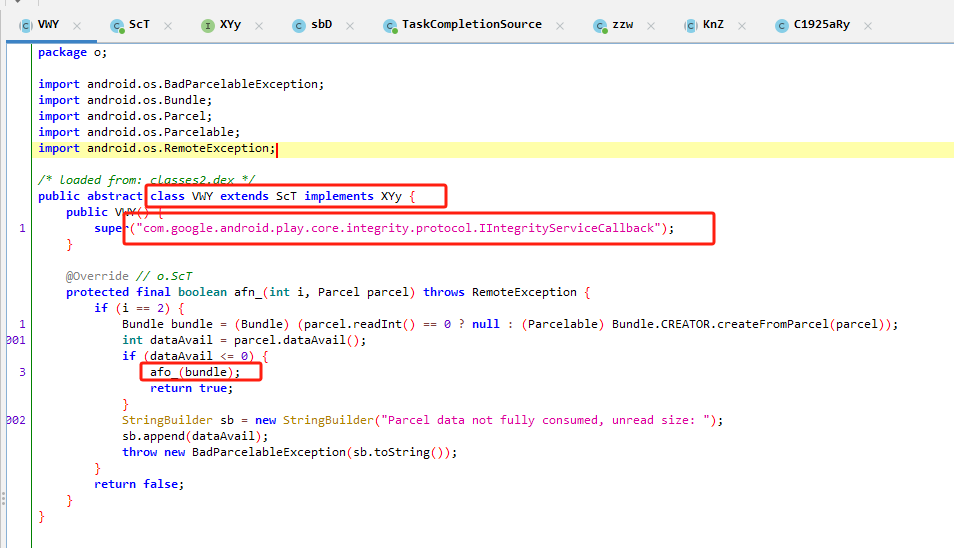
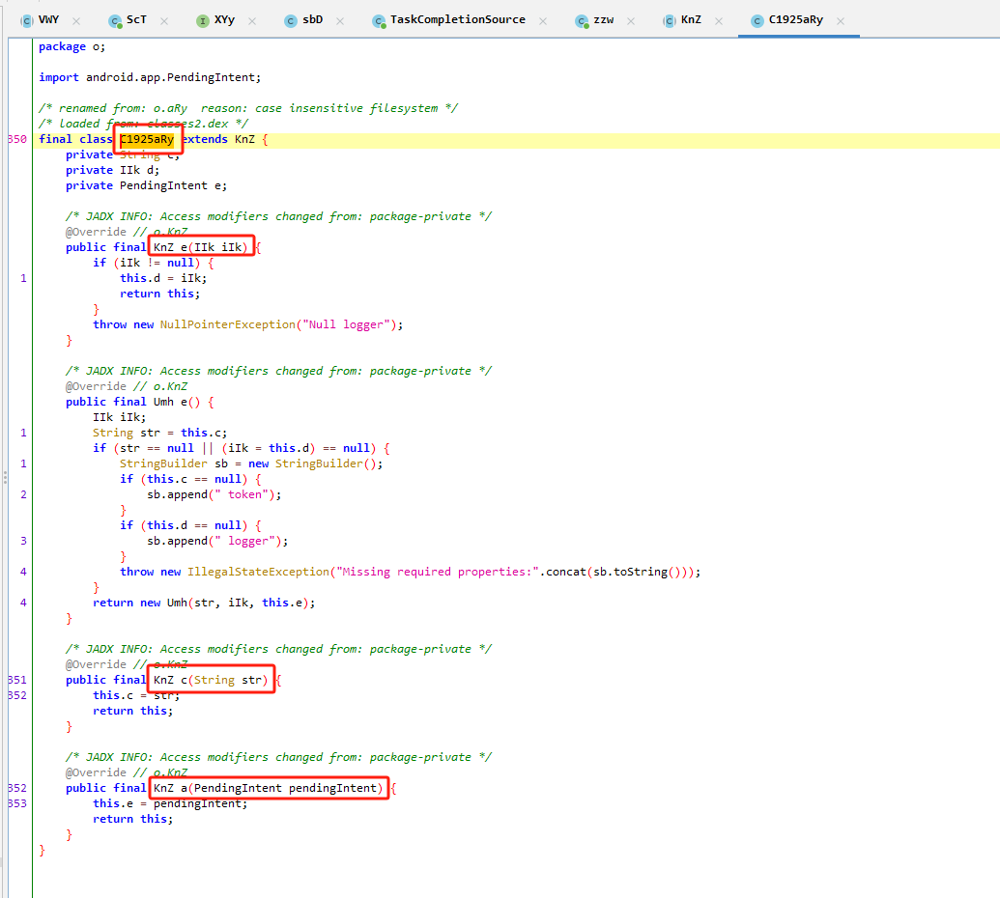
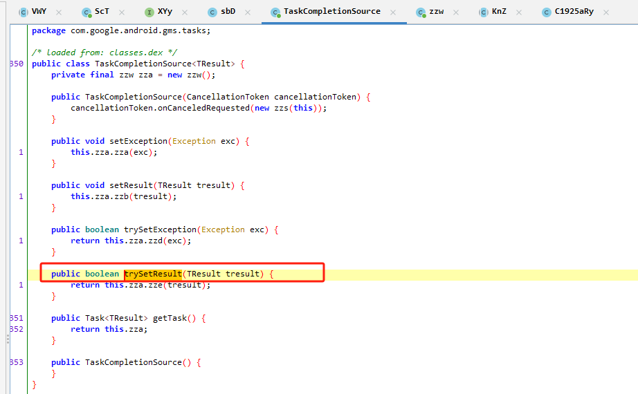

scb的函数

```java
* loaded from: classes2.dex */
public abstract class VWY extends ScT implements XYy {
    public VWY() {
        super("com.google.android.play.core.integrity.protocol.IIntegrityServiceCallback");
    }

    @Override // o.ScT
    protected final boolean afn_(int i, Parcel parcel) throws RemoteException {
        if (i == 2) {
            Bundle bundle = (Bundle) (parcel.readInt() == 0 ? null : (Parcelable) Bundle.CREATOR.createFromParcel(parcel));
            int dataAvail = parcel.dataAvail();
            if (dataAvail <= 0) {
                afo_(bundle);
                return true;
            }
            StringBuilder sb = new StringBuilder("Parcel data not fully consumed, unread size: ");
            sb.append(dataAvail);
            throw new BadParcelableException(sb.toString());
        }
        return false;
    }
}
```

这段代码是一个抽象类 VWY，它继承了 ScT 并实现了 XYy 接口。在构造函数中调用了父类的构造函数，传入了字符串 "com.google.android.play.core.integrity.protocol.IIntegrityServiceCallback"。

在 `afn_` 方法中，根据传入的参数 `i` 的值来判断需要执行的操作。当 `i` 的值为 2 时，表示需要处理一个特定的事务。

在这个特定的事务中，首先判断传入的 Parcel 中是否有数据。如果没有数据（即 `dataAvail` 的值小于等于 0），则调用 `afo_` 方法处理 Bundle 对象（这个方法的具体实现不在提供的代码中）。如果数据还未全部消费，抛出 `BadParcelableException` 异常，提示 Parcel 中还有未读取的数据。

总结一下对 Parcel 的读写操作：

- 从 Parcel 中读取一个整数，用于判断是否存在 Bundle 对象。
- 如果存在 Bundle 对象，则从 Parcel 中读取 Bundle 对象。
- 检查 Parcel 中是否还有未读取的数据（通过 `dataAvail` 方法），如果有，则抛出异常。

在这段代码中，读取了一个整数（用于判断是否存在 Bundle 对象），如果存在，则读取 Bundle 对象。这个操作是在处理 Binder 事务时对 Parcel 进行的读取操作。

sbD => VMY =>ScT、XYy

### 思路









线索=>"com.google.android.play.core.integrity.protocol.IIntegrityServiceCallback");

**VWY :**

    afn_(int i, Parcel parcel) 	读取parcel.dataAvail();

    afo_(bundle)----------------->

**sbD extends VWY:**

    afo_(Bundle bundle)		读取bundle.getInt("error")  ，bundle.getString("token"); ， bundle.getParcelable("dialog.intent"

    c1925aRy.c(string);
        		c1925aRy.e(this.a);
        		c1925aRy.a(pendingIntent);

    taskCompletionSource2.trySetResult(c1925aRy.e());---------------------->

**TaskCompletionSource `<TResult>`:**

    trySetResult(TResult tresult)

    zza.zze(tresult)------------------------------------>

**zzw `<TResult>` extends Task `<TResult>`**

    boolean zze(Object obj)--------->true?false

### 进度


镜像：

gms+4G+adbd+之前的sim信息+系统模拟


### Parcel 报错


