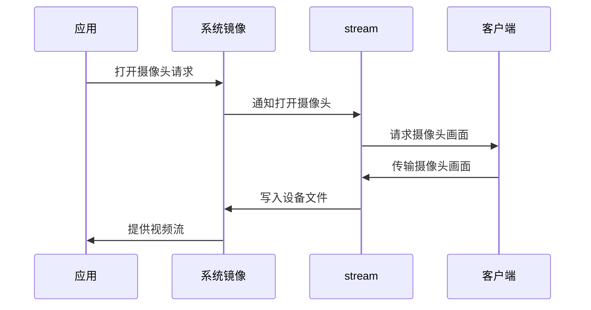
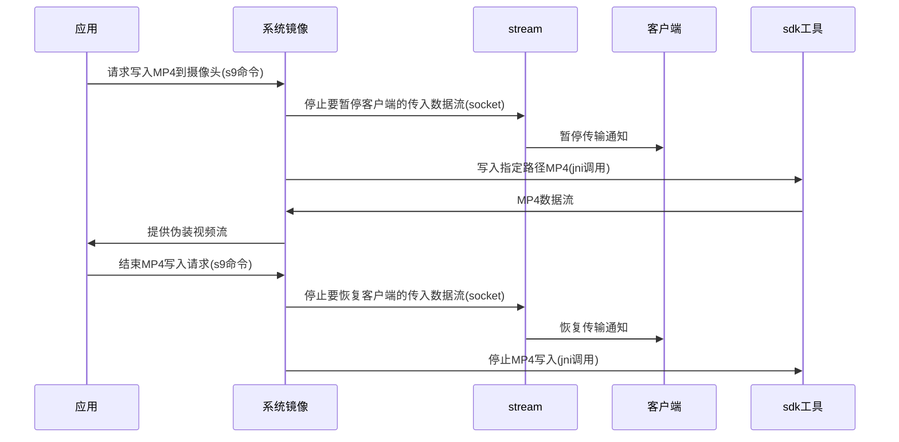

### 虚拟摄像头方案（应用、系统镜像、stream、客户端）

1. 镜像打开摄像头，告知stream打开摄像头，stream把信息告诉客户端，stream准备接收客户端传来的摄像头画面
2. 客户端打开摄像头，把客户的摄像头画面传给stream，stream再将这些画面写入安卓系统的设备文件

### 播放视频伪装直播方案（应用、系统镜像、stream、客户端、sdk工具）

1. 应用打开摄像头，应用告诉镜像要向摄像头里写入MP4，镜像告诉stream*暂停***客户端往摄像头写入视频和麦克风数据**，镜像告诉sdk工具向摄像头里写入某个路径的MP4
2. 应用想要结束向摄像头里写入MP4，告诉镜像结束向摄像头里写入MP4，镜像通知stream*恢复***客户端往摄像头传入视频和麦克风数据**，镜像告诉sdk工具停止向摄像头里写入MP4

### 相互沟通的协议

应用 -> 安卓镜像

由镜像开始写入视频帧到摄像头（stream、客户端停止写入摄像头） s9 ctlMp4toCarmera loadMp4 xxx/xxxx/xxx/

由镜像停止写入视频帧到摄像头（stream、客户端恢复写入摄像头）s9 ctlMp4toCarmera clearMp4

安卓镜像 -> stream 

由镜像开始写入视频帧到摄像头（stream、客户端停止写入摄像头）示例：{"opType": "pauseCameraStream","data":[],"resultCode":0,"resultInfo":"success"}

由镜像停止写入视频帧到摄像头（stream、客户端恢复写入摄像头）示例：{"opType": "resumeCameraStream","data":[],"resultCode":0,"resultInfo":"success"}