# 坑

# 疑问

##### 1. OS 02 内存管理，这里什么意思？？？

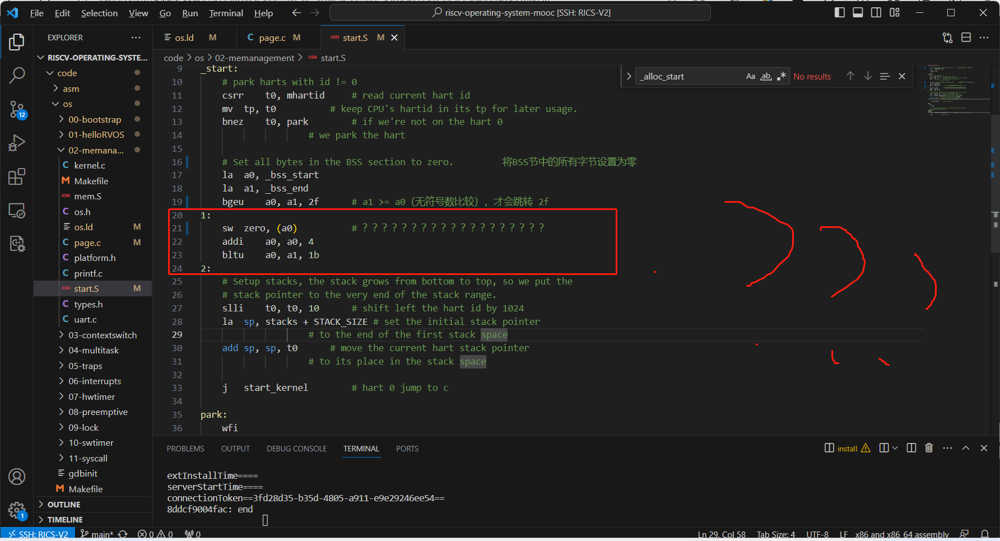

##### 2. 为什么 栈指针sp要加上(hart id * 2^10),而且haerid，不就是0吗？这样的意义是什么？

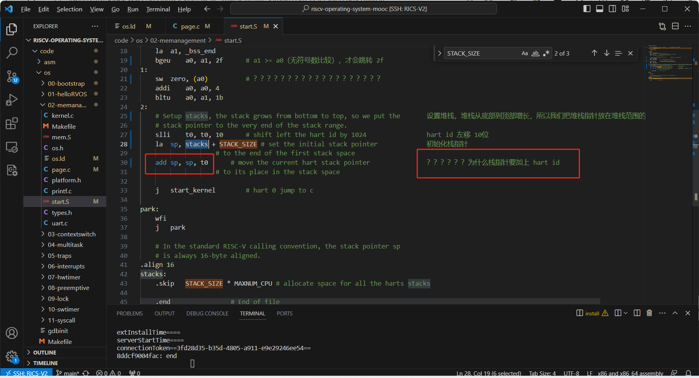

##### 3. C 内嵌 汇编语法

[risc-v GCC内嵌汇编 - sureZ_ok - 博客园 (cnblogs.com)](https://www.cnblogs.com/sureZ-learning/p/16286560.html#:~:text=2%20%E5%86%85%E5%B5%8C%E6%B1%87%E7%BC%96%E8%AF%AD%E6%B3%95%201%201.%20%E6%B1%87%E7%BC%96%E6%8C%87%E4%BB%A4%E5%88%97%E8%A1%A8%3A%20%E8%A6%81%E5%B5%8C%E5%85%A5%E7%9A%84%E6%B1%87%E7%BC%96%E6%8C%87%E4%BB%A4%EF%BC%8C%E6%AF%8F%E6%9D%A1%E6%8C%87%E4%BB%A4%E5%BA%94%E8%AF%A5%E8%A2%AB%E5%8F%8C%E5%BC%95%E5%8F%B7%E6%8B%AC%E8%B5%B7%E6%9D%A5%E4%BD%9C%E4%B8%BA%E5%AD%97%E7%AC%A6%E4%B8%B2%EF%BC%8C%E6%8C%87%E4%BB%A4%E4%BB%A5%5Cn%20%E6%88%96%E8%80%85%EF%BC%9B%E4%BD%9C%E4%B8%BA%E5%88%86%E9%9A%94%E7%AC%A6%E3%80%82%20%E5%A6%82%E4%B8%8B4%E4%B8%AD%E6%A0%B7%E5%BC%8F%E9%83%BDOK,4%204.%20%E7%A0%B4%E5%9D%8F%E6%8F%8F%E8%BF%B0%E9%83%A8%E5%88%86%3A%20%E6%96%B0%E7%9A%84%E6%AE%B5%E7%94%A8%EF%BC%9A%E5%BC%80%E5%A4%B4%EF%BC%8C%E8%8B%A5%E6%9C%89%E5%A4%9A%E4%B8%AA%E5%AF%84%E5%AD%98%E5%99%A8%E7%94%A8%E9%80%97%E5%8F%B7%2C%E9%97%B4%E9%9A%94%20%E5%9C%A8%E6%B1%87%E7%BC%96%E4%BB%A3%E7%A0%81%E4%B8%AD%EF%BC%8C%E6%88%91%E4%BB%AC%E7%94%A8%E5%88%B0%E4%BA%86%E4%B8%80%E4%BA%9B%E5%AF%84%E5%AD%98%E5%99%A8%EF%BC%8C%E9%9C%80%E8%A6%81%E5%91%8A%E7%9F%A5GCC%E4%B8%8D%E5%86%8D%E4%BF%A1%E4%BB%BB%E8%BF%99%E4%BA%9B%E5%AF%84%E5%AD%98%E5%99%A8%E7%9A%84%E5%80%BC%EF%BC%88%E8%BE%93%E5%85%A5%E8%BE%93%E5%87%BA%E6%93%8D%E4%BD%9C%E6%95%B0%E6%8C%87%E5%AE%9A%E7%9A%84%E5%AF%84%E5%AD%98%E5%99%A8%E5%A4%96%EF%BC%8C%E8%BF%99%E9%83%A8%E5%88%86%E7%94%B1%E7%BC%96%E8%AF%91%E5%99%A8%E8%87%AA%E5%8A%A8%E5%88%86%E9%85%8D%E5%9B%9E%E6%94%B6%EF%BC%89%E3%80%82%203%20ABI%E6%8E%A5%E5%8F%A3%20)

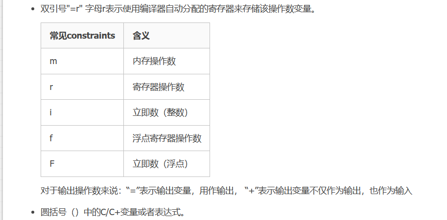

- "r"(x)			输入变量，把x的值放入一个寄存器
- "=r"(sum)		输出变量，把sum的值放入一个寄存器，最终要输出
- "+r"(i)			既是输入，又是输出

%0	%1	%2，表示第一、第二、第三个寄存器

##### 4. void (*start_routin)(void) 这个语法

`void (*start_routin)(void)` 是一个函数指针的声明。它表示一个指向不返回任何值（`void`）且不接受任何参数的函数。

在这个特定的上下文中，`start_routin` 是一个函数指针参数，用于指定任务的入口点。当调用 `task_create` 函数时，可以将一个函数的地址作为参数传递给 `start_routin`，这个函数就会成为新创建的任务的入口点。

例如，我们可以定义一个函数 `void my_task(void)`，然后将其地址作为参数传递给 `task_create` 函数：

<pre class="code-block-wrapper">
c复制代码
<code class="hljs code-block-body c">void my_task(void)
{
    // 任务的代码逻辑
}

int main(void)
{
    task_create(my_task);

    // 其他的代码逻辑
    return 0;
}
</code></pre>

在上面的例子中，我们将 `my_task` 函数的地址传递给 `task_create` 函数，这样就创建了一个新的任务。当任务开始执行时，它会从 `my_task` 函数的入口点开始执行，执行完任务的代码逻辑后，任务会返回到 `task_create` 函数中，然后继续执行其他的代码逻辑。

总结来说，`void (*start_routin)(void)` 是一个函数指针类型的声明，用于指定任务的入口点，可以将一个函数的地址作为参数传递给该函数指针，从而创建一个新的任务。

##### 5. mscratch记录当前处理哪一个上下文·

##### 6. 第一个任务如何切换到第二个任务的？

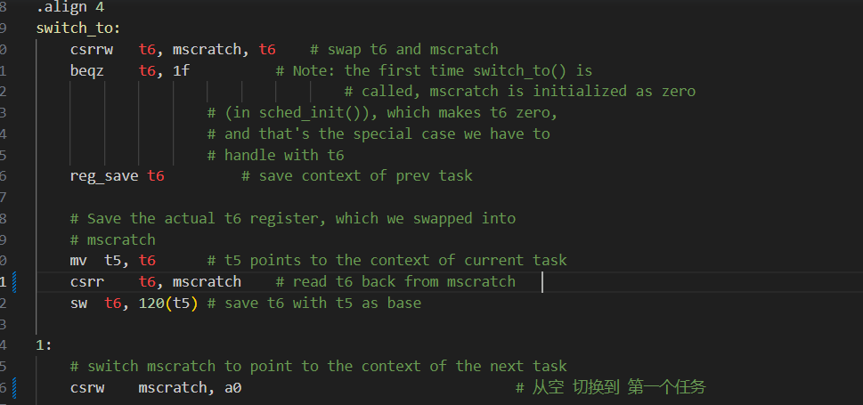

# 第5章 汇编和C的相互调用

- volatile: 不优化的关键字
- asm：汇编关键字

r相当于C语言里建议编译器的register关键字

# 第6章  RVOS 介绍

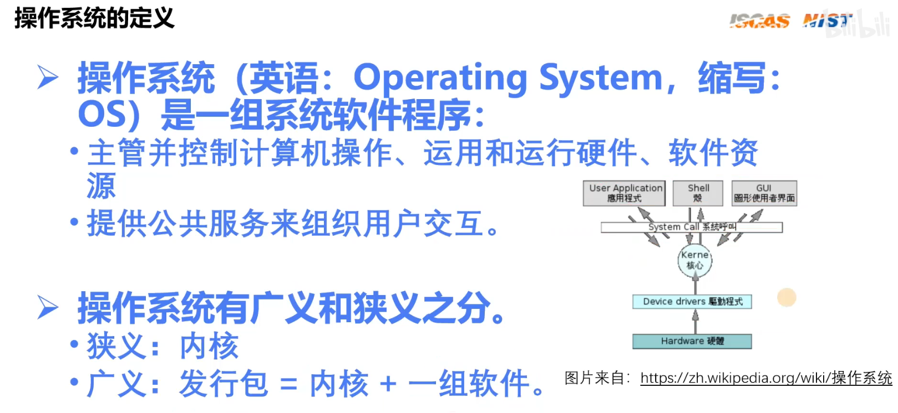

- Machine模式		访问物理地址
- User模式			物理内存保护
- Supervisor模式	支持虚拟地址

- 内存分配
- 多线程
- 任务互斥
- 软件定时器

# 第7章 hello RCVS

- 通过访问这些地址来访问这些元器件

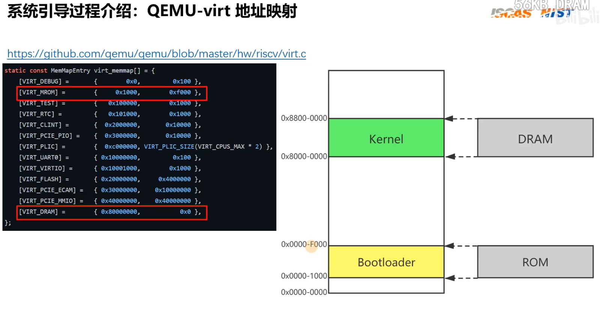

ROM掉电，数据还在

- 0x8000是一个特殊的地址，内存的第一个指令必须在这

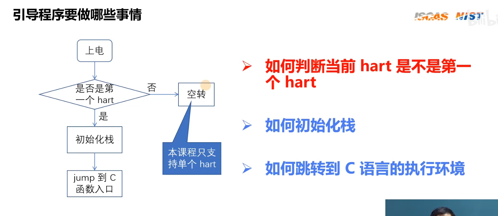

##### CSRs：

- 每一个模式都有一组自己的寄存器，这些寄存器叫 **CSR寄存器**

- 一上电就是machine模式

##### CSR指令：专门对这些寄存器的指令

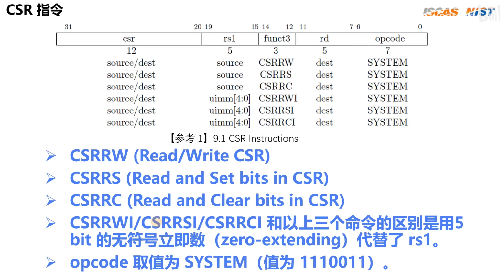

CSRRW

- 该指令 是原子指令
- 两步操作，对值”零扩展“ （也就是不足补零）

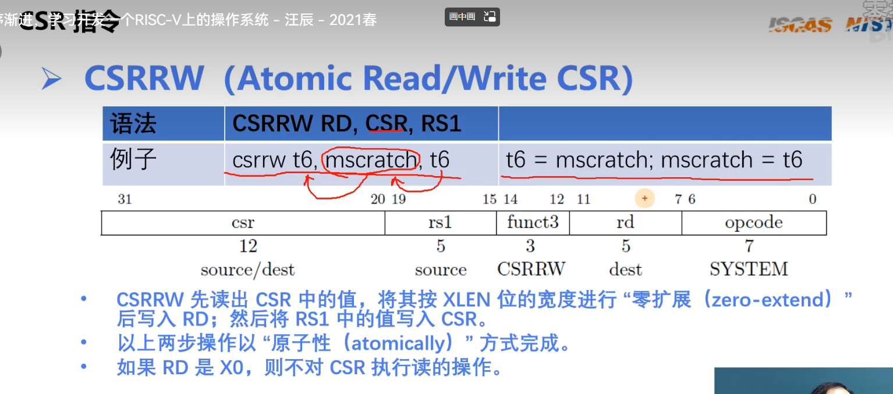

CSRW

- 该指令：读CSR值，写入RD，再对CSR根据RS1 set Bit。
- set Bit:意思是，当RS1中某位为1，则CSR此位也写成1，其他位不变

csrr： 仅进行读操作

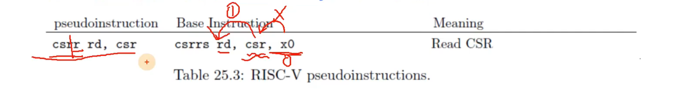

- wfi：休眠指令，如果仅用j 这个死循环会非常耗电

大写的.S文件支持预处理指令

##### UART硬件连接

##### UART特点

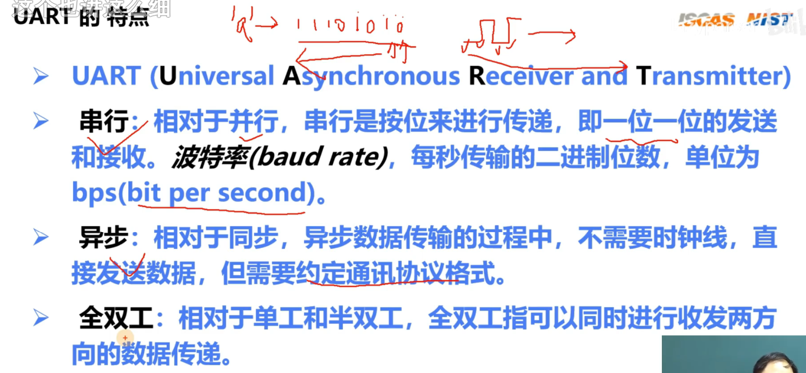

##### UART通信协议

1. 空闲位：当总线空闲时，这根线处于 高电平 '1'
2. 起始位：发送1个bit时间的 低电平'0'信号，表示开始传送字符
3. 数据位：起始位后，就是传输的数据，数据长度可以是5/6/7/8/9位，构成一个字符，一般8位，先放送最低位，最后发最高位
4. 校验位：串口校验分：
   - 无校验
   - 奇校验
   - 偶校验
   - mark parity：校验位始终为1
   - space parity：校验位始终为0
5. 停止位：结束时，可以是1位高电平、2位、1.5位

8个寄存器，UART0地址+reg偏移量，访问这8个寄存器

- 每个寄存器都有2个模式，读模式，写模式

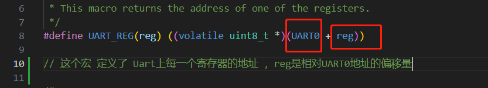

##### NS16550a的初始化

- 设置波特率

外围设备要配波特率，

x是18432，我们要配这个a，使得y的结果合理

- 所以的板子频率都是18432MHZ或者73728MHZ
- 所以可移配的值都是16位，而Uart寄存器是8位，所以需要两个寄存器

为什么需要写LCR寄存器，因为DLL、DLM和读和写寄存器 复用了地址，

要么使人中断的效果，要不使用设置波特率的效果，功能只能2选1.

我们通过拨动一个开关来选择我们要的效果（设置LCR寄存器的第7位）

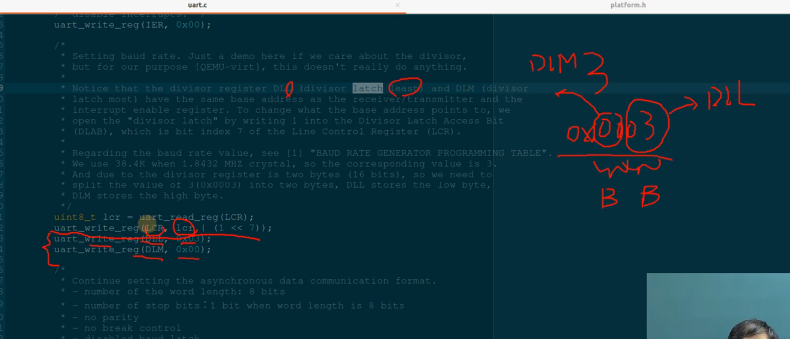

设置奇偶校验位

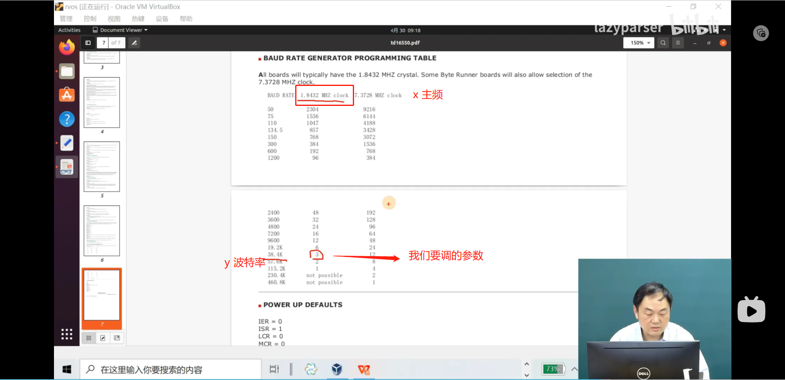

##### Uart寄存器，是8位的！！

##### Ns16550a 的读写

- 轮询：不断查看发送寄存器是否空闲，空闲就把数据放入该寄存器，当寄存器有值就会发出去
- 中断：当寄存器空闲了，串口设备就会提醒我们把东西放进去

THR寄存器：发送寄存器，把东西放进去，他就会放进去

LSR寄存器：我们可以通过访问他特殊的位，得到发送寄存器是否空闲

##### 轮询方式的实现

- 不断的读LSR寄存器的值 ，同时 与操作不断这个寄存器第5位是否为1，不满足条件说明 发送寄存器不空闲
- 如果满足条件，就把一个字符写入

### !!!巨重要[第7章（下）-Hello RVOS_哔哩哔哩_bilibili](https://www.bilibili.com/video/BV1Q5411w7z5/?p=17&spm_id_from=pageDriver&vd_source=f30dd07ede5a1255c0b1aaf0d2788938)

# 第8章 内存管理

### Linked Script链接脚本语法

##### Entry命令：设置入口命令

设置模块和api

##### Memory命令

申请内存命令

1. 先申请一块rom内存（只读），这块内存起始地址 0，长度 256k
2. 再申请一块ram内存（可读写），起始地址0x40000000，长度4M

如果链接器发现哪些节没有设置放在哪块地址，会根据读写属性去默认放入

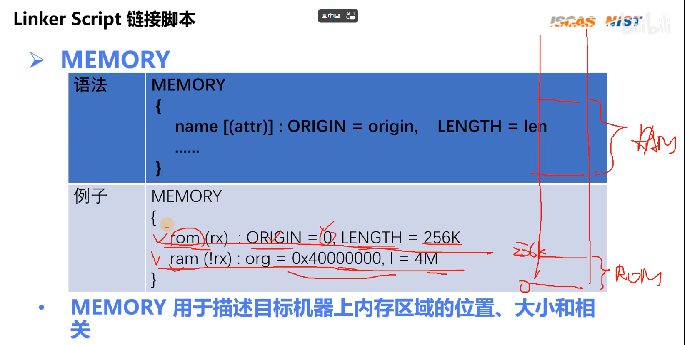

##### Section命令：

描述输入文件 如何映射到 目标文件，以及 目标setion 如何放入内存

`.=0x10000 // .是当前指针位置，这里把当前指针位置设置为0x10000`

`.text:{*(.text)}    // output section : input section,这里是在0x10000 所有输入文件的.text放入目标文件的.text `

Provide命令

赋值命令，把后面的值赋给前面

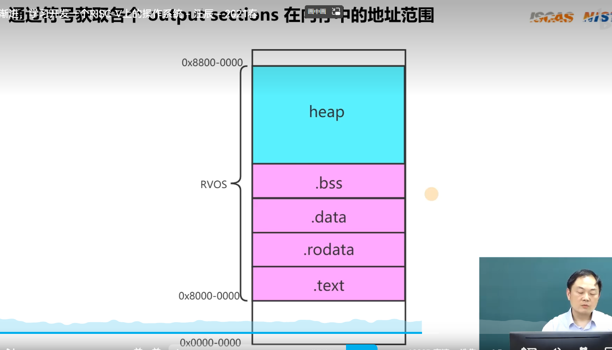

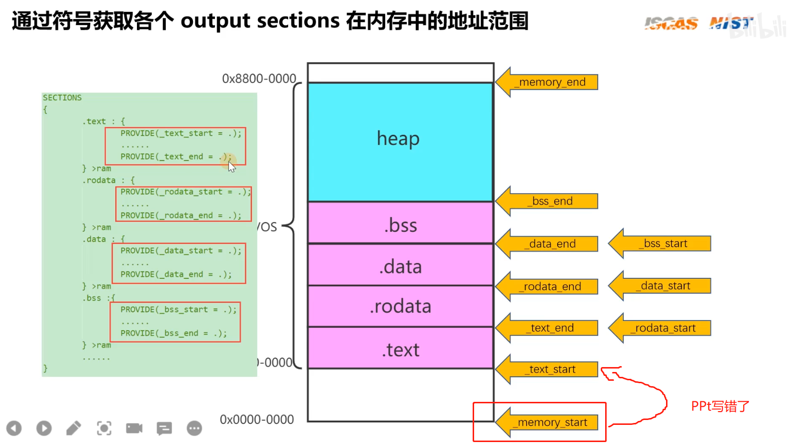

这里定义了一些全局变量，word代表32为空间

> .ld -> .S -> .c

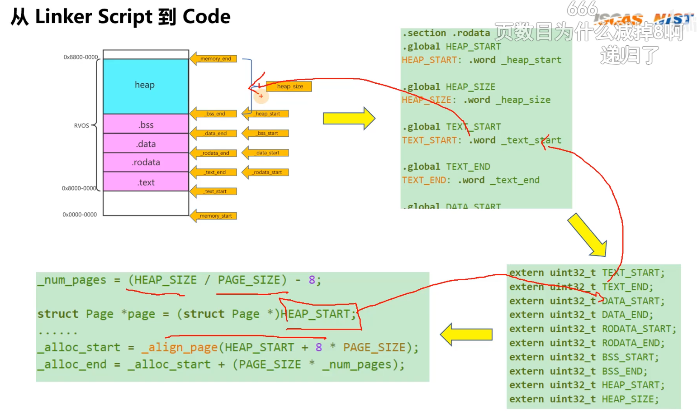

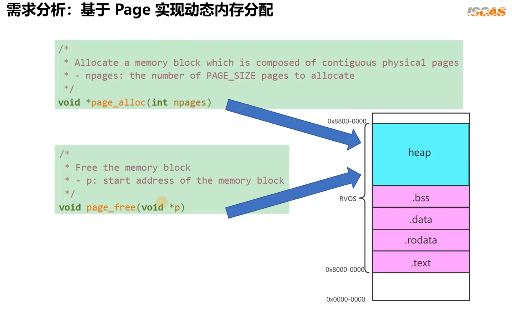

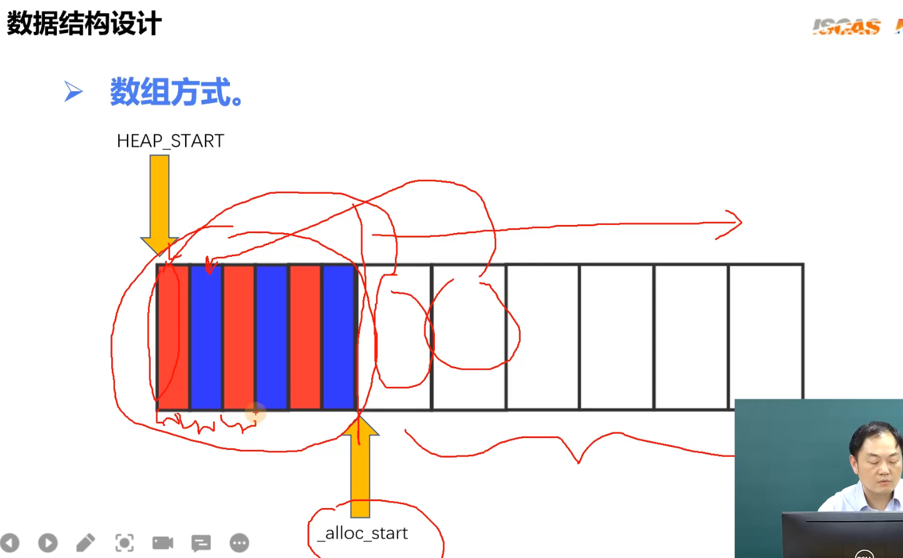

4k对齐

##### 定义Page的数据结构

page_token:用第一位表示自己是否被用掉

page_last:当好几个page被化成一块给用户时，用第二位表示自己是不是该块的 最后一个

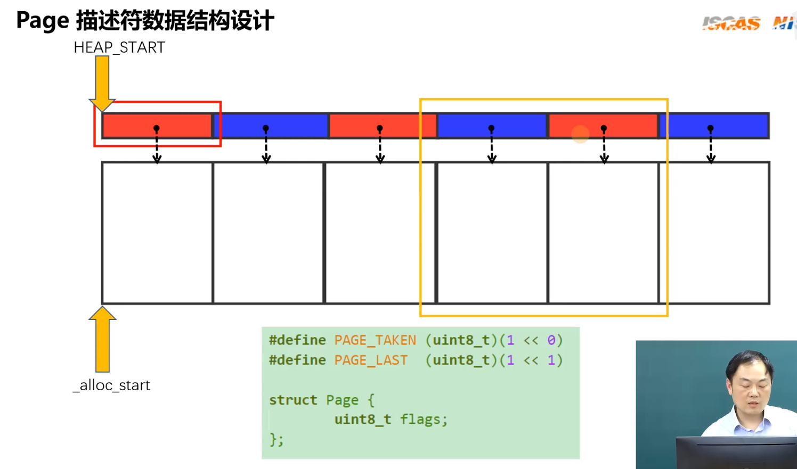

##### Page的分配

##### Page的释放

##### 物理内存保护和虚拟内存

##### 练习

# 第9章 上下文切换和协作多任务

- 多任务：在单核上跑多个执行流，需要上下文切换
- 上下文切换：当一个hart要执行时，先把上一个hert在寄存器上所有的值存入栈中，这个hert再工作，再切回来时，再保存自己，恢复另一个hert的上下文

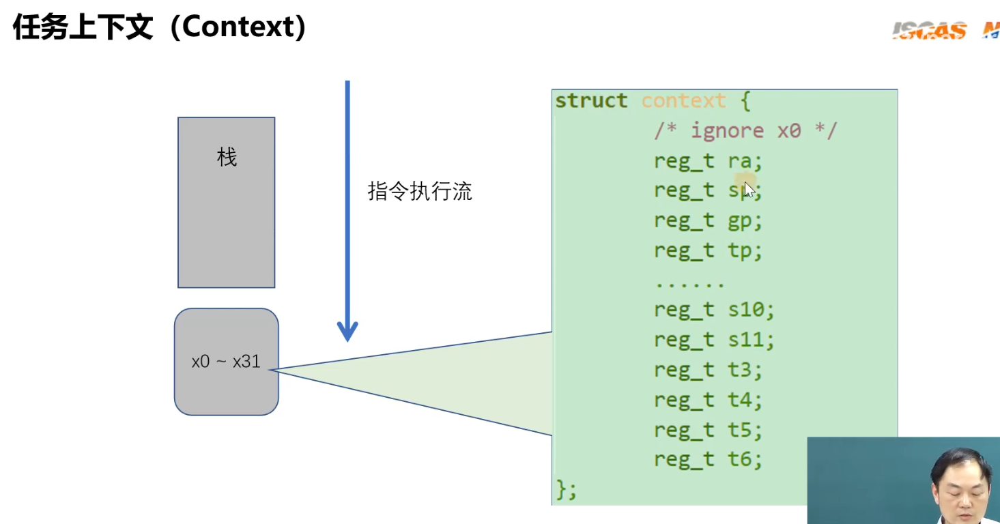

1. 协作式多任务：任务 工作一段时间后，主动把cpu让出来，缺点：程序员忘记写让了
2. 抢占式多任务

- ra：返回值地址寄存器， 但是在这里存放 该任务的当前执行命令的地址，如i
- mscratch寄存器：是一个 mechine模式的寄存器，一会指向a的上下文，一会指向b的上下文

- t6是最后一个被覆盖的通用寄存器

1. 定义上下文的结构体
2. 定义一个任务，定义他的 栈和上下文
3. 初始化一个任务：
   - ？
   - 初始化该任务的栈
   - 把任务的第一条指令的地址放入 上下文的ra中

把任务task0的上下文给schedule函数，switch_to就跳到了第一个任务

1. 内核->初始化sched->schedule任务->我们的任务

1. 直接定义1个任务栈数组 和 1个上下文数组
2. top表示有多少个任务，cur表示当前任务的下标
3. 通过 轮转 的方式实现上下文切换
4. task_yield 主动放弃任务

##### 练习

# 第10章 trap和Exception

- 控制流
- 异常控制流 ECP，有异常和中断两种，统称Trap

##### mtvec

- base：这30位或62位放trap入口函数的基地址，保证4字节对齐，其实就相当 32位的地址后两位为0省去
- mode：设置控制入口函数地址的 配置方式，0 Direct  1Vectored	2以上----
- Direct方式：到函数里用 switch、case判断不同的异常
- Vector方式：tarp函数不是一个函数，base放的其实是一个函数数组的地址，根据不同异常对应不同下标的异常处理函数

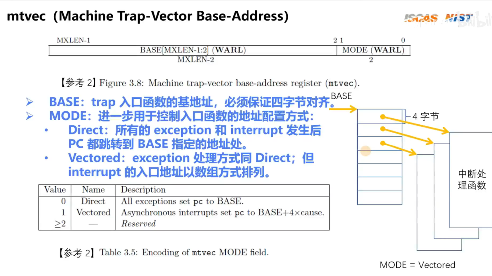

切换到异常控制流时，pc的值会保存在epc中，回到正常控制流时，pc再通过epc恢复

##### mepc：

切换的异常执行流时，保存正常执行流的pc值以便恢复

##### mcause

保存异常或中断的原因

- 最高位为1，表示中断，0，表示异常
- 其他位表示具体的异常或中断的种类

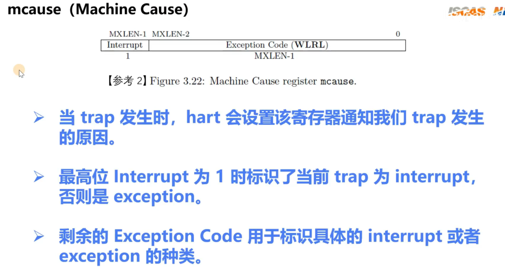

##### mtval

存放异常的其他信息，mcause只是提供异常的种类，mtval的信息可以辅助进一步判断

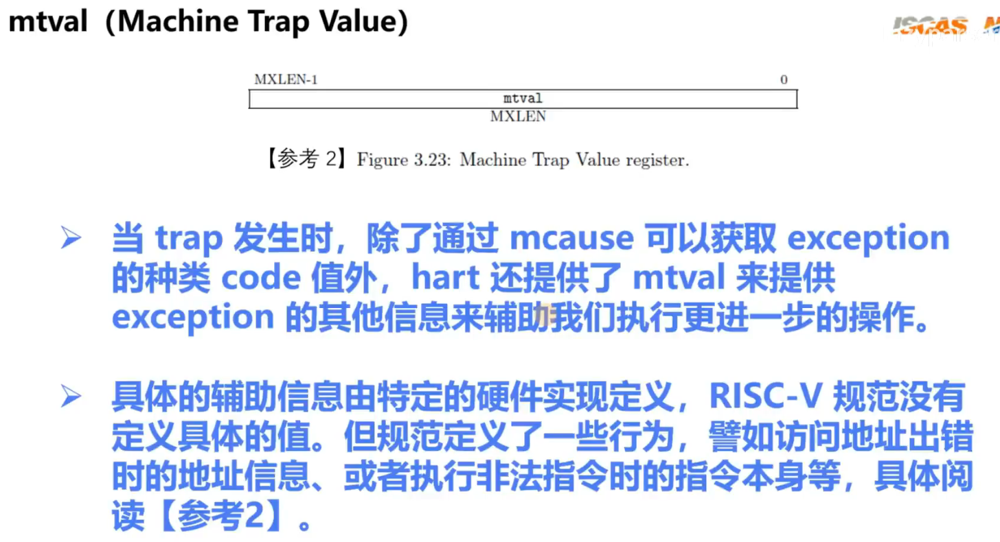

##### mstatus

保存中断/异常和中断前的一些状态

- xIE：M/S/U的全局中断是否打开，1开 0闭， tarp发生时，xIE自动设0
- xPIE：保存trap发生前的xIE值
- xPP：保存trap发生前的权限级别
  - 没有UPP
  - SPP占1位
  - MPP占2位
    当trap发生时，模式只会由高到低，不会切换到更高的模式，也因此取名“trap”，“陷入”的意思。
    U模式之前只能是U模式，只有这一个可能，所以省略
    S模式之前可能是U模式转的，或还是U模式，2可能，占1bit
    M模式3中可能，占2bit

##### Trap处理流程

1. tarp初始化
2. tarp的Top Half（这个是硬件自己的处理，不是我们写的）
3. Bottom half（这个是我们自己写的处理函数）
4. 返回

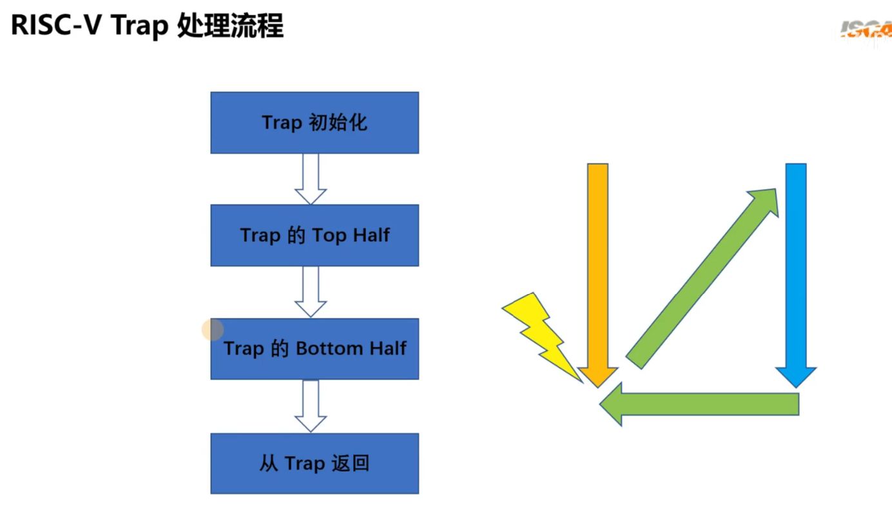

##### trap初始化

trap的top half（硬件自己做的）

1. mstatus的MIE值保存到MPIE，再设置MIE为0，中端被禁止
2. 设置mepc，若中断保存当前pc的下一条指令地址，若异常保存当前指令地址，再给一次机会。
3. 然后pc被设置mtvec的值（实际就是跳转）
4. 根据trap种类设置mcause，设置mtval附加信息
5. mstatus保存之前的权限模式到MPP中，再把hart的权限改为M（无论什么情况都切换M模式）

##### trap的bottomHalf

1. 保存当前控制流上下文
2. 调用trap handler，传参mepc、mcause
3. 恢复上下文
4. mret，恢复到trap之前的状态

退出Trap

1. 恢复权限等级（不同权限用不同指令 mret/sret/uret）
2. 恢复中断的禁用开启状态
3. pc从mepe恢复

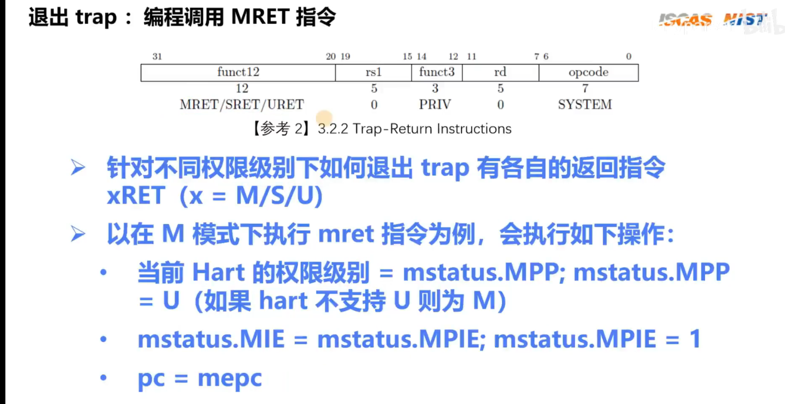

# 第11章外部设备中断

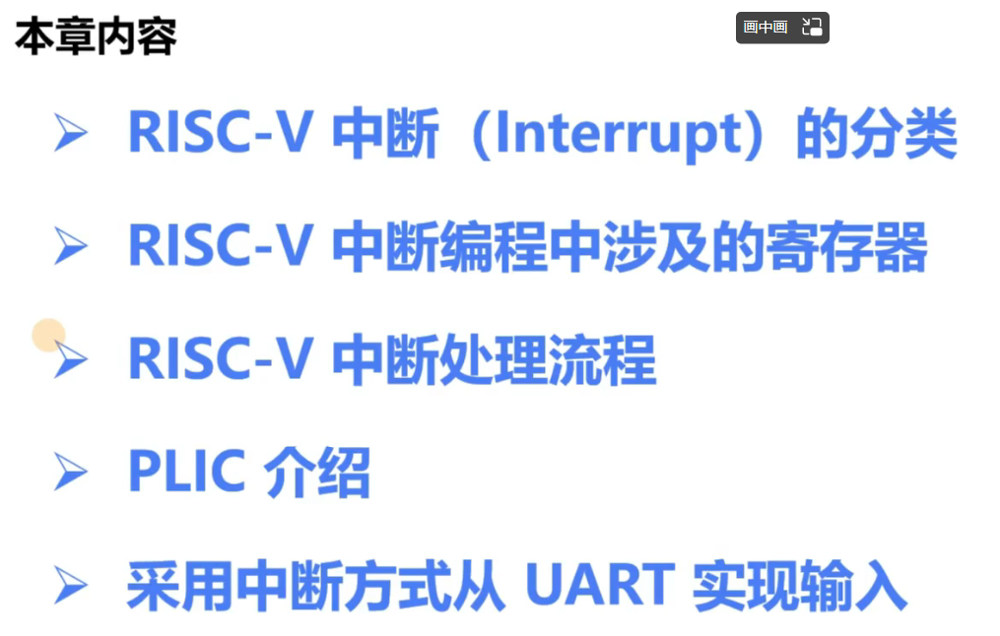

### 中断分类

1. 本地中断

   - software interrupt
   - timer interrupt
2. 全局中断

   - externel interrupt外部中断

   每种中断又分为User模式、Supervisor模式、Machine模式

一个hart有3个引脚，对应3个中断

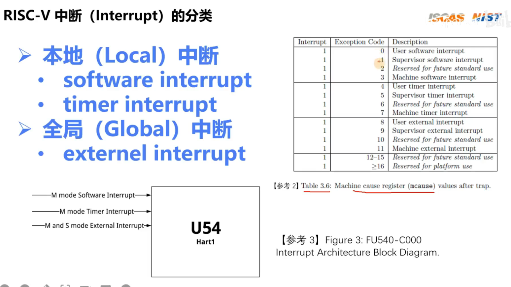

### 中断涉及的寄存器

mstatus寄存器：MIE，这是一个全局中断，这如果关了，所有中断都被禁止，是**最高级的**

##### mie、mip

mie：是用来写的

mip：是用来读的

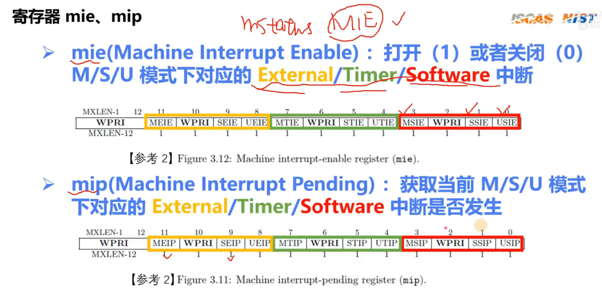

##### 中断处理过程

##### PLRC（中断控制器）

PLIC对一个 hart，只有一个引脚

中断源

ID范围（1~53）

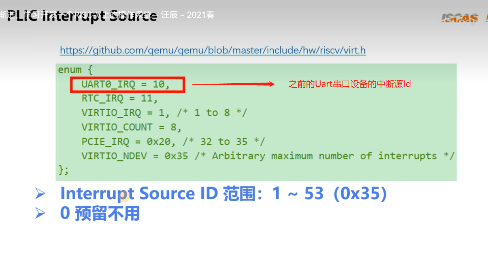

- PLIC本身自己就是一个外设，有自己的中断源id
- PLIC也是想要映射到内存上，基地址是 0x0c000000

##### PLIC寄存器 Priority （优先级设置）

##### PLIC寄存器 Pending （描述某一路中断源是否发生中断）

- 可读可写
- 可以提供claim方式清除

##### PLIC寄存器 Enable（开启或关闭某个中断源）

- 每个hart有2个Enable寄存器

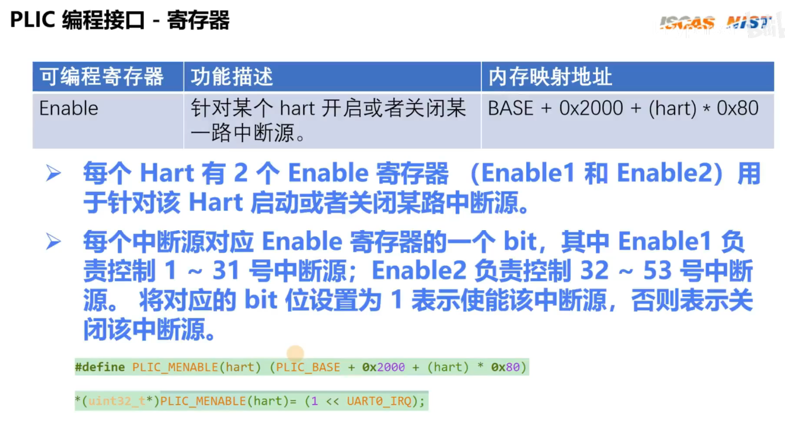

##### PLIC寄存器 Threshold（）

##### PLIC寄存器 Claim/Complete（）

- Claim和Complete是同一个寄存器，每个hart只有一个
- 对该寄存器进行读操作 被称为Claim，获取当前发生的最高级中断源ID，Claim成功后会清除Pending位
- 进行写时，称为Complete，通知PLIC对该路的中断已经结束

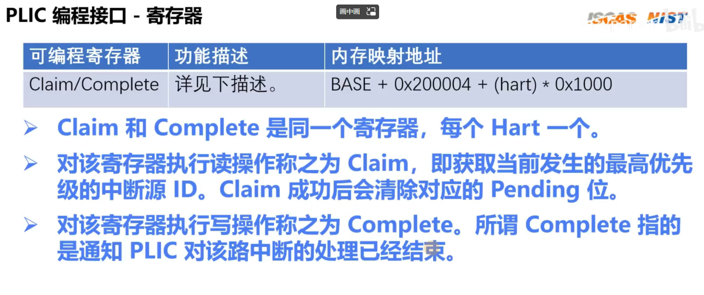

1. **Priorities**		设置某个中断源的优先级 Priorities
2. **Enable**		设置某个中断源在某个hart 的  中断启用
3. **THreshold**	设置某个hart的中断阈值，0时放所有中断进来
4. 进行中断处理程序
5. **Claim**		调用Claim后会返回中断源id，**Pending会被关掉**， 然后进行中断处理逻辑，
6. **Complete**	处理完再调用	Complete操作写这个寄存器，告诉PLIC这个中断处理完了。如果有其他中断在等着，就进行其他中断

### 通过中断实现Uart串口设备的输入

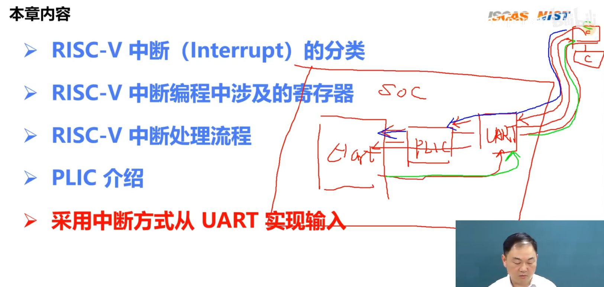

1. 主机输入一个c，UART通过中断通知PLIC，PLIC告诉hart，hart再用轮询的方式写出去

##### Uart中断处理-初始化

- 读取当前hartid
- 设置Priority优先级
- 设置Menable中断的开启
- 设置中断阈值MThreshold
- 先读mie在修改某一位来开启外部中断
- 修改mstatus_mie 来开启全局中断

注意：中断的启用是多级的

1. 最高级的 全局中断开关mstatus_mie
2. 次一级 对三种中断的开关mie
3. 设置中断阈值，如果中断优先级低于阈值mThreshold，则被过滤
4. 最后就是 某个中断源和某个hart  的是否启用中断

plic_claim()函数，读该中断的中断源id并返回

plic_complete()函数，写这个寄存器，通知PLIC中断已经处理完了

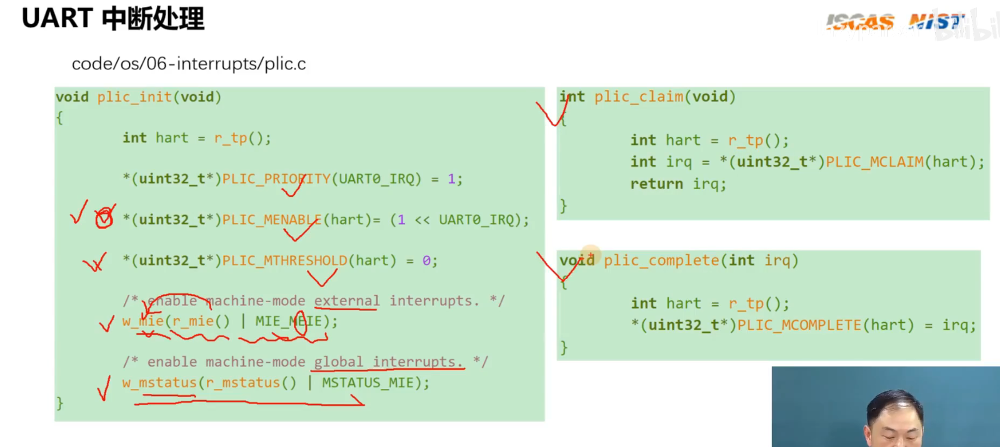

##### Uart中断处理-中断处理函数

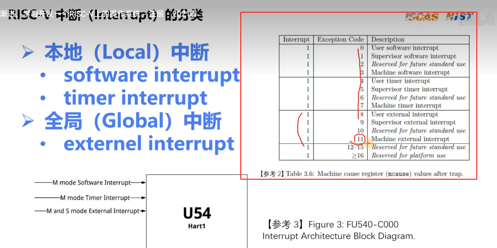

* trap_handler()函数，处理trap

  - cause判断是中断还是异常
  - case_code判断那种中断，并跳转到对应的处理函数
* external_interrupt_handler()函数，处理外部中断

  * 读claim查看是哪个中断源，如果是uart转跳相应的函数
  * 处理完后写complete寄存器，告诉中断结束

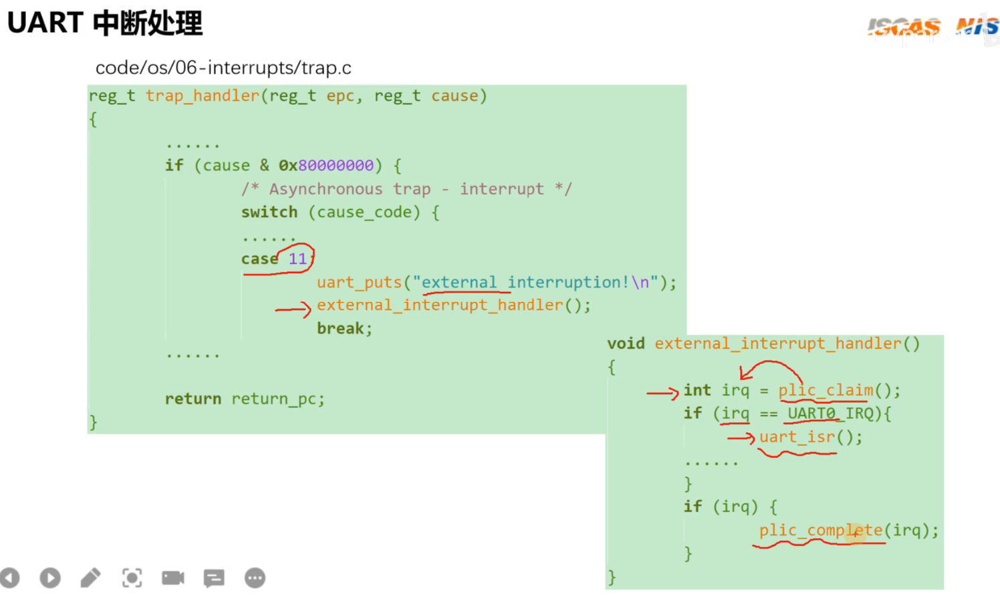

1. uart初始化时，开启uart读的中断
2. 调用 uart_isr时，不停调用uart_getc()，并发送其返回值
3. uart_getc(),读LSR的与LSR_RX_READY的与，返回RHR寄存器的值

# 第12章 硬件的定时器中断

- 不是普通的设备发出，是CLINT发出
- CLINT负责两类中断，1个是软件中断，1个Timer中断

### CLINT 编程接口-寄存器

- 基地址0x2000000

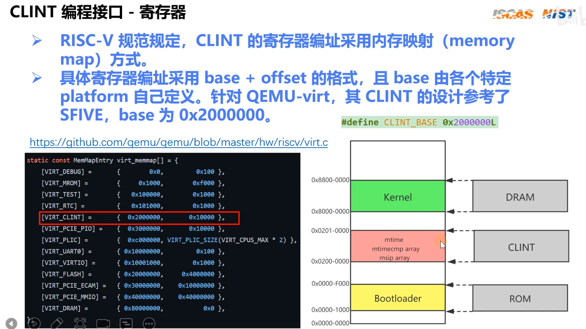

##### mtime寄存器

- 有的地方叫RTC（实时时钟），无论32位还是64位，都是64bit，
- 上电归零，始终按一个固定频率递增
- 内存映射地址：BASE+0xbff8

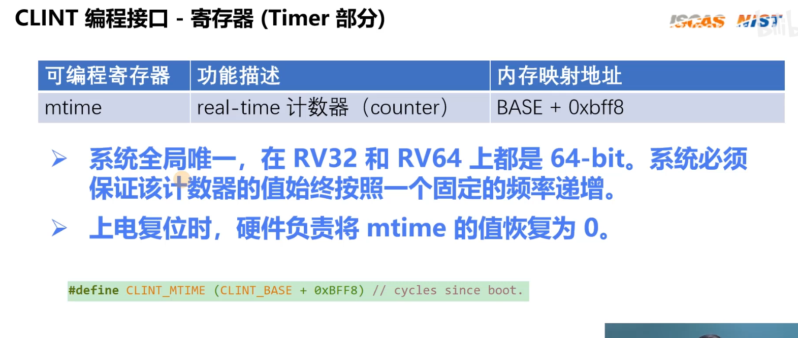

##### mtimecmp寄存器

- 每个hart都有个mtimecmp寄存器，这个寄存器是拿来与mtime比较的，如果mtime达到了mtimecmp就会发生一次中断并清除mtimecmp的值
- 定义一个 根据hartid 取相应的mtimecmp寄存器内存地址的宏
- 开启内核时，初始化调用time_init（）
- 在time_init（）调用time_load()
- time_load(),根据当前hartid取mtimecmp寄存器并写入 一个想设置的数+当前mtime的值。

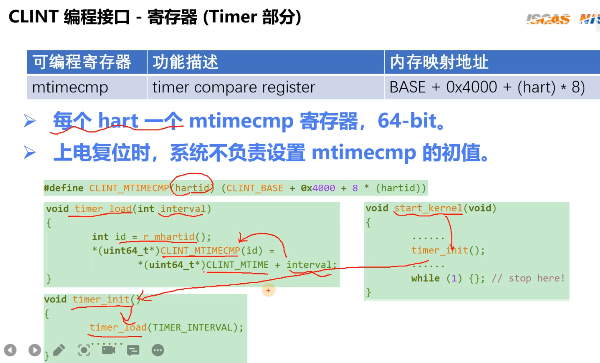

##### mtimecmp寄存器作用

- mtime每次增加时都会与mtimecmo比较，如果mtime>=mtimecmp，产生一个timer中断，如果需要这个中断，要确保全局中断打开且mie.MTIE置1
- 当timer发生时，hart会设置mip.MTIP,如果你需要周期性触发这个中断，你需要程序中在中断完再次写入mtimecmp,清除mip.MTIP

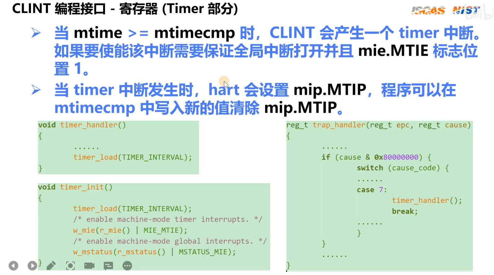

##### 总流程

### 定时器的应用

##### 时钟节拍Tick

系统时钟

# 第13章 抢占式多任务

- 抢占式多任务：不是任务自己转跳，而是操作系统来控制任务的转跳
- 原理：通过系统定时器来中断当前任务，在处理中断过程中，转跳到其他任务。

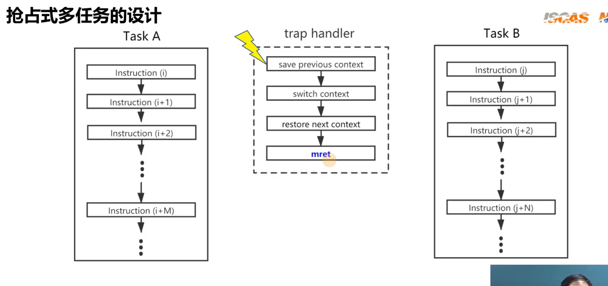

##### 设计

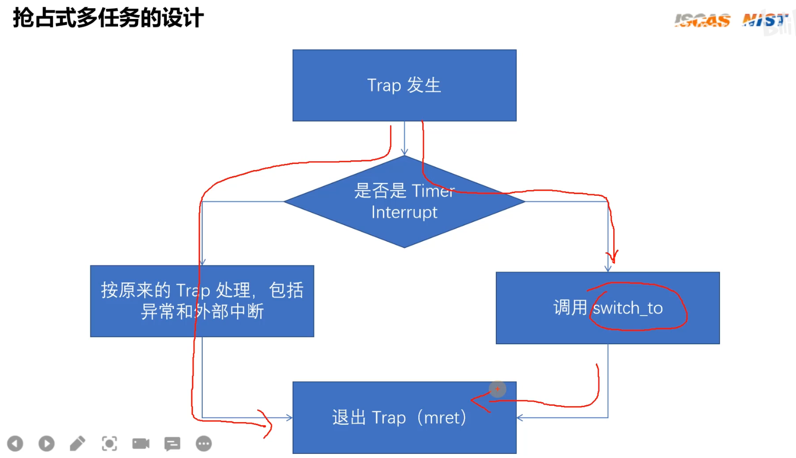

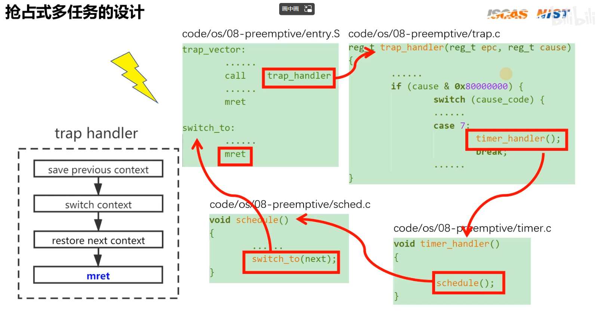

a
