# 疑惑

# 资源

# 第14章 任务同步和锁


### 同步与并发

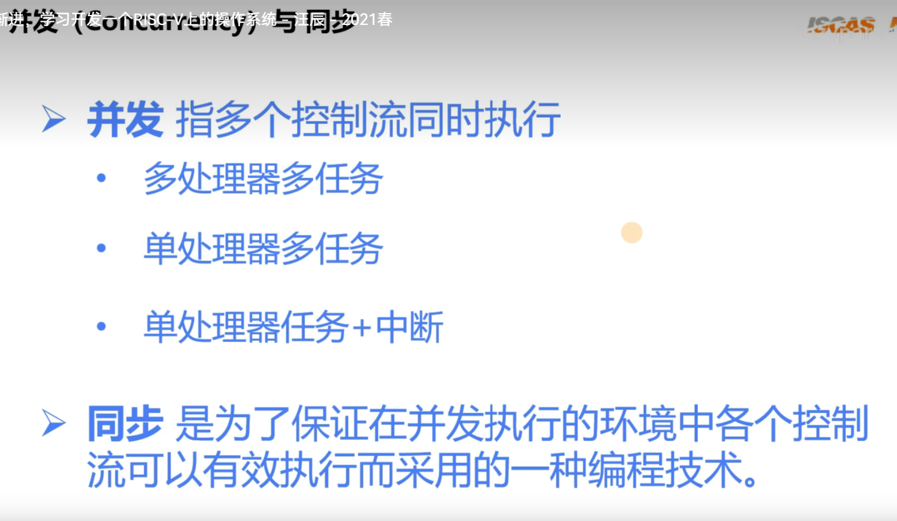

### 临界区

- 是一个相对的概念，一个指令片段会与另一个指令片段共享存储资源，互为临界区。

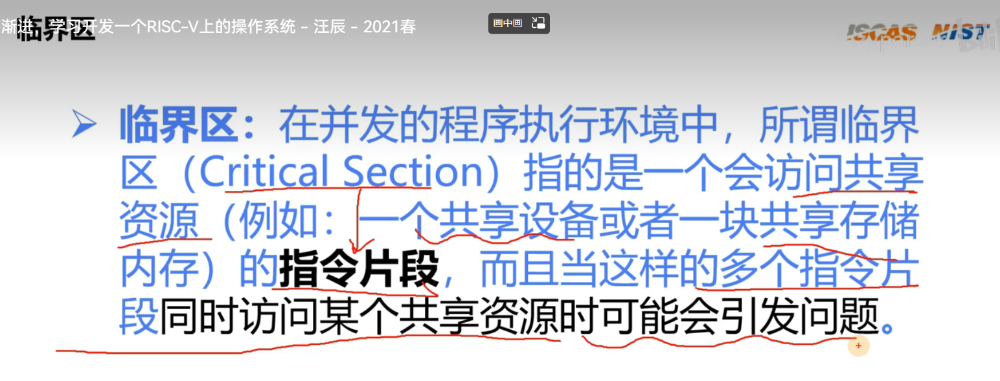

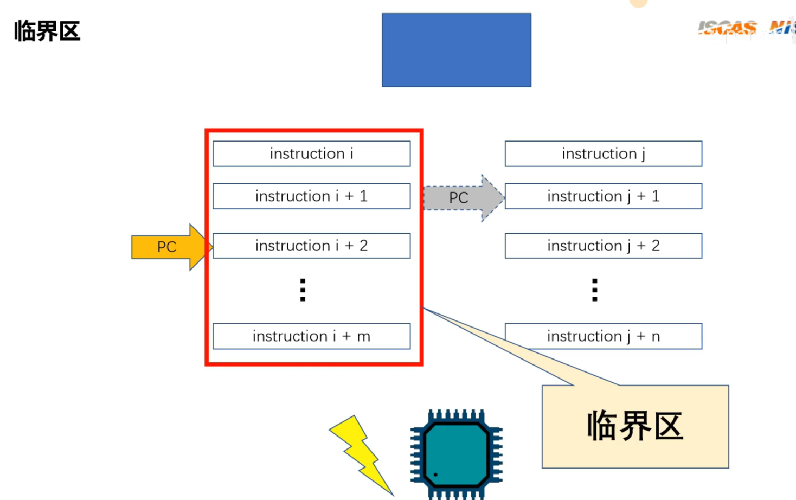

### 锁

- 可睡眠
- 不可睡眠

##### 死锁

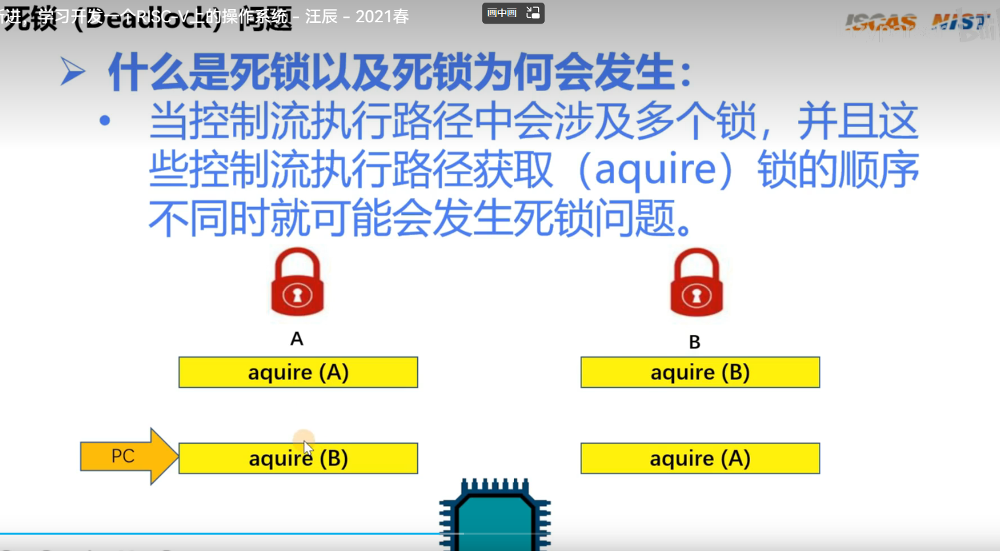


##### 自旋锁

- 不可睡眠

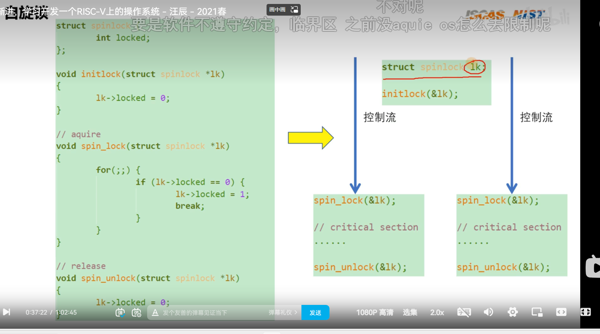

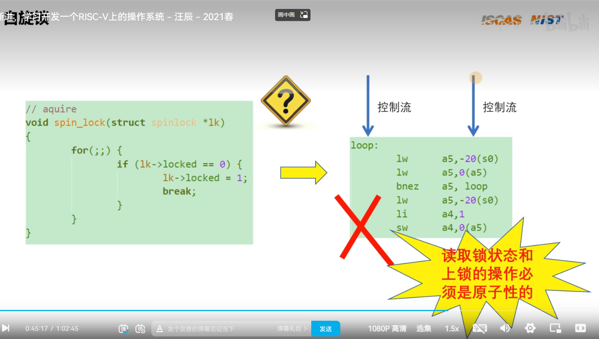

##### amoswap.w.aq 和__sync_lock_test_and_set()

- 原子命令
- 查看锁的状态并加锁

```
1. 把指针的地址放进a4
2. 把a5赋值1
3. 把a4指向的内存放入a5的值，再把a5赋值原先a4指向的内存的值（原子命令）
```

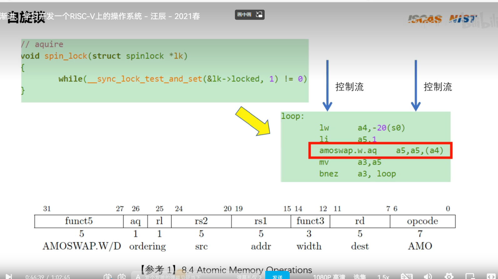

我们实现上锁的的方法是 ，直接关掉中断。

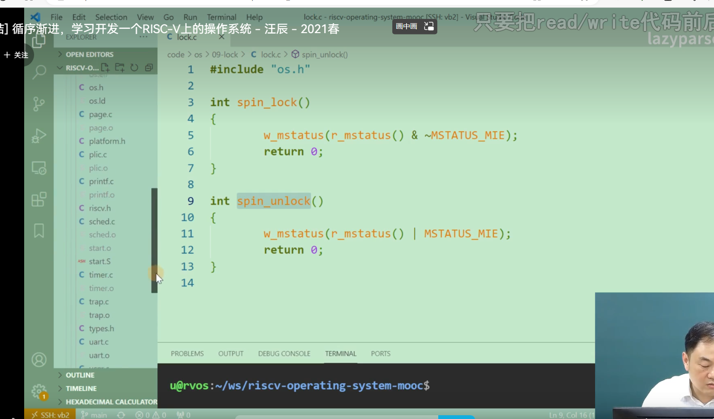

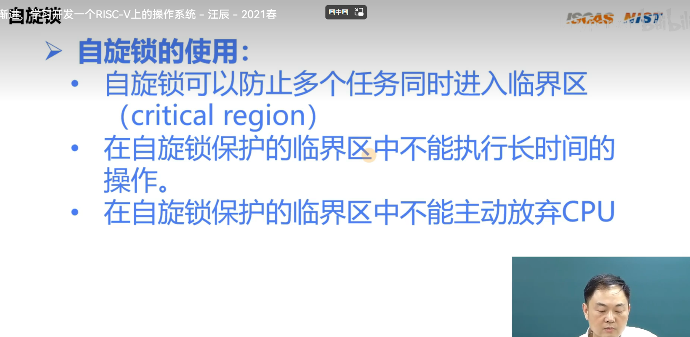

##### 信号量、互斥锁、完成变量

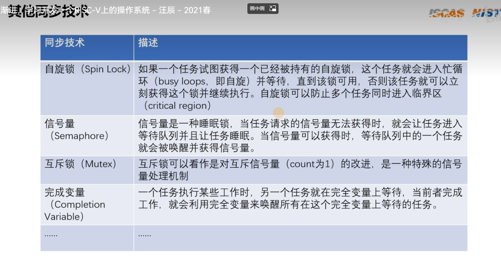

# 第10章 软件定时器


* 硬件定时器
  * 精度高
  * 定时器数量个数受硬件芯片限制
* 软件定时器
  * 是基于硬件定时器的扩展
  * 精度低，是硬件的整数倍
  * 但数量多，自由


- 单次触发定时器
- 周期触发定时器
- 在中断上下文中
- 在任务上下文中

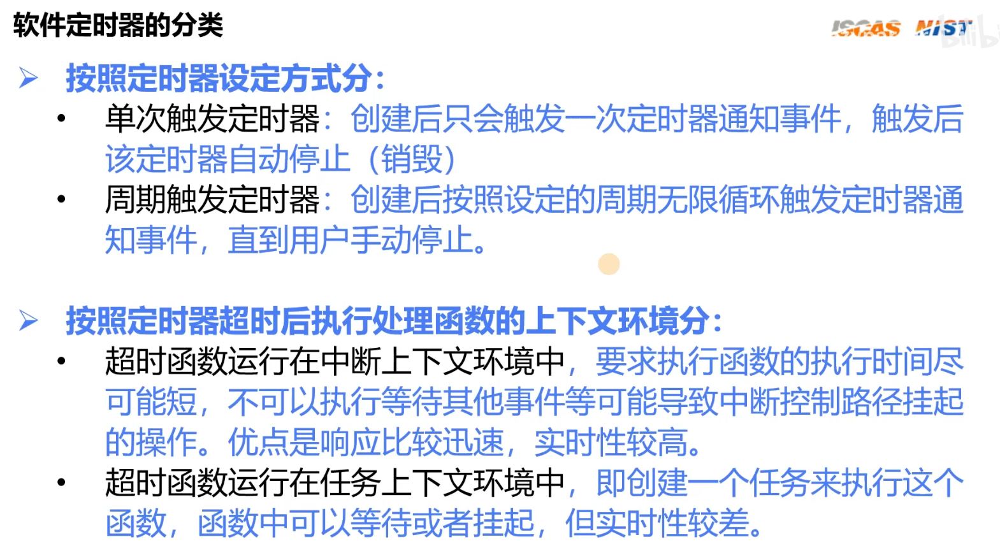

### 软件定时器的设计与实现

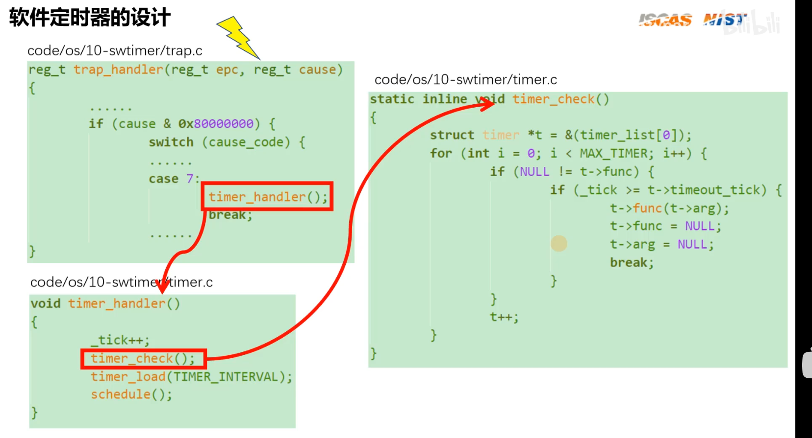


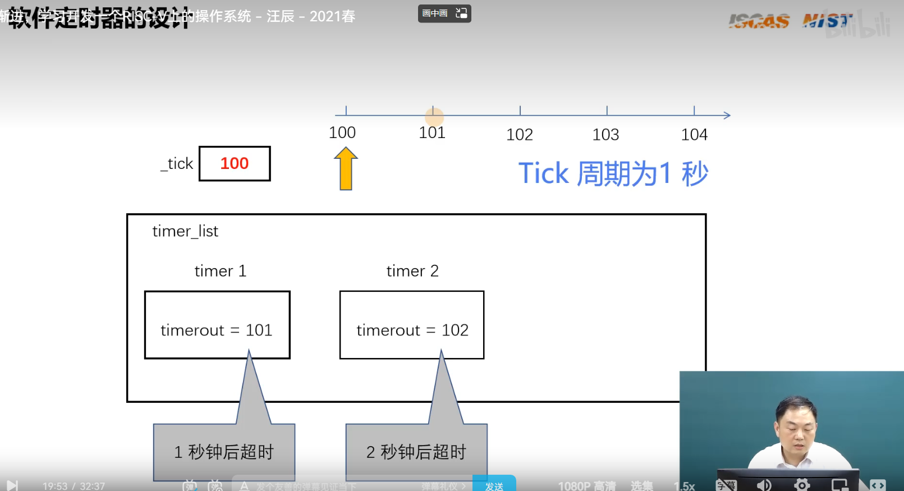


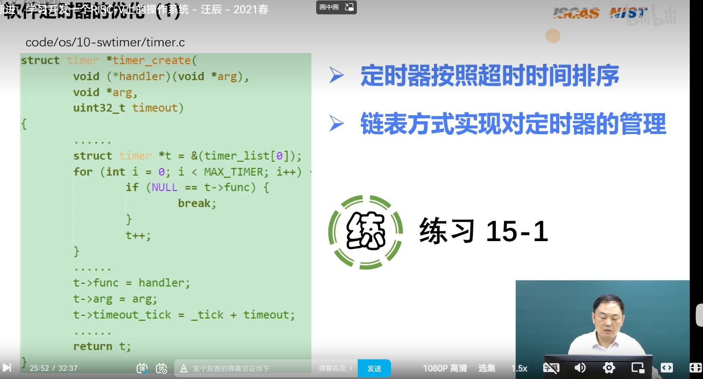


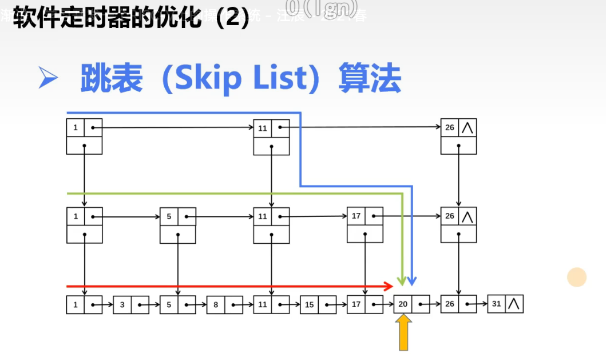


a
