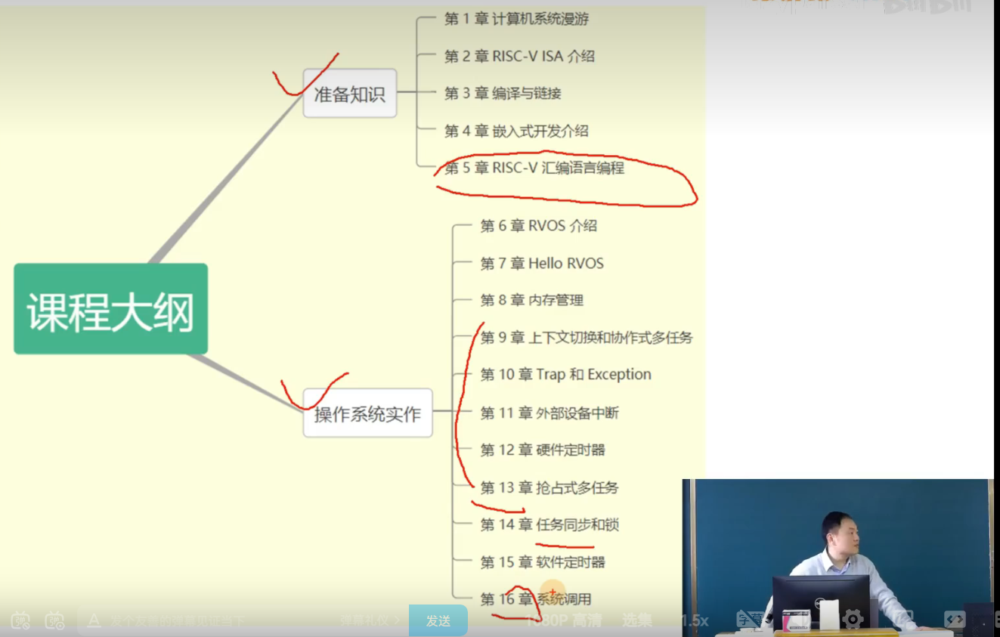
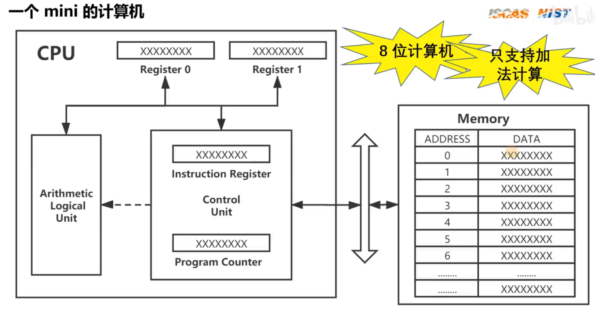
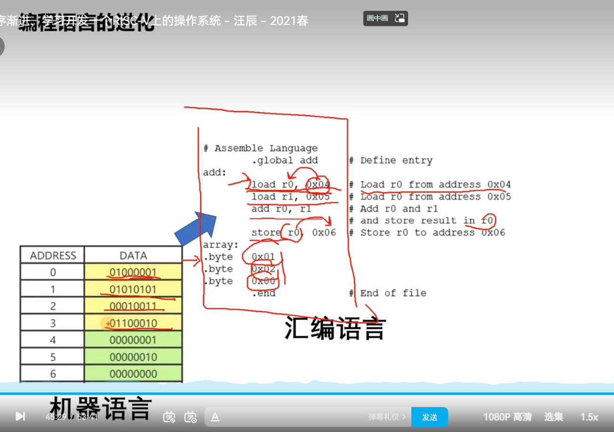
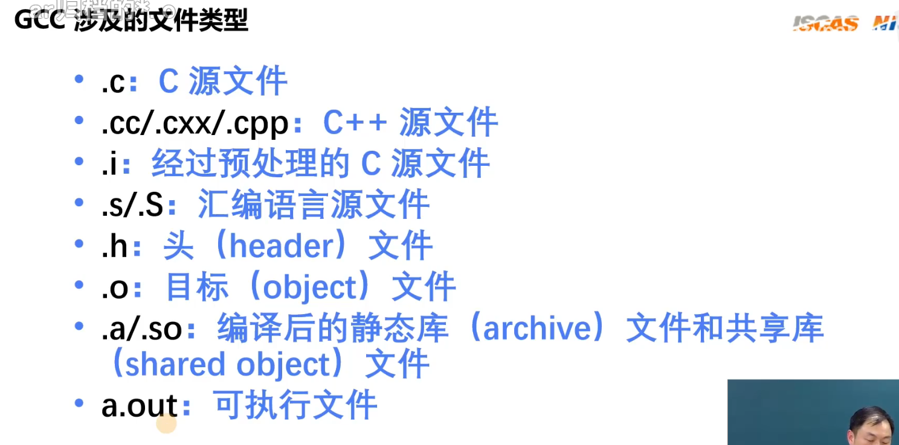

# 第一章 计算机系统漫游

##### 计算机硬件组成



cpu:

* 控制单元：把指令解析处理运行再交给控制单元和计算逻辑单元
* 计算逻辑单元：负责数字运算和逻辑运算
* 寄存器：

IOBridge（IO桥）：负责cpu和外界的桥梁，连接主存和总线

总线下面的是一些外设：鼠标、键盘、硬盘、显示器


##### 计算机架构

* 冯·诺依曼架构
  指令和数据不加以区分的存储的存储器中，执行效率较低，总线开销更小，控制逻辑更简单
* 哈佛架构
  指令和数据分开存储，执行效率高，总线开销更大，控制逻辑更难实现

##### 一个c语言文件到执行的过程

1. 编译和链接 -> a.out 存在硬盘
2. 运行 -> 把可执行程序a.out里的指令加载到内存
3. cpu的控制单元会一条一条把内存里的指令取出来（不断地 **取址** 、**译码**、**执行**）

谁会驱动cpu做这个事情？

晶振：通电后会不断一下一下发出脉冲信号，驱动cpu不断地 **取址** 、**译码**、**执行** ,这个频率叫**cpu的主频**


##### 一个mini的计算机（8位计算机，仅支持加法）

8位划分：8个比特bit

* 2位表示操作：支持最多4种操作	 01（LOAD）	 10（STORE）	 11（ADD）
* 2位表示寄存器：支持最多4个寄存器
* 4位表示地址：支持最多16个地址



OPCODE：操作码

```html
1. xxxx-00-01
2. xxxx-01-01
3. xx01-00-11
4. xxxx-00-10
```


1. 取址


2.译码





##### 存储设备的层次结构


##### 操作系统

* 系统调用（System Call）
* 指令集架构（ISA）

1. 保护硬件不被失控的软件应用程序滥用
2. 为软件提供简单一致的抽象接口，来控制复杂的多个外设硬件


---

# 第二章 RISC-V ISA介绍

[第2章(上)-RISC-V ISA 介绍_哔哩哔哩_bilibili](https://www.bilibili.com/video/BV1Q5411w7z5/?p=3&spm_id_from=pageDriver&vd_source=f30dd07ede5a1255c0b1aaf0d2788938)

ISA是一个接口规范，微架构是一种实现

* 基本数据类型：byte（8）halfword（16）word（32）


ISA的宽度代表 寻址范围的大小

注意：ISA的宽度与指令长度无关


RV[字宽][模块集合]


##### 模块化

1. I	整数模块
2. E	嵌入式
3. M	乘法、除法
4. A	储存器原子指令集
5. F	单浮点精度
6. D	双浮点精度
7. C	压缩指令集
8. **G	IMAFD模块的组合**


##### 通用寄存器

非特权模式中定义了32个通用寄存器和一个PC寄存器（在RISC-V中PC没有暴露出来，与x86不一样）


##### Hart

翻译：硬件线程

指令执行流：在早期的cpu，一个核心只有一个指令执行流，也就是只有一个控制单元不停地取址、译码、执行


##### 特权级别

1. User/Application	U	（用户地址）
2. Supervisor		S	（类似保护模式，开启虚拟地址）
3. Reserved
4. Machine			M	(类似x86的实模式，此时，虚拟地址不生效，全部运行在物理地址，)

开了虚拟地址之后才有进程的概念


##### Control and Status Registers（CSR）

- 在不同的级别下，有对应各自一套寄存器（CSR）
- 高级别可以访问低级别的寄存器
- 有专门操作CSR的指令
- 有特定的指令可以在不同特权级别之间切换


##### 内存管理与保护

虚拟内存需要硬件MMU（内存管理单元）

Locker表示这段内存不可使用

RWX表示能读、写、执行

X-only只能执行


##### 异常和中断

异常：自身的问题，给你一个改过自新的机会

中断：外部的


# 第三章 编译和链接

##### gcc

- -E：预处理 -> hello.i	cc1
- -S：编译成汇编		cc1
- -c：编译成机器语言		as
- 无参数：链接，链接一些标准库成为最终可执行文件		ld





##### ELF文件格式


- ELF Header:文件的基本信息，文件运行在哪个体系架构上的，版本号信息
- Program Header Table：运行视图

  最终程序放入内存中时，会4k对齐，把几个节（Section）放在一起形成段（Segment），比如都是指令的节。
- 一个一个节
- .text：放指令
- .init：初始化指令
- .data：数组，全局变量


- Section Header Table：链接视图，知道有哪些节，有多大，在什么位置


##### Binutils


##### objdump反汇编

要加 -g 调试信息！！


a
