# 坑

##### 1.  riscv64-unknown-elf-gcc 找不到头文件

解决方法：[howto-run-with-ubuntu1804_zh.md · unicornx/riscv-operating-system-mooc - Gitee.com](https://gitee.com/unicornx/riscv-operating-system-mooc/blob/main/howto-run-with-ubuntu1804_zh.md)

##### 2. qemu-system-riscv32: error while loading shared libraries: libncursesw.so.6: cannot open shared object file: No such file or directory

解决方法：[环境配置问题 :qemu-system-riscv32: error while loading shared libraries: libncursesw.so.6: cannot open shared object file: No such file or directory · Issue #I477IX · unicornx/riscv-operating-system-mooc - Gitee.com](https://gitee.com/unicornx/riscv-operating-system-mooc/issues/I477IX)

3. ##### make debug 总是处于之前的进程，

   

# 第一章 计算机系统漫游

##### 计算机硬件组成


cpu:

* 控制单元：把指令解析处理运行再交给控制单元和计算逻辑单元
* 计算逻辑单元：负责数字运算和逻辑运算
* 寄存器：

IOBridge（IO桥）：负责cpu和外界的桥梁，连接主存和总线

总线下面的是一些外设：鼠标、键盘、硬盘、显示器


##### 计算机架构

* 冯·诺依曼架构
  指令和数据不加以区分的存储的存储器中，执行效率较低，总线开销更小，控制逻辑更简单
* 哈佛架构
  指令和数据分开存储，执行效率高，总线开销更大，控制逻辑更难实现

##### 一个c语言文件到执行的过程

1. 编译和链接 -> a.out 存在硬盘
2. 运行 -> 把可执行程序a.out里的指令加载到内存
3. cpu的控制单元会一条一条把内存里的指令取出来（不断地 **取址** 、**译码**、**执行**）

谁会驱动cpu做这个事情？

晶振：通电后会不断一下一下发出脉冲信号，驱动cpu不断地 **取址** 、**译码**、**执行** ,这个频率叫**cpu的主频**


##### 一个mini的计算机（8位计算机，仅支持加法）

8位划分：8个比特bit

* 2位表示操作：支持最多4种操作	 01（LOAD）	 10（STORE）	 11（ADD）
* 2位表示寄存器：支持最多4个寄存器
* 4位表示地址：支持最多16个地址


OPCODE：操作码

```html
1. xxxx-00-01
2. xxxx-01-01
3. xx01-00-11
4. xxxx-00-10
```


1. 取址


2.译码


##### 存储设备的层次结构


##### 操作系统

* 系统调用（System Call）
* 指令集架构（ISA）

1. 保护硬件不被失控的软件应用程序滥用
2. 为软件提供简单一致的抽象接口，来控制复杂的多个外设硬件


---

# 第二章 RISC-V ISA介绍

[第2章(上)-RISC-V ISA 介绍_哔哩哔哩_bilibili](https://www.bilibili.com/video/BV1Q5411w7z5/?p=3&spm_id_from=pageDriver&vd_source=f30dd07ede5a1255c0b1aaf0d2788938)

ISA是一个接口规范，微架构是一种实现

* 基本数据类型：byte（8）halfword（16）word（32）


ISA的宽度代表 寻址范围的大小

注意：ISA的宽度与指令长度无关


RV[字宽][模块集合]


##### 模块化

1. I	整数模块
2. E	嵌入式
3. M	乘法、除法
4. A	储存器原子指令集
5. F	单浮点精度
6. D	双浮点精度
7. C	压缩指令集
8. **G	IMAFD模块的组合**


##### 通用寄存器

非特权模式中定义了32个通用寄存器和一个PC寄存器（在RISC-V中PC没有暴露出来，与x86不一样）


##### Hart

翻译：硬件线程

指令执行流：在早期的cpu，一个核心只有一个指令执行流，也就是只有一个控制单元不停地取址、译码、执行


##### 特权级别

1. User/Application	U	（用户地址）
2. Supervisor		S	（类似保护模式，开启虚拟地址）
3. Reserved
4. Machine			M	(类似x86的实模式，此时，虚拟地址不生效，全部运行在物理地址，)

开了虚拟地址之后才有进程的概念


##### Control and Status Registers（CSR）

- 在不同的级别下，有对应各自一套寄存器（CSR）
- 高级别可以访问低级别的寄存器
- 有专门操作CSR的指令
- 有特定的指令可以在不同特权级别之间切换


##### 内存管理与保护

虚拟内存需要硬件MMU（内存管理单元）

Locker表示这段内存不可使用

RWX表示能读、写、执行

X-only只能执行


##### 异常和中断

异常：自身的问题，给你一个改过自新的机会

中断：外部的


# 第三章 编译和链接

##### gcc

- -E：预处理 -> hello.i	cc1
- -S：编译成汇编		cc1
- -c：编译成机器语言		as
- 无参数：链接，链接一些标准库成为最终可执行文件		ld


##### ELF文件格式


- ELF Header:文件的基本信息，文件运行在哪个体系架构上的，版本号信息
- Program Header Table：运行视图

  最终程序放入内存中时，会4k对齐，把几个节（Section）放在一起形成段（Segment），比如都是指令的节。
- 一个一个节
- .text：放指令
- .init：初始化指令
- .data：数组，全局变量
- Section Header Table：链接视图，知道有哪些节，有多大，在什么位置


##### Binutils


##### objdump反汇编

要加 -g 调试信息！！


# 第四章 嵌入式开发


##### 交叉编译

- 构建系统
- 主机系统
- 目标系统

本地编译：都在一台机器上

交叉编译：目标系统不是同一台


1. 用x86_64gcc做一个RISCV64的gcc编译器
2. 让然后用这个编译器编译源代码


##### GDB

> gdb  a.out

gdb会fork一个子进程跑我们的程序，当进程跑到我们的断点时，gdb会挂起这个进程，此时就可以读寄存器，看相关的值

远程调试时，目标系统会跑一个gdb-server来代理我们的操作。


```shell
snow@snow$ riscv64-unknown-elf-gcc -march=rv32ima -mabi=ilp32 hello.c
snow@snow$ gcc hello.c -o a_x86.out
snow@snow$ file a.out
a.out:     ELF 32-bit LSB executable, UCB RISC-V, soft-float ABI, version 1 (SYSV), statically linked, with debug_info, not stripped
snow@snow$ file a_x86.out
a_x86.out: ELF 64-bit LSB pie executable, x86-64, version 1 (SYSV), dynamically linked, interpreter /lib64/ld-linux-x86-64.so.2, BuildID[sha1]=e374fe264738f54f3249dae124c2308601f46db3, for GNU/Linux 3.2.0, not stripped
```


##### MakeFile


第五章 汇编语言编程


- label		标志
  ：结尾
- operation	操作
  1. instruction：对应二进制指令
  2. pseudo-instruction：伪指令 ，实际上是多条指令
  3. directive：伪操作， “.”开头，类似自定义函数
  4. macro:   .macro和.endm 的 自定义宏
- comment		注释  #开头

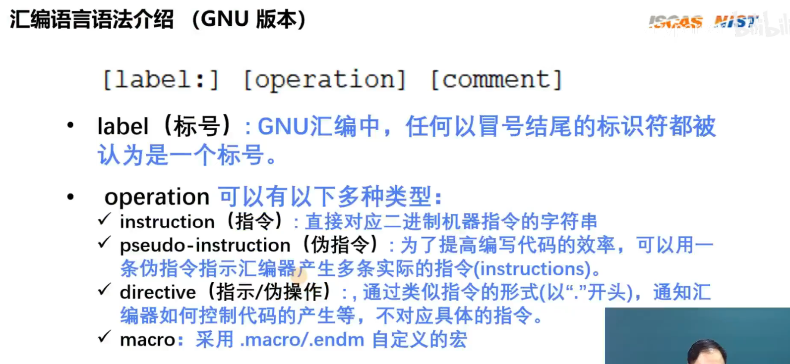

##### 汇编指令操作对象


寄存器

1. 可以操作的有32个通用寄存器
2. 执行算数运算、逻辑运算时，只能对寄存器上的数据运算
3. hart是运算的最小单元，也就是一个执行流，以前的cpu一个核只有一个hart

内存

1. hart可以在内存与寄存器之间读写
2. 读写操作时，字节是最小单位，一个字节一个字节寻址，每个字节都有一个地址
3. RV最大可以访问2^32给字节


开头必11


##### 小端序

- 主机字节序
- 大端序
- 小端序


RISC-V是小端序


##### 汇编指令分类


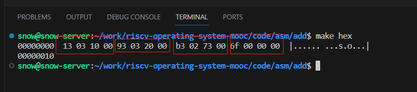

| 13    | 03 | 10    | 00 |  | 93       | 03 | 20     | 00 |  | b3       | 02 | 73      | 00 |  | 6f      | 00 | 00 | 00 |
| ----- | -- | ----- | -- | - | -------- | -- | ------ | -- | - | -------- | -- | ------- | -- | - | ------- | -- | -- | -- |
| 10011 | 11 | 10000 | 0  |  | 10010011 | 11 | 100000 | 0  |  | 10110011 | 10 | 1110011 | 0  |  | 1101111 | 0  | 0  | 0  |
|       |    |       |    |  |          |    |        |    |  |          |    |         |    |  |         |    |    |    |

注意 ：小端序


##### make debug

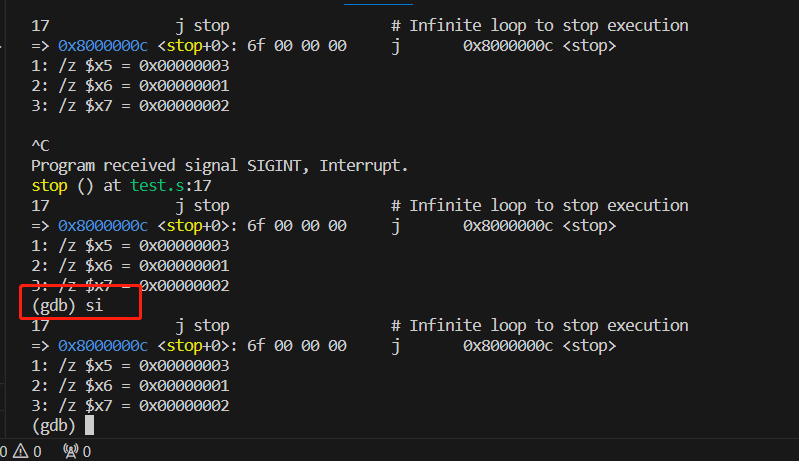


b3	05	95	00

10110011	00000101	10010101	00000000

因为小端序，要转过来

00	95	05	b3

**0000000***0 1001*0101 0**000***0101 1***0110011**

add x9 x10 x11


AADI

比ADD命令少一个寄存器，多一个立即数   [-2048，2047），

好处：可以让一个寄存器直接加这个立即数，2^11

immediate

### 算数运算指令

##### ADDI加法


注意符号拓展


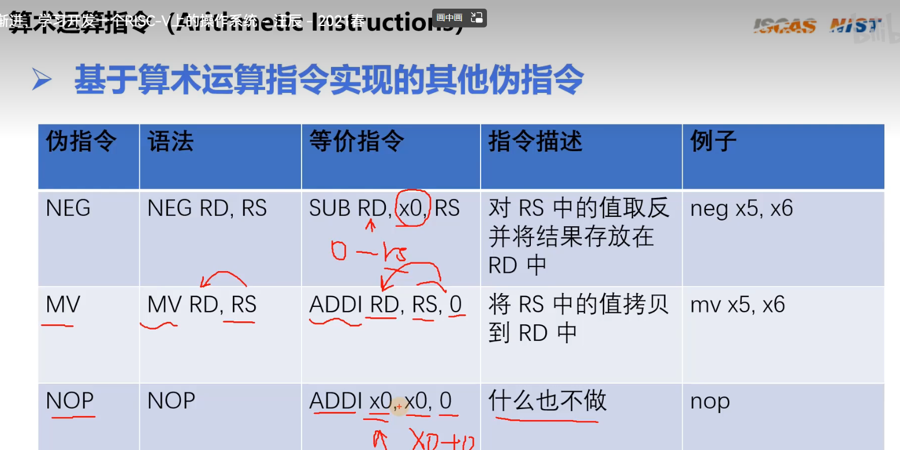


LUI构造大数


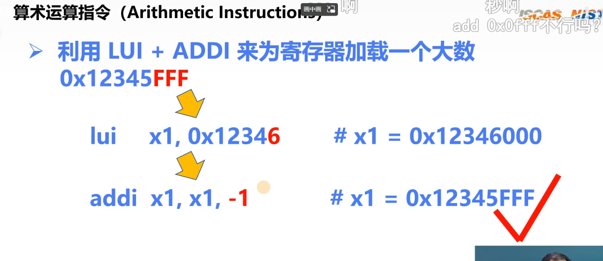

##### LI直接对寄存器赋值


AUIPC：与PC寄存器相加


LA ：把一个地址赋给一个寄存器

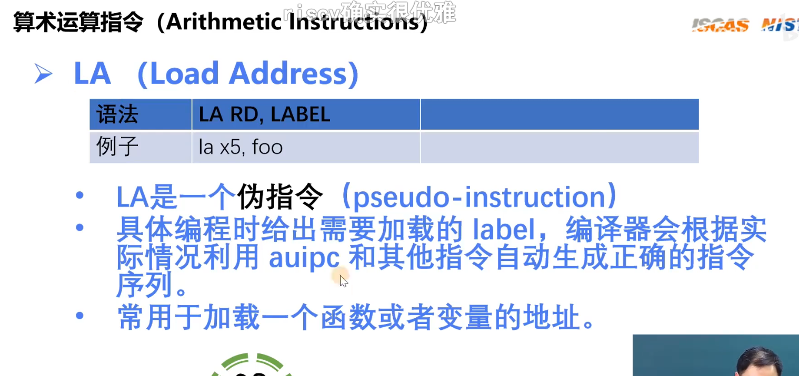


### 逻辑运算指令


### 移位运算指令

##### 逻辑移位：缺位必补零

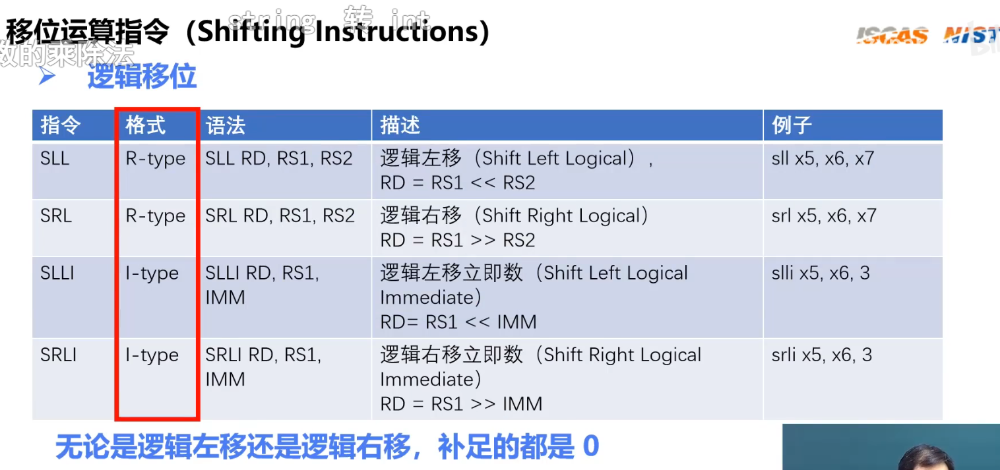

##### 算数移位：按符号位移位


##### 内存读写指令

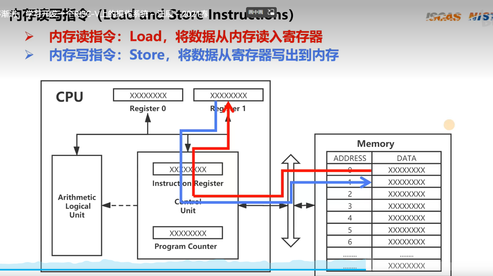

- load type | halfword | word
- U,空位补零，sign-extended,补符号位、
- imm立即数范围，【】


##### 内存写：不考虑符号问题


### 条件分支指令（B-type）

- 等于就跳转imm
- 不等于就跳转imm
- RS1<RS2,就跳转（当作无符号数比较）
- RS1<RS2,就跳转（当作有符号数比较）
- 大于>
- 大于>，当作有符号数比较

1. 跳转是按照 与*当前运行代码*地址偏移量进行跳转。
2. *当前运行代码*地址在PC寄存器上，偏移量是imm
3. 偏移量并不是需要我们来写，链接器会帮我们写偏移量，其实就是 标号的地址
4. imm是12位，也就是能表示4k大小的数也就是2个字节，然而指令是4个字节，C模组（压缩模组）的指令是16位，2字节，所以偏移量必定是偶数，最后一位必定是0.  所以指令中直接省略一位。实际imm的范围是【-4096，4094】
5. 


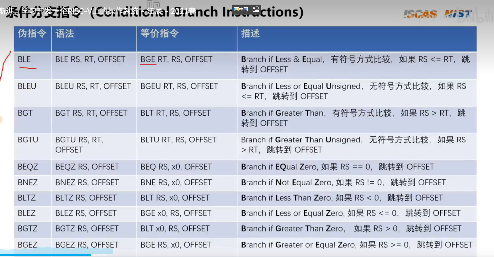

##### 无条件跳转指令（J类型）

- imm是20bit，跳转范围基于pc的+/-1MB
- rd保存下一条指令的地址，一般方便以后调用完后函数回来


- I类型
- imm 12bit，+/-2kb
- rd 存储下一行地址
- rs1： 跳转表示基于pc，而是rs1


不返回的跳转


- 立即数寻址
- 寄存器寻址
- PC相对寻址
- 基址寻址

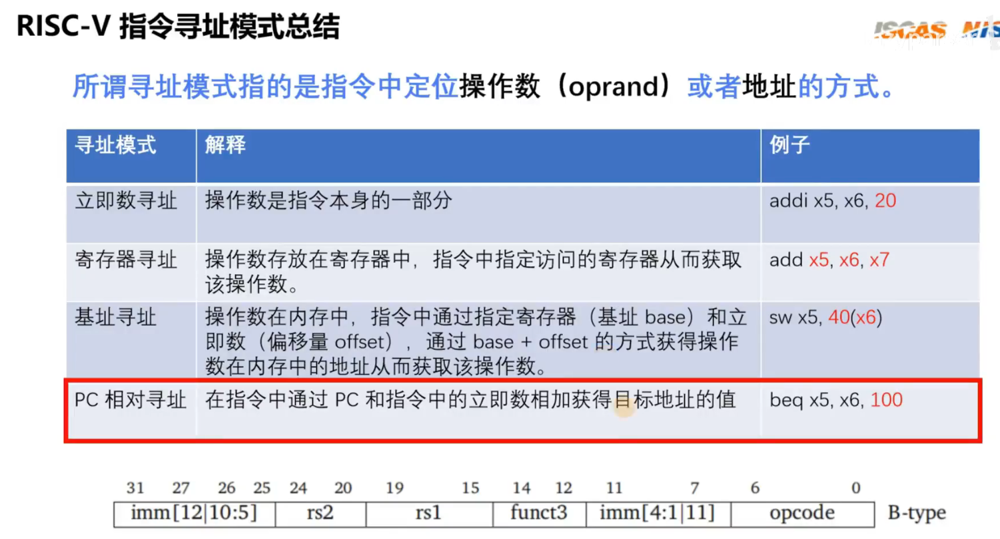

### 函数调用的编程约定

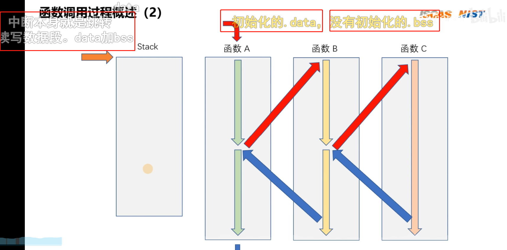

##### Caller 和Callee


3种约定


x3:gp(global pointer)全局指针

x4:tp(thread pointer)线程指针

## 没懂！！

1. zero永零寄存器
2. ra 存放 函数返回值 的地址
   * 每个函数调用时，如果要调用此寄存器，必须先将该寄存器原先的值保存到内存栈中，调用结束时，把该寄存器恢复原样
3. sp 存放 栈指针
4. saved寄存器：
   * 每个函数调用时，如果要调用此寄存器，必须先将该寄存器原先的值保存到内存栈中，调用结束时，把该寄存器恢复原样
5. temp寄存器：
   * 函数调用时，不需要保证该寄存器调用前后数据一致
6. argment寄存器：
   * 大家约定函数传递时，参数放这。


##### 尾调用


- 减少sp的值就是开启一个栈帧，空间的大小取决于所以 使用多少个 saved寄存器 和 load变量
- 将saved寄存器的值保存在栈中
- 如果不是尾调用，而是该函数还需要调用其他函数，则 将 ra寄存器的值保存栈中


```nasm
# Calling Convention
# Demo how to write nested routines
#
# void _start()
# {
#     // calling nested routine
#     aa_bb(3, 4);
# }
#
# int aa_bb(int a, int b)
# {
#     return square(a) + square(b);
# }
#
# int square(int num)
# {
#     return num * num;
# }

	.text			# Define beginning of text section
	.global	_start		# Define entry _start

_start:
	la sp, stack_end	# prepare stack for calling functions	# sp寄存器 存放 栈底地址

	# aa_bb(3, 4);
	li a0, 3													# a0寄存器 写入3
	li a1, 4													# a1寄存器 写入4
	call aa_bb													# 跳转 aa_bb标签的地址

stop:
	j stop			# Infinite loop to stop execution

# int aa_bb(int a, int b)
# return a^2 + b^2
aa_bb:
	# prologue
	addi sp, sp, -16											# 减少16就是开启一个16字节的栈帧， 因为该函数将使用 3个 saved寄存器 和 1个ra寄存器
	sw s0, 0(sp)												# 保存s0寄存器中的值到内存 ，从当前栈指针 0字节处开始写入
	sw s1, 4(sp)												# 保存s1寄存器中的值到内存 ，从当前栈指针 4字节处开始写入
	sw s2, 8(sp)												# 保存s2寄存器中的值到内存 ，从当前栈指针 8字节处开始写入
	sw ra, 12(sp)												# 保存ra寄存器中的值到内存 ，从当前栈指针 12字节处开始写入

	# cp and store the input params
	mv s0, a0													# 将 a0寄存器的值 写入 s0寄存器
	mv s1, a1													# 将 a1寄存器的值 写入 s1寄存器

	# sum will be stored in s2 and is initialized as zero
	li s2, 0													# s2寄存器 初始化为 0

	mv a0, s0													# 将 s0的值 赋值给 a0寄存器（参数寄存器）
	jal square													# 转跳 square 函数
	add s2, s2, a0												# 刚刚 square函数把结果 放在a0 ，现在把a0 和s2(此时值0)相加 赋给 s2

	mv a0, s1													# 将 s1的值 赋值给 a0寄存器（参数寄存器）
	jal square													# 转跳 square 函数
	add s2, s2, a0												# 刚刚 square函数把结果 放在a0 ，现在把a0 和s2(此时值a1^2)相加 赋给 s2

	mv a0, s2													# 把结果 s2 赋给 a0参数寄存器，为什么用a0 存呀？

	# epilogue
	lw s0, 0(sp)			# 把 栈指针0字节处的值 恢复给 s0		
	lw s1, 4(sp)			# 把 栈指针4字节处的值 恢复给 s1
	lw s2, 8(sp)			# 把 栈指针8字节处的值 恢复给 s2
	lw ra, 12(sp)			# 把 栈指针12字节处的值 恢复给 ra
	addi sp, sp, 16			# 栈中 释放这个16字节的栈帧
	ret

# int square(int num)
square:
	# prologue
	addi sp, sp, -8			# 在内存栈中开启8字节的栈帧
	sw s0, 0(sp)			# 把当前 s0寄存器的值 写入栈指针0字节处
	sw s1, 4(sp)			# 把当前 s1寄存器的值 写入栈指针4字节处

	# `mul a0, a0, a0` should be fine,
	# programing as below just to demo we can contine use the stack
	mv s0, a0				# 参数寄存器a0的值 赋给 s0
	mul s1, s0, s0			# s0 和 s0 相乘 赋给 s1
	mv a0, s1				# s1的值 赋给 参数寄存器a0	？？？？

	# epilogue
	lw s0, 0(sp)			# 把 栈指针0字节处的值 恢复给 s0
	lw s1, 4(sp)			# 把 栈指针4字节处的值 恢复给 s1
	addi sp, sp, 8			# 在内存栈中 释放这个8字节的栈帧

	ret						# 返回

	# add nop here just for demo in gdb
	nop

	# allocate stack space
stack_start:
	.rept 12
	.word 0
	.endr
stack_end:

	.end			# End of file

```
