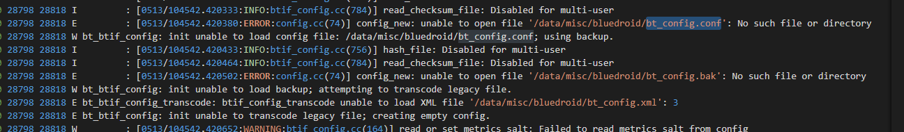
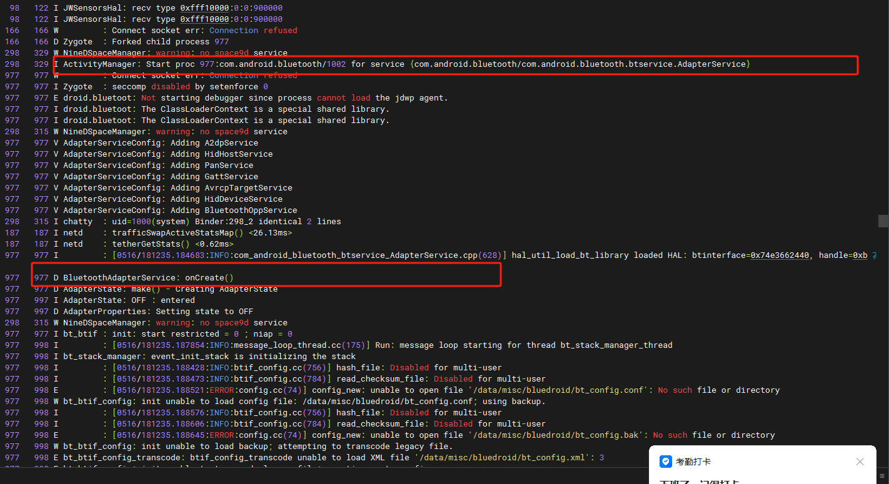

[
](https://blog.csdn.net/qq_25370227/category_12524610.html)

[
](https://blog.csdn.net/qq_25370227/category_12524610.html)

[
](https://blog.csdn.net/qq_25370227/category_12524610.html)

* [android蓝牙协议栈 fluoride_小小鸟飞呀飞的博客-CSDN博客](https://blog.csdn.net/qq_25370227/category_12524610.html)
* [蓝牙  |  Android 开源项目  |  Android Open Source Project](https://source.android.com/docs/core/bluetooth?hl=zh-cn)
* [android.bluetooth  |  Android Developers](https://developer.android.com/reference/android/bluetooth/package-summary)


frameworks/base/core/java/com/android/internal/space/api/BluetoothMock.java

在AOSP中，蓝牙相关的代码和接口主要位于 `system/bt`目录下[^1^](https://source.android.google.cn/docs/core/connect/bluetooth/services?hl=zh-cn)[。这个目录包含了实现Android蓝牙功能的所有源代码](https://source.android.google.cn/docs/core/connect/bluetooth/services?hl=zh-cn)[^1^](https://source.android.google.cn/docs/core/connect/bluetooth/services?hl=zh-cn)。

[如果你想要模拟蓝牙信息，你可能需要查看 `include/hardware/bluetooth.h`文件](https://source.android.google.cn/docs/core/connect/bluetooth/services?hl=zh-cn)[^1^](https://source.android.google.cn/docs/core/connect/bluetooth/services?hl=zh-cn)[。这个文件包含了用于不同服务的蓝牙配置文件](https://source.android.google.cn/docs/core/connect/bluetooth/services?hl=zh-cn)[^1^](https://source.android.google.cn/docs/core/connect/bluetooth/services?hl=zh-cn)。

[此外，你可能还需要查看 `packages/apps/Bluetooth`目录，这个目录包含了Android蓝牙应用的源代码](https://source.android.google.cn/docs/core/connect/bluetooth/services?hl=zh-cn)[^1^](https://source.android.google.cn/docs/core/connect/bluetooth/services?hl=zh-cn)。

[请注意，修改这些代码可能需要一定的Android和蓝牙开发知识。如果你在修改过程中遇到问题，你可以在相关的开发者论坛上寻求帮助](https://source.android.google.cn/docs/core/connect/bluetooth/services?hl=zh-cn)[^1^](https://source.android.google.cn/docs/core/connect/bluetooth/services?hl=zh-cn)。希望这些信息对你有所帮助！

./packages/apps/Bluetooth

packages/services/Telecomm/src/com/android/server/telecom/bluetooth

system/bt/osi/src/alarm.cc

frameworks/base/core/java/android/bluetooth

### 报错分析

Zygote  : seccomp disabled by setenforce 0
05-13 10:45:42.373 28798 28798 E droid.bluetoot: Not starting debugger since process cannot load the jdwp agent.可能是什么意思？

Copilot

正在为你生成答案…

这两条日志信息分别表示：

1. [ **Zygote : seccomp disabled by setenforce 0** ：这条信息表示 `seccomp`（一个Linux内核特性，用于限制进程可以调用的系统调用）被禁用了](https://blog.csdn.net/zhangtengyuan23/article/details/78478969)[^1^](https://blog.csdn.net/zhangtengyuan23/article/details/78478969)[。`setenforce 0`是一个命令，用于将SELinux（一个用于提供访问控制安全策略的Linux内核模块）设置为宽松模式](https://blog.csdn.net/zhangtengyuan23/article/details/78478969)[^2^](https://stackoverflow.com/questions/30998343/how-to-set-selinux-to-0-or-permissive-mode-in-android-4-4-4-and-above)[。在这种模式下，SELinux会允许所有操作，但会记录哪些操作会在强制模式下被拒绝](https://blog.csdn.net/zhangtengyuan23/article/details/78478969)[^2^](https://stackoverflow.com/questions/30998343/how-to-set-selinux-to-0-or-permissive-mode-in-android-4-4-4-and-above)[。这通常用于调试](https://stackoverflow.com/questions/30998343/how-to-set-selinux-to-0-or-permissive-mode-in-android-4-4-4-and-above)[^2^](https://stackoverflow.com/questions/30998343/how-to-set-selinux-to-0-or-permissive-mode-in-android-4-4-4-and-above)。
2. [ **05-13 10:45:42.373 28798 28798 E droid.bluetoot: Not starting debugger since process cannot load the jdwp agent** ：这条信息表示 `droid.bluetooth`进程无法加载JDWP（Java Debug Wire Protocol，Java调试线协议）代理，因此调试器无法启动。JDWP代理是用于处理调试请求和管理调试资源的](https://blog.csdn.net/lijie2664989/article/details/109689067)[^3^](https://blog.csdn.net/lijie2664989/article/details/109689067)。

[这些信息可能表明你的应用或设备正在调试模式下运行，但由于某些原因（如安全策略或配置错误），调试器无法正常启动](https://blog.csdn.net/lijie2664989/article/details/109689067)[^3^](https://blog.csdn.net/lijie2664989/article/details/109689067)。希望这些信息对你有所帮助！

### 报错



### 别触发蓝牙栈启用

```java
@RequiresPermission(Manifest.permission.BLUETOOTH)
    @ScanMode
    public int getScanMode() {
        if (getState() != STATE_ON) {
            return SCAN_MODE_NONE;
        }
        try {
            mServiceLock.readLock().lock();
            if (mService != null) {
                return mService.getScanMode();
            }
        } catch (RemoteException e) {
            Log.e(TAG, "", e);
        } finally {
            mServiceLock.readLock().unlock();
        }
        return SCAN_MODE_NONE;
    }
```

1. **检查蓝牙状态** ：首先，函数通过调用 `getState()`方法来获取当前蓝牙设备的状态。如果蓝牙设备的状态不是 `STATE_ON`（即蓝牙设备没有打开），那么函数就会返回 `SCAN_MODE_NONE`。
2. **获取蓝牙服务** ：然后，函数尝试获取一个读锁，以便安全地访问蓝牙服务。如果蓝牙服务存在（`mService != null`），那么函数就会调用蓝牙服务的 `getScanMode()`方法来获取当前的扫描模式。
3. **处理异常** ：如果在访问蓝牙服务时发生了 `RemoteException`，那么函数就会捕获这个异常，并使用 `Log.e`方法来记录这个异常。
4. **释放读锁** ：最后，无论是否成功获取了扫描模式，函数都会释放读锁。
5. **返回扫描模式** ：如果函数能够成功获取扫描模式，那么它就会返回这个扫描模式。否则，它会返回 `SCAN_MODE_NONE`。


frameworks/base/core/java/android/bluetooth/BluetoothAdapter.java

frameworks/base/core/java/android/bluetooth/BluetoothInputStream.java


    这个枚举类型包含了7个值，分别对应蓝牙适配器的7种状态：

1. **STATE_OFF** ：这个状态表示蓝牙适配器当前处于关闭状态。
2. **STATE_TURNING_ON** ：这个状态表示蓝牙适配器正在打开。
3. **STATE_ON** ：这个状态表示蓝牙适配器已经打开。
4. **STATE_TURNING_OFF** ：这个状态表示蓝牙适配器正在关闭。
5. **STATE_BLE_TURNING_ON** ：这个状态表示低功耗蓝牙（Bluetooth Low Energy，BLE）正在打开。
6. **STATE_BLE_ON** ：这个状态表示低功耗蓝牙已经打开。
7. **STATE_BLE_TURNING_OFF** ：这个状态表示低功耗蓝牙正在关闭。

这些状态可以帮助应用程序了解蓝牙适配器的当前状态，从而做出相应的操作。希望这些信息对你有所帮助！


1. **`SCAN_MODE_NONE`** ：

* **解释** ：设备不进行扫描，不对外广播自身，也无法被其他设备发现或连接。
* **用途** ：用于节省电量或隐私保护。当设备处于这种模式时，它不会主动向外发送任何信号，也不会响应其他设备的连接请求。

1. **`SCAN_MODE_CONNECTABLE`** ：

* **解释** ：设备处于可连接状态，但不可发现。设备不会主动广播其存在信息，但可以接受连接请求。
* **用途** ：用于设备在已知连接的情况下继续保持连接能力。例如，一些设备可以在这种模式下由已配对的设备连接，而无需被新的设备发现。

1. **`SCAN_MODE_CONNECTABLE_DISCOVERABLE`** ：

* **解释** ：设备处于既可连接又可发现的状态。设备会广播其存在信息，并接受新的连接请求。
* **用途** ：用于设备希望被新的设备发现并建立连接的场景。比如，在初次配对或设备配对模式下，设备通常处于这种模式，使其能够被其他设备扫描到并请求连接。


