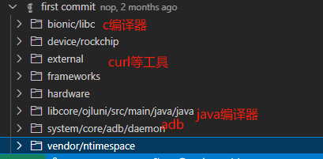

android10镜像 (http://gitlab.ntimespace.com/sdd/android10/-/commits/dev-nop/)

### first commit[755ed66e](http://gitlab.ntimespace.com/sdd/android10/-/commit/755ed66e8738a441b0dcfa5bc995d3b7db2669d2)

- 给一些Clib加上报错日志
- **bionic/libc/system_properties/system_properties.cpp**
- 

##### device/rockchip

- device/rockchip/space-common/device.mk
- device/rockchip/space-common/radio_default.conf

##### frameworks

- base
- native/libs/binder
- opt/net/wifi/service/java/com/android/server/wifi

##### hardware

- ntimespace/space-reference-ril
- rockchip

##### vendor/ntimespace

- command
- etc
- ExtProvide		拓展功能
- Google			google服务支持
- proc_watcher
- s9				s9命令
- script_guard
- space9DService
- su				root权限

---

1. s9和s9dservice

##### s9

s9 ->Space.java ->获得个INineDSpace mService

mService = INineDSpace.Stub.asInterface(ServiceManager.getService("space"));//[获取一个 `INineDSpace`接口的实例，这个实例是在另一个进程中的一个服务](https://blog.csdn.net/weixin_38451161/article/details/88744668)[^1^](https://blog.csdn.net/weixin_38451161/article/details/88744668)。

- business
- system
- dump
- config
- showUsage

##### runUpdateConfig（）

addMap（-a）、delList（-r）

mService.updateMock(addMap, delList); 	->Space9dManagerService.updateMock()

mMockManager.updateMock()			-> MockManager.updateMock()//核心

mMockMap.get(name).map.put(toMockKey(item), addMap.get(item));、、！！！！！！！！！！！！！

mMockMap.get(name).map.remove(toMockKey(item));

##### INineDSpace

frameworks/base/core/java/com/android/internal/space/INineDSpace.aidl

##### vendor/ntimespace/Space9dService

Space:Application -> Space9dManagerService

Space9dManagerService

- mContext
- mModuleManager
- mMockManager
- mServerSocket
- mSystemInfo
- mInterceptor

mServerSocket.startServer();

onStart(
