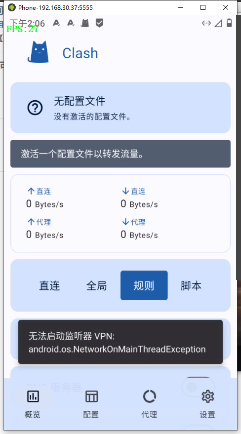
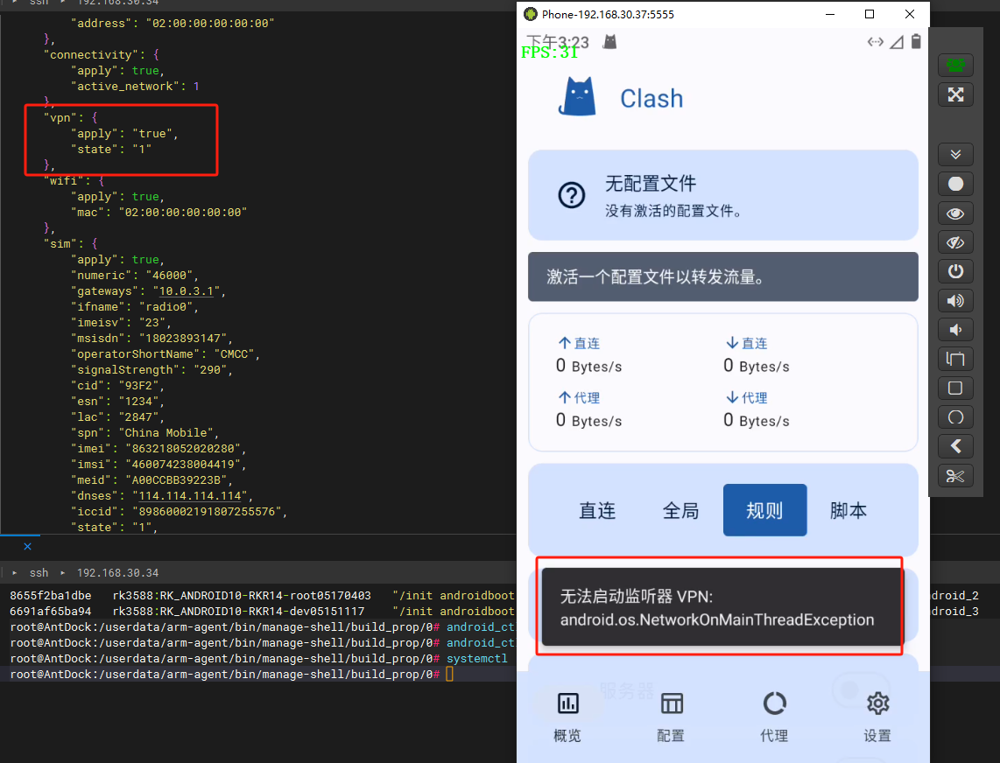

在AOSP(Android Open Source Project)中，VPN相关的代码和资源通常分布在多个目录中。以下是一些可能包含VPN相关代码和资源的主要目录：

1. [ **frameworks/base/services/core/java/com/android/server/connectivity** ：这个目录包含了VPN服务的核心实现，例如 `Vpn.java`文件就定义了VPN服务的主要功能](https://developer.android.com/develop/connectivity/vpn)[^1^](https://developer.android.com/develop/connectivity/vpn)。
2. [ **frameworks/base/core/java/android/net** ：这个目录包含了一些与网络和VPN相关的基础类，例如 `Network.java`和 `VpnService.java`](https://developer.android.com/develop/connectivity/vpn)[^1^](https://developer.android.com/develop/connectivity/vpn)。
3. [ **packages/apps/Settings** ：这个目录包含了系统设置应用的代码，其中的 `VpnSettings.java`文件定义了VPN设置界面的行为](https://developer.android.com/develop/connectivity/vpn)[^1^](https://developer.android.com/develop/connectivity/vpn)。
4. [ **system/netd** ：这个目录包含了一些底层的网络服务和守护进程的代码，可能会涉及到VPN的实现](https://developer.android.com/develop/connectivity/vpn)[^1^](https://developer.android.com/develop/connectivity/vpn)。
5. [ **device** ：这个目录包含了设备特定的代码和资源，如果你正在为特定的设备添加或修改VPN功能，可能需要在这个目录下进行操作](https://stackoverflow.com/questions/64553580/adding-system-app-secure-vpn-in-aosp-from-app-source-code)[^2^](https://stackoverflow.com/questions/64553580/adding-system-app-secure-vpn-in-aosp-from-app-source-code)。
6. [ **packages/apps** ：这个目录包含了所有的应用程序代码，如果你正在开发或修改一个VPN应用，可能需要在这个目录下进行操作](https://stackoverflow.com/questions/64553580/adding-system-app-secure-vpn-in-aosp-from-app-source-code)[^2^](https://stackoverflow.com/questions/64553580/adding-system-app-secure-vpn-in-aosp-from-app-source-code)。

[请注意，这些只是可能包含VPN相关代码和资源的目录，具体的文件和代码可能会根据AOSP的版本和设备的不同而有所不同。如果你需要更详细的信息，我建议你查阅AOSP的官方文档或者直接查看AOSP的源代码](https://developer.android.com/develop/connectivity/vpn)[^1^](https://developer.android.com/develop/connectivity/vpn)。希望这些信息能对你有所帮助！





1. **VpnMock类** ：这个类继承了 `IMockCallback.Stub`，用于模拟VPN的行为。
2. **构造函数** ：在构造函数中，它获取了 `NineDSpaceManager`服务的实例，这个服务可能是用于管理空间的。
3. **isMock方法** ：这个方法用于检查是否已经设置了模拟回调。如果没有，并且 `mSpaceService`已经准备好，那么它会添加一个模拟回调并返回是否成功。
4. **getAppUid方法** ：这个方法接收一个包名作为参数，然后尝试获取这个包对应的应用的UID。如果找不到这个包，那么它会返回-1。
5. **getBypassVpnPackages方法** ：这个方法返回一个列表，包含了所有需要绕过VPN的应用的UID。它首先检查是否设置了模拟，如果没有，那么返回一个空的列表。然后，它从 `mMap`中获取了"bypass.pkgs"和"bypass.uids"的值，这些值是以逗号分隔的字符串。对于每一个包名，它获取其UID并添加到结果列表中。对于每一个UID，如果结果列表中还没有这个UID，那么也添加到结果列表中。
6. **regroupDnsServer方法** ：这个方法接收一个DNS服务器列表作为参数，然后返回一个新的DNS服务器列表。新的列表首先包含了当前活动网络的所有DNS服务器，然后添加了所有还没有在列表中的旧的DNS服务器。
7. **onCallback方法** ：这个方法是 `IMockCallback`接口的一部分，当有回调发生时，它会被调用，并将回调的数据保存到 `mMap`中。


### 错误点

config.dnsServers = mMock.regroupDnsServer(config.dnsServers);

解决方法：

```
            // result.add(inetAddress.getHostName());
            result.add(inetAddress.getHostAddress());
```

原因：


在你的 `regroupDnsServer`函数中，使用 `inetAddress.getHostName()`时程序停止执行，而使用 `inetAddress.getHostAddress()`时程序正常。这主要是由于这两个方法的工作方式和依赖条件不同。

### 区别

- **`inetAddress.getHostAddress()`**:

  - 返回一个字符串，表示 `InetAddress`对象的IP地址。
  - 这个方法不会尝试进行DNS解析，因此它是快速且不会阻塞的。
  - 举例：如果 `inetAddress`是 `192.168.1.1`，那么 `inetAddress.getHostAddress()`将返回 `"192.168.1.1"`。
- **`inetAddress.getHostName()`**:

  - 返回一个字符串，表示 `InetAddress`对象的主机名。如果没有主机名，则返回IP地址。
  - 这个方法尝试进行DNS解析，将IP地址解析为主机名。这可能导致阻塞，特别是在DNS服务器不可用或解析超时时。
  - 举例：如果 `inetAddress`是 `192.168.1.1`，而且该IP地址有一个主机名，例如 `"router.local"`，那么 `inetAddress.getHostName()`将返回 `"router.local"`。如果没有对应的主机名，它会返回 `"192.168.1.1"`。

### 原因分析

1. **DNS解析阻塞**:

   - `getHostName()`会触发一个反向DNS查找，这可能会阻塞，特别是在网络环境不佳或者DNS服务器响应缓慢的情况下。
   - 反向DNS查找需要时间，可能会引起方法的执行停顿。
2. **DNS服务器问题**:

   - 如果DNS服务器配置有问题，或者当前网络环境无法访问DNS服务器，那么 `getHostName()`会因等待DNS响应而长时间阻塞。
3. **主机名缓存**:

   - 在某些情况下，主机名解析可能需要从网络上查询而不是从缓存中获取，这会进一步导致延迟和阻塞。

### 解决方法

如果你不需要主机名，只需要IP地址，使用 `getHostAddress()`是更高效和可靠的做法。如果确实需要主机名，但要避免阻塞，可以考虑以下方法：

- **异步DNS解析**:

  - 使用单独的线程或异步任务进行DNS解析，避免阻塞主线程。
- **缓存主机名**:

  - 如果经常需要解析相同的地址，可以考虑缓存结果，以减少反向DNS查找次数。
- **超时设置**:

  - 配置合理的DNS查询超时，避免长时间等待。

### 代码示例

如果你确实需要主机名，并且愿意承担一定的延迟，可以用如下的异步方法：

```java
new Thread(() -> {
    for (InetAddress inetAddress : addressList) {
        try {
            String hostName = inetAddress.getHostName();
            synchronized (result) {
                result.add(hostName);
            }
        } catch (Exception e) {
            e.printStackTrace();
        }
    }
}).start();
```

这种方式将DNS解析移到一个单独的线程中，避免阻塞主线程的执行。

通过这些方法，你可以有效地避免 `getHostName()`可能带来的阻塞问题，并确保程序的稳定运行。
