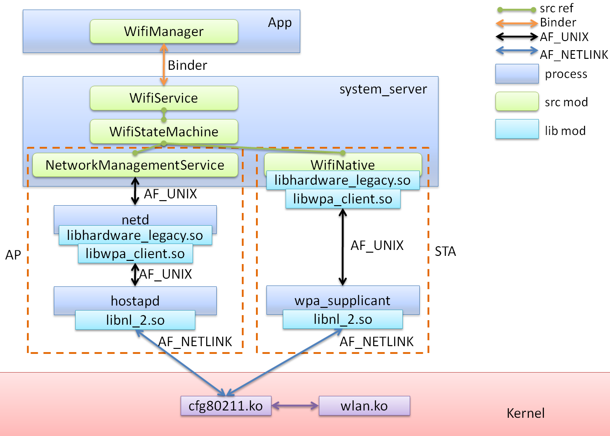

要在AOSP 10中定制Network & Internet设置中的WiFi页面，并实现一个虚拟的WiFi连接，需要修改相关的系统服务和UI代码。以下是找到相关代码文件和实现方法的步骤：

### 1. 找到WiFi设置页面的代码

WiFi设置页面属于系统设置的一部分，主要位于 `Settings`应用中。`Settings`应用的源码在以下路径：

```
packages/apps/Settings/
```

具体的WiFi设置页面位于 `wifi`子目录下：

```
packages/apps/Settings/src/com/android/settings/wifi/
```

### 2. 主要的文件和类

1. **WiFi设置的入口类**：

   - 文件：`WifiSettings.java`
   - 路径：`packages/apps/Settings/src/com/android/settings/wifi/WifiSettings.java`
   - 作用：负责显示WiFi设置页面和处理用户的交互。
2. **WiFi设置的详细页面**：

   - 文件：`WifiDetailPreferenceController.java`
   - 路径：`packages/apps/Settings/src/com/android/settings/wifi/details/WifiDetailPreferenceController.java`
   - 作用：显示具体的WiFi网络详情。

### 3. 修改WiFi设置页面

要mock一个虚拟的WiFi连接，可以从以下几个方面入手：

#### 3.1 修改WiFi扫描结果

为了显示虚拟的WiFi网络，需要修改WiFi扫描结果。在系统服务层，可以拦截或修改扫描结果。WiFi扫描结果主要通过 `WifiService`来管理：

- 文件：`WifiServiceImpl.java`
- 路径：`frameworks/opt/net/wifi/service/java/com/android/server/wifi/WifiServiceImpl.java`

在 `WifiServiceImpl`中，可以找到 `getScanResults()`方法，修改其返回值以添加虚拟的WiFi网络。

#### 3.2 修改连接逻辑

修改WiFi连接逻辑以处理虚拟WiFi连接。在 `WifiServiceImpl`中，可以找到 `connect()`方法，添加对虚拟WiFi网络的处理逻辑。

### 4. 具体实现步骤

#### 4.1 修改 `WifiServiceImpl.java`中的扫描结果

```java
@Override
public List<ScanResult> getScanResults(String callingPackage, String callingFeatureId) {
    List<ScanResult> results = super.getScanResults(callingPackage, callingFeatureId);

    // 添加虚拟的WiFi网络
    ScanResult virtualWifi = new ScanResult();
    virtualWifi.SSID = "Virtual_WiFi";
    virtualWifi.BSSID = "00:11:22:33:44:55";
    virtualWifi.capabilities = "[WPA2-PSK-CCMP][ESS]";
    virtualWifi.level = -50; // 信号强度
    results.add(virtualWifi);

    return results;
}
```

#### 4.2 修改 `WifiServiceImpl.java`中的连接逻辑

```java
@Override
public void connect(int networkId, ActionListener listener, int uid, String packageName) {
    if (isVirtualWifiNetwork(networkId)) {
        // 处理虚拟WiFi连接
        listener.onSuccess();
        return;
    }

    super.connect(networkId, listener, uid, packageName);
}

private boolean isVirtualWifiNetwork(int networkId) {
    // 判断是否是虚拟WiFi网络
    return networkId == VIRTUAL_WIFI_NETWORK_ID;
}
```

#### 4.3 修改UI层

在 `WifiSettings.java`中，可以添加对虚拟WiFi网络的处理逻辑。

```java
// 在初始化WiFi设置时，添加对虚拟WiFi网络的处理
private void initWifiSettings() {
    // 其他初始化代码

    // 添加虚拟WiFi网络
    AccessPoint virtualAp = new AccessPoint(getContext());
    virtualAp.setSsid("Virtual_WiFi");
    virtualAp.setBssid("00:11:22:33:44:55");
    virtualAp.setSecurity(AccessPoint.SECURITY_PSK);
    virtualAp.setLevel(-50);
    mWifiManager.addNetwork(virtualAp.getConfig());
}
```

### 总结

以上步骤展示了如何在AOSP 10中修改WiFi设置页面，并mock一个虚拟的WiFi连接。主要涉及到修改WiFi扫描结果和连接逻辑，同时在UI层添加对虚拟WiFi网络的处理。通过这些修改，可以在定制的操作系统中显示并处理虚拟的WiFi连接。

    [在AOSP 10中，处理WiFi扫描结果的代码主要位于 `WifiConfigController.java`和 `WifiSettings.java`这两个文件中](https://blog.csdn.net/frank_eos/article/details/111409440)[^1^](https://blog.csdn.net/frank_eos/article/details/111409440)[^2^](https://blog.csdn.net/zx54633089/article/details/110943136)。

* [`WifiConfigController.java`：这个文件主要负责处理WiFi配置，包括扫描结果的处理。你可能需要在这个文件中找到处理扫描结果的函数，并进行修改](https://blog.csdn.net/frank_eos/article/details/111409440)[^1^](https://blog.csdn.net/frank_eos/article/details/111409440)[^2^](https://blog.csdn.net/zx54633089/article/details/110943136)。
* [`WifiSettings.java`：这个文件是WiFi设置的主界面，它会显示扫描到的WiFi网络列表。如果你想要修改显示的扫描结果，你可能需要在这个文件中进行修改](https://blog.csdn.net/frank_eos/article/details/111409440)[^1^](https://blog.csdn.net/frank_eos/article/details/111409440)[^2^](https://blog.csdn.net/zx54633089/article/details/110943136)。

请注意，这只是一个大致的指导，具体的实现可能会根据你的具体需求和AOSP版本的不同而有所不同。你可能需要阅读和理解更多的源码，以找到最适合你需求的解决方案。

[希望这些信息对你有所帮助！如果你有其他问题，欢迎随时向我提问。](https://blog.csdn.net/frank_eos/article/details/111409440)[^1^](https://blog.csdn.net/frank_eos/article/details/111409440)[^2^](https://blog.csdn.net/zx54633089/article/details/110943136)

---

[android 10 模仿Settings写WiFi控制 安卓模拟wifi软件_mob64ca14106f2f的技术博客_51CTO博客](https://blog.51cto.com/u_16213684/11060345)

getBSSID（）获取BSSID属性

getDetailedStateOf（）获取客户端的连接性

getHiddenSSID（）获取SSID是否隐藏

getIpAddress（）获取IP地址

getLinkSpeed（）获取连接的速度

getMacAddress（）获取Mac地址

getRssi（）获取802.11n网络的信号

getSSID（）获取SSID

getSupicanState（）获取有关特定客户端端状态的信息

[Fake Wifi Connection (伪装WIFI连接) v1.3 安卓版 下载-脚本之家 (jb51.net)](https://www.jb51.net/softs/188369.html)

---

`XposedMain.java` 在 `FakeWifi` 项目中主要通过以下步骤实现了模拟 WiFi 连接：

1. **初始化 Xposed 模块**：在 `initZygote` 方法中注册 Xposed 模块，使其在 Zygote 进程中初始化。
2. **处理应用加载**：在 `handleLoadPackage` 方法中，检测目标包的加载，并调用 `fakeWifiState` 方法。
3. **模拟 WiFi 状态**：在 `fakeWifiState` 方法中，通过 Xposed Hook 拦截和修改系统 API（如 `isWifiEnabled`、`getConnectionInfo` 等），返回虚假的 WiFi 连接信息，欺骗应用认为设备已连接到 WiFi。

通过这些步骤，`FakeWifi` 项目实现了 WiFi 连接状态的模拟。具体代码可以在 [这里](https://github.com/chylek/FakeWifi/blob/master/app/src/main/java/eu/chylek/adam/fakewifi/XposedMain.java) 查看。

### 详细步骤

1. **`initZygote`**

   - 注册 Xposed 模块，确保模块在 Zygote 进程中初始化。
2. **`handleLoadPackage`**

   - 当加载特定应用包时调用，通常用于修改特定应用的行为。
   - 在该方法中调用 `fakeWifiState` 以修改 WiFi 相关的方法。
3. **`fakeWifiState`**

   - 使用 Xposed API（如 `XposedHelpers.findAndHookMethod`）来拦截和修改与 WiFi 状态相关的方法。
   - 修改方法包括 `isWifiEnabled`、`getConnectionInfo` 等，返回预设的虚假数据。
   - 例如，`isWifiEnabled` 总是返回 `true`，`getConnectionInfo` 返回一个模拟的 `WifiInfo` 对象。

### 参考实现

您可以将类似的逻辑集成到 AOSP 10 源码中，通过修改 WiFi 管理相关的 Java 文件来实现模拟 WiFi 连接。以下是可能需要修改的文件：

- `frameworks/base/services/core/java/com/android/server/wifi/WifiServiceImpl.java`
- `frameworks/base/services/core/java/com/android/server/wifi/WifiStateMachine.java`

通过在这些文件中插入模拟逻辑，可以实现 WiFi 连接状态的虚假返回。

### 总结

通过分析 `FakeWifi` 项目，您可以学习到如何利用 Xposed Hook 修改系统方法以实现模拟 WiFi 连接，并将其应用到 AOSP 10 源码的修改中。需要注意的是，修改 AOSP 源码需要编译整个系统并部署到设备上进行测试。

# WIFI架构



[Android WiFi 架构总览（模块及接口）_示了android系统wifi模块的架构(当然,这只是软件的控制命令部分,数据部分直接通过-CSDN博客](https://blog.csdn.net/xusiwei1236/article/details/48495485)


[Android的Wifi系统框架分析第一篇_wifi在代码的组成结构中-CSDN博客](https://blog.csdn.net/qq_30624591/article/details/95937502?spm=1001.2101.3001.6661.1&utm_medium=distribute.pc_relevant_t0.none-task-blog-2%7Edefault%7Ebaidujs_baidulandingword%7ECtr-1-95937502-blog-48495485.235%5Ev43%5Epc_blog_bottom_relevance_base7&depth_1-utm_source=distribute.pc_relevant_t0.none-task-blog-2%7Edefault%7Ebaidujs_baidulandingword%7ECtr-1-95937502-blog-48495485.235%5Ev43%5Epc_blog_bottom_relevance_base7&utm_relevant_index=1)

- WifiManager: 它是Wifi模块向外部应用透漏出来的接口，其它所有应用都可以通过WifiManager来操作Wifi的各项功能，但是WifiManager本身不具备处理请求的能力，而是把所有的请求转发给WifServiceImpl来处理。
- WifiService: Java Framework中Wifi功能的总入口，负责Wifi功能的核心业务。它是服务器端的实现，作为Wifi部分的核心，处理实际的驱动加载、扫描、链接、断开等命令，以及底层上报的事件。对于主动的命令控制，WiFi是一个简单的封装，针对来自客户端的控制命令，调用相应的WifiNative底层实现。
- WifiServiceImpl: 本身也不具备处理请求的能力，而是将请求分类后交给不同的处理者处理，比如WifiStateMachine。
- WifiStateMachine: 它是一个复杂的状态机，维护了Wifi的启动、扫描、连接、断开等多个状态。它运行自己独有的线程中，拥有自己的消息队列。
- WifiStateTracker: 除了负责WiFi的电源管理模式等功能外，其核心是WifiMonitor所实现的事件轮询机制，以及消息处理函数handleMessage()。
- WifiMonitor: 专门负责接收来自Wpa_supplicant的事件，并将这些信息进行分类再交予StateMachine处理。
- WifiNative: 一个接口类，主要是提供一些native方法用于wifi framework层和WPAS通信。WifiNative的主要实现都在wifi.c函数里,WifiNative不过是将其封装,供framework层调用。

特别注意：WifiService 和 WifiMonitor 是整个模块的核心。WifiService 负责启动关闭 wpa_supplicant、启动关闭 WifiMonitor 监视线程和把命令下发给 wpa_supplicant,而 WifiMonitor 则负责从 wpa_supplicant 接收事件通知。也就是说WifiService负责wifi整个流程的控制，而WifiMonitor负责监视底层的事件。

### frameworks/opt/net/wifi/service/java/com/android/server/wifi/WifiServiceImpl.java

```
public boolean startScan(String packageName)
```

这个代码片段是Android系统中 `WifiServiceImpl`类中的一个方法，用于启动Wi-Fi扫描。下面是详细的解释：

### 函数签名

```java
@Override
public boolean startScan(String packageName) {
```

- `@Override`：表示这是重写父类或接口中的方法。
- `public boolean startScan(String packageName)`：这是一个公开的、返回布尔值的方法，参数是调用该方法的应用程序的包名。

### 权限检查

```java
if (enforceChangePermission(packageName) != MODE_ALLOWED) {
    return false;
}
```

- `enforceChangePermission(packageName)`：检查调用者是否有权限进行操作。如果没有权限，返回 `false`。

### 获取调用者信息

```java
int callingUid = Binder.getCallingUid();
long ident = Binder.clearCallingIdentity();
mLog.info("startScan uid=%").c(callingUid).flush();
```

- `Binder.getCallingUid()`：获取调用该方法的应用程序的UID。
- `Binder.clearCallingIdentity()`：清除调用者的身份信息，记录原来的身份信息以便稍后恢复。
- `mLog.info`：记录日志信息，记录调用者的UID。

### 检查设备是否处于空闲模式

```java
synchronized (this) {
    if (mInIdleMode) {
        sendFailedScanBroadcast();
        mScanPending = true;
        return false;
    }
}
```

- `synchronized (this)`：确保以下代码块是线程安全的。
- `if (mInIdleMode)`：检查设备是否处于空闲模式。如果是，则发送失败的扫描广播，并将扫描挂起标记为 `true`，返回 `false`。

### 权限和扫描操作

```java
try {
    mWifiPermissionsUtil.enforceCanAccessScanResults(packageName, callingUid);
    Mutable<Boolean> scanSuccess = new Mutable<>();
    boolean runWithScissorsSuccess = mWifiInjector.getClientModeImplHandler()
            .runWithScissors(() -> {
                scanSuccess.value = mScanRequestProxy.startScan(callingUid, packageName);
            }, RUN_WITH_SCISSORS_TIMEOUT_MILLIS);
    if (!runWithScissorsSuccess) {
        Log.e(TAG, "Failed to post runnable to start scan");
        sendFailedScanBroadcast();
        return false;
    }
    if (!scanSuccess.value) {
        Log.e(TAG, "Failed to start scan");
        return false;
    }
} catch (SecurityException e) {
    Slog.e(TAG, "Permission violation - startScan not allowed for"
            + " uid=" + callingUid + ", packageName=" + packageName + ", reason=" + e);
    return false;
} finally {
    Binder.restoreCallingIdentity(ident);
}
```

- `try`：尝试执行以下代码，如果发生 `SecurityException`则捕获。
- `mWifiPermissionsUtil.enforceCanAccessScanResults(packageName, callingUid)`：检查调用者是否有权限访问扫描结果。
- `Mutable<Boolean> scanSuccess = new Mutable<>()`：创建一个可变的布尔值对象，存储扫描是否成功。
- `boolean runWithScissorsSuccess = mWifiInjector.getClientModeImplHandler().runWithScissors(...)`：通过 `Handler`在规定时间内执行扫描任务，并将结果存储在 `scanSuccess.value`中。
  - `runWithScissors`：确保在特定的时间内运行任务。
  - `scanSuccess.value = mScanRequestProxy.startScan(callingUid, packageName)`：实际启动扫描操作。
- `if (!runWithScissorsSuccess)`：检查任务是否成功运行。如果不成功，记录错误日志并发送失败的扫描广播，返回 `false`。
- `if (!scanSuccess.value)`：检查扫描是否成功。如果不成功，记录错误日志，返回 `false`。
- `catch (SecurityException e)`：捕获权限异常，记录错误日志，返回 `false`。
- `finally`：无论是否发生异常，都恢复调用者的身份信息。

### 返回成功

```java
return true;
```

- 如果上述所有操作都成功，则返回 `true`。

### 总结

这个方法通过一系列的权限检查和状态检查来确保Wi-Fi扫描操作的安全性和成功执行。如果任何一步失败（如权限不足、设备处于空闲模式、扫描操作失败等），都会适时地记录日志、发送广播并返回 `false`。
