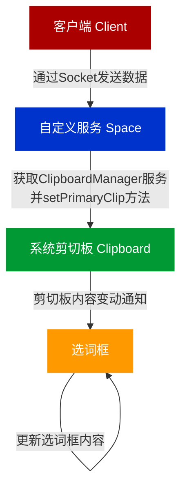
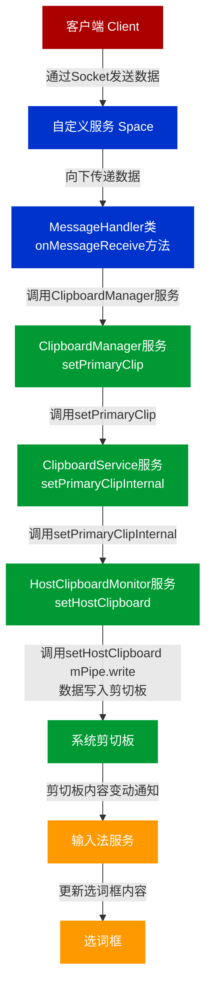

- [x] 3000长度
- [ ] 回环消息
- [ ] 旧接口

---

## 需求

客户端与云机双向复制

### 核心

```java
ClipboardManager clipboard = (ClipboardManager) getSystemService(CLIPBOARD_SERVICE);
clipboard.addPrimaryClipChangedListener(new ClipboardManager.OnPrimaryClipChangedListener() {
    @Override
    public void onPrimaryClipChanged() {
        ClipData clip = clipboard.getPrimaryClip();
        if (clip != null && clip.getItemCount() > 0) {
            CharSequence copiedText = clip.getItemAt(0).getText();
            // 发送copiedText到宿主机
        }
    }
});

```


- ./frameworks/base/core/java/com/android/internal/space/NineDSpaceManager.java:28:    public static final String STATUS_CLIPBOARD = "**clipboard_chanaged**";
- ./vendor/ntimespace/Space9dService/src/com/android/server/SystemInfo.java:6:import static com.android.internal.space.NineDSpaceManager.**STATUS_CLIPBOARD**;
  ./vendor/ntimespace/Space9dService/src/com/android/server/SystemInfo.java:118:                        **mListener**.onInfoChanged(STATUS_CLIPBOARD, bundle);

startListener(SystemInfoListener **listener**) 


- vendor/ntimespace/Space9dService/src/com/android/server/MessageHandler.java

mInfo.startListener(this);

vendor/ntimespace/Space9dService/src/com/android/server/SystemInfo.java

public interface SystemInfoListener

vendor/ntimespace/Space9dService/src/com/android/server/MessageHandler.java

public class MessageHandler implements ServerSocket.MessageListener, SystemInfo.SystemInfoListener

public void onInfoChanged(String action, Bundle bundle) {


Log.d("clipp","");

STATUS_CLIPBOARD = "clipboard_chanaged"

## clipboard_chanaged从执行流向下延申

**frameworks/base/core/java/android/content/ClipboardManager.java**

public void addPrimaryClipChangedListener(OnPrimaryClipChangedListener what) 

  public interface OnPrimaryClipChangedListener {

​    void onPrimaryClipChanged();

  }

**frameworks/base/core/java/com/android/internal/space/NineDSpaceManager.java**

  public static final String STATUS_CLIPBOARD = "**clipboard_chanaged**";

**vendor/ntimespace/Space9dService/src/com/android/server/SystemInfo.java**

import static com.android.internal.space.NineDSpaceManager.**STATUS_CLIPBOARD**;

icm = (ClipboardManager) context.getSystemService(Context.CLIPBOARD_SERVICE);

public void startListener(SystemInfoListener listener) {...

this.mListener = listener;

icm.addPrimaryClipChangedListener(new ClipboardManager.OnPrimaryClipChangedListener() {

mListener.onInfoChanged(**STATUS_CLIPBOARD**, bundle);

...}

  private **SystemInfoListener** mListener;

> **vendor/ntimespace/Space9dService/src/com/android/server/MessageHandler.java**

public class MessageHandler implements ServerSocket.MessageListener, SystemInfo.**SystemInfoListener** {

  public void **onInfoChanged**(String action, Bundle bundle) {

mService.**sendTracking**(action, bundle);

}

> **vendor/ntimespace/Space9dService/src/com/android/server/Space9dManagerService.java**

public void **sendTracking**(String name, Bundle data)

mServerSocket.**send**(message.toString());

this.mServerSocket = new **ServerSocket**(new MessageHandler(this));

> **vendor/ntimespace/Space9dService/src/com/android/server/MessageHandler.java**

public MessageHandler(Space9dManagerService service)

​	mHandler = new Handler(Looper.getMainLooper())

​		public void handleMessage(@NonNull Message msg)

​			getServer().send(sat.mResultTask.socket, mResult.toString());

> **vendor/ntimespace/Space9dService/src/com/android/server/ServerSocket.java**

public **ServerSocket**(MessageListener listener)

public void send(String message)

public void send(LocalSocket socket, String message) 


Sock

```
/data/system/s9_sock
```


### Api

向云机粘贴

```json
{"opType":"clipboard_copy","paste":true,"text":"55555"}
```


---

### clipboard_copy向下延申

**./Space9dService/src/com/android/server/MessageHandler.java:45:**

private static final String OP_WRITE_CLIPBOARD = "clipboard_copy";

> **./Space9dService/src/com/android/server/MessageHandler.java:147:**                

public void onMessageReceive(LocalSocket socket, String data)

case OP_WRITE_CLIPBOARD:
cm = (ClipboardManager) mService.mContext.getSystemService(Context.CLIPBOARD_SERVICE);

cm.setPrimaryClip(ClipData.newPlainText("client", c_text));

setResult(mResult, OP_SUCCESS, "success");

**frameworks/base/services/java/com/android/server/SystemServer.java**

ClipboardService clipboard = new ClipboardService(context);
ServiceManager.addService(Context.CLIPBOARD_SERVICE, clipboard);

**frameworks/base/core/java/android/content/ClipboardManager.java**

public void setPrimaryClip(@NonNull ClipData clip) 

​	mService.setPrimaryClip(clip, mContext.getOpPackageName(), mContext.getUserId());

但是mService = IClipboard.Stub.asInterface(

​        ServiceManager.getServiceOrThrow(Context.CLIPBOARD_SERVICE));

**frameworks/base/services/core/java/com/android/server/clipboard/ClipboardService.java**

public void setPrimaryClip(ClipData clip, String callingPackage, @UserIdInt int userId)

setPrimaryClipInternal(clip, intendingUid);

mHostClipboardMonitor.setHostClipboard(text.toString());

​        mPipe.writeInt(Integer.reverseBytes(content.getBytes().length));

​        mPipe.write(content.getBytes());

setPrimaryClipInternal(getClipboard(userId), clip, uid);

.dispatchPrimaryClipChanged();

---

### 复制导致回环问题


原因：
从外复制到内，会写进剪切板

触发剪切板就会向外复制

---

frameworks/base/core/java/android/content/ClipboardManager.java


`CLIPBOARD_SERVICE` 在 AOSP 项目中的实现涉及多个文件和目录。以下是如何找到这个服务的详细步骤：

### 1. `Context.java` 中的服务定义
在 `frameworks/base/core/java/android/content/Context.java` 文件中，`CLIPBOARD_SERVICE` 定义如下：

```java
public static final String CLIPBOARD_SERVICE = "clipboard";
```

### 2. `ServiceManager` 获取服务
`ClipboardManager` 使用 `ServiceManager` 获取 `CLIPBOARD_SERVICE`。`ServiceManager` 实际上从系统服务中获取服务。

```java
mService = IClipboard.Stub.asInterface(
    ServiceManager.getServiceOrThrow(Context.CLIPBOARD_SERVICE));
```

### 3. 系统服务注册
系统服务是在系统启动时注册的。对于剪贴板服务，它的实现位于 `frameworks/base/services/core/java/com/android/server/clipboard/ClipboardService.java` 中。

### 4. `SystemServer` 注册服务
系统服务是在 `SystemServer` 中注册的。在 `frameworks/base/services/java/com/android/server/SystemServer.java` 文件中，可以找到注册 `ClipboardService` 的代码：

```java
ClipboardService clipboard = new ClipboardService(context);
ServiceManager.addService(Context.CLIPBOARD_SERVICE, clipboard);
```

### 具体步骤
1. **定义**:
   - `frameworks/base/core/java/android/content/Context.java` 中定义了 `CLIPBOARD_SERVICE` 常量。
   
   ```java
   public static final String CLIPBOARD_SERVICE = "clipboard";
   ```

2. **获取服务**:
   - `frameworks/base/core/java/android/content/ClipboardManager.java` 中使用 `ServiceManager` 获取 `CLIPBOARD_SERVICE`。
   
   ```java
   mService = IClipboard.Stub.asInterface(
       ServiceManager.getServiceOrThrow(Context.CLIPBOARD_SERVICE));
   ```

3. **系统服务实现**:
   - `frameworks/base/services/core/java/com/android/server/clipboard/ClipboardService.java` 中实现了剪贴板服务。
   
   ```java
   public class ClipboardService extends IClipboard.Stub {
       // 实现细节
   }
   ```

4. **系统服务注册**:
   - `frameworks/base/services/java/com/android/server/SystemServer.java` 中注册了剪贴板服务。
   
   ```java
   ClipboardService clipboard = new ClipboardService(context);
   ServiceManager.addService(Context.CLIPBOARD_SERVICE, clipboard);
   ```

### 结论
`CLIPBOARD_SERVICE` 在 AOSP 10 项目中的定义、实现和注册路径如下：

- **定义**: `frameworks/base/core/java/android/content/Context.java`
- **获取服务**: `frameworks/base/core/java/android/content/ClipboardManager.java`
- **服务实现**: `frameworks/base/services/core/java/com/android/server/clipboard/ClipboardService.java`
- **服务注册**: `frameworks/base/services/java/com/android/server/SystemServer.java`

通过这些文件和路径，你可以了解 `CLIPBOARD_SERVICE` 的完整实现过程。


----

### 监听的逻辑(逆推)

**frameworks/base/core/java/android/content/ClipboardManager.java**

注册监听器

```java
public void addPrimaryClipChangedListener(OnPrimaryClipChangedListener what) {
    synchronized (mPrimaryClipChangedListeners) {
        if (mPrimaryClipChangedListeners.contains(what)) {
            return;
        }
        mPrimaryClipChangedListeners.add(what);
        if (mPrimaryClipChangedListeners.size() == 1) {
            mService.addPrimaryClipChangedListener(mPrimaryClipChangedListener);
        }
    }
}

```

剪切板内容变化

```java
private final IOnPrimaryClipChangedListener mPrimaryClipChangedListener = new IOnPrimaryClipChangedListener.Stub() {
    @Override
    public void dispatchPrimaryClipChanged() {
        ClipboardManager.this.dispatchPrimaryClipChanged();
    }
};

void dispatchPrimaryClipChanged() {
    ArrayList<OnPrimaryClipChangedListener> listeners;
    synchronized (mPrimaryClipChangedListeners) {
        if (mPrimaryClipChangedListeners.isEmpty()) {
            return;
        }
        listeners = new ArrayList<>(mPrimaryClipChangedListeners);
    }

    for (int i = 0; i < listeners.size(); i++) {
        listeners.get(i).onPrimaryClipChanged();
    }
}

```

**frameworks/base/services/core/java/com/android/server/clipboard/ClipboardService.java**

void setPrimaryClipInternal(PerUserClipboard clipboard, @Nullable ClipData clip,

​      int uid)


### 回环问题


### 流程图




##### 解释

1. Space的MessageHandler类的onMessageReceive方法，收到socket数据，向下传递
2. 安卓系统的ClipboardManager服务的方法setPrimaryClip（），把数据向下传递 
3. 安卓系统的ClipboardService服务setPrimaryClip（）setPrimaryClipInternal（），把数据向下传递 
4. 安卓系统的HostClipboardMonitor服务的setHostClipboard（）把数据向下传递 
   mPipe.writeInt(Integer.reverseBytes(content.getBytes().length)); 
   mPipe.write(content.getBytes()); 

最终内容到底系统的剪切板

 然后就是输入法会监听到系统剪切板变动 把剪切板的最新内容放到输入法的选词框



