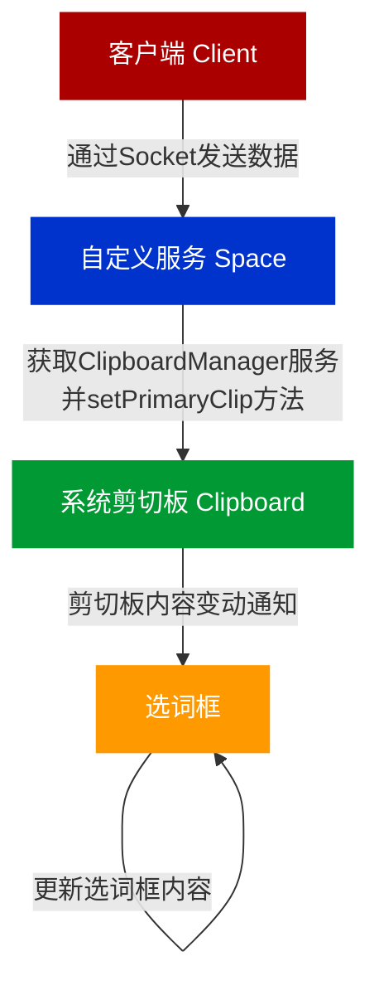
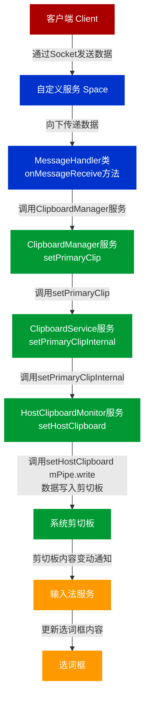

- [x] 3000长度
- [ ] 回环消息
- [ ] 旧接口

---

## 需求

客户端与云机双向复制

### 核心

- ./frameworks/base/core/java/com/android/internal/space/NineDSpaceManager.java:28:    public static final String STATUS_CLIPBOARD = "**clipboard_chanaged**";
- ./vendor/ntimespace/Space9dService/src/com/android/server/SystemInfo.java:6:import static com.android.internal.space.NineDSpaceManager.**STATUS_CLIPBOARD**;
  ./vendor/ntimespace/Space9dService/src/com/android/server/SystemInfo.java:118:                        **mListener**.onInfoChanged(STATUS_CLIPBOARD, bundle);

startListener(SystemInfoListener **listener**) 


- vendor/ntimespace/Space9dService/src/com/android/server/MessageHandler.java

mInfo.startListener(this);

vendor/ntimespace/Space9dService/src/com/android/server/SystemInfo.java

public interface SystemInfoListener

vendor/ntimespace/Space9dService/src/com/android/server/MessageHandler.java

public class MessageHandler implements ServerSocket.MessageListener, SystemInfo.SystemInfoListener

public void onInfoChanged(String action, Bundle bundle) {


Log.d("clipp","");

STATUS_CLIPBOARD = "clipboard_chanaged"

## clipboard_chanaged从执行流向下延申

**frameworks/base/core/java/android/content/ClipboardManager.java**

public void addPrimaryClipChangedListener(OnPrimaryClipChangedListener what) 

  public interface OnPrimaryClipChangedListener {

​    void onPrimaryClipChanged();

  }

**frameworks/base/core/java/com/android/internal/space/NineDSpaceManager.java**

  public static final String STATUS_CLIPBOARD = "**clipboard_chanaged**";

**vendor/ntimespace/Space9dService/src/com/android/server/SystemInfo.java**

import static com.android.internal.space.NineDSpaceManager.**STATUS_CLIPBOARD**;

icm = (ClipboardManager) context.getSystemService(Context.CLIPBOARD_SERVICE);

public void startListener(SystemInfoListener listener) {...

this.mListener = listener;

icm.addPrimaryClipChangedListener(new ClipboardManager.OnPrimaryClipChangedListener() {

mListener.onInfoChanged(**STATUS_CLIPBOARD**, bundle);

...}

  private **SystemInfoListener** mListener;

> **vendor/ntimespace/Space9dService/src/com/android/server/MessageHandler.java**

public class MessageHandler implements ServerSocket.MessageListener, SystemInfo.**SystemInfoListener** {

  public void **onInfoChanged**(String action, Bundle bundle) {

mService.**sendTracking**(action, bundle);

}

> **vendor/ntimespace/Space9dService/src/com/android/server/Space9dManagerService.java**

public void **sendTracking**(String name, Bundle data)

mServerSocket.**send**(message.toString());

this.mServerSocket = new **ServerSocket**(new MessageHandler(this));

> **vendor/ntimespace/Space9dService/src/com/android/server/MessageHandler.java**

public MessageHandler(Space9dManagerService service)

​	mHandler = new Handler(Looper.getMainLooper())

​		public void handleMessage(@NonNull Message msg)

​			getServer().send(sat.mResultTask.socket, mResult.toString());

> **vendor/ntimespace/Space9dService/src/com/android/server/ServerSocket.java**

public **ServerSocket**(MessageListener listener)

public void send(String message)

public void send(LocalSocket socket, String message) 


Sock

```
/data/system/s9_sock
```


### Api

向云机粘贴

```json
{"opType":"clipboard_copy","paste":true,"text":"55555"}
```


---

### clipboard_copy向下延申

**./Space9dService/src/com/android/server/MessageHandler.java:45:**

private static final String OP_WRITE_CLIPBOARD = "clipboard_copy";

> **./Space9dService/src/com/android/server/MessageHandler.java:147:**                

public void onMessageReceive(LocalSocket socket, String data)

case OP_WRITE_CLIPBOARD:
cm = (ClipboardManager) mService.mContext.getSystemService(Context.CLIPBOARD_SERVICE);

cm.setPrimaryClip(ClipData.newPlainText("client", c_text));

setResult(mResult, OP_SUCCESS, "success");

**frameworks/base/services/java/com/android/server/SystemServer.java**

ClipboardService clipboard = new ClipboardService(context);
ServiceManager.addService(Context.CLIPBOARD_SERVICE, clipboard);

**frameworks/base/core/java/android/content/ClipboardManager.java**

public void setPrimaryClip(@NonNull ClipData clip) 

​	mService.setPrimaryClip(clip, mContext.getOpPackageName(), mContext.getUserId());

但是mService = IClipboard.Stub.asInterface(

​        ServiceManager.getServiceOrThrow(Context.CLIPBOARD_SERVICE));

**frameworks/base/services/core/java/com/android/server/clipboard/ClipboardService.java**

public void setPrimaryClip(ClipData clip, String callingPackage, @UserIdInt int userId)

setPrimaryClipInternal(clip, intendingUid);

mHostClipboardMonitor.setHostClipboard(text.toString());

​        mPipe.writeInt(Integer.reverseBytes(content.getBytes().length));

​        mPipe.write(content.getBytes());

setPrimaryClipInternal(getClipboard(userId), clip, uid);

.dispatchPrimaryClipChanged();

---

### 复制导致回环问题


原因：
从外复制到内，会写进剪切板

触发剪切板就会向外复制

---

frameworks/base/core/java/android/content/ClipboardManager.java


`CLIPBOARD_SERVICE` 在 AOSP 项目中的实现涉及多个文件和目录。以下是如何找到这个服务的详细步骤：

### 1. `Context.java` 中的服务定义
在 `frameworks/base/core/java/android/content/Context.java` 文件中，`CLIPBOARD_SERVICE` 定义如下：

```java
public static final String CLIPBOARD_SERVICE = "clipboard";
```

### 2. `ServiceManager` 获取服务
`ClipboardManager` 使用 `ServiceManager` 获取 `CLIPBOARD_SERVICE`。`ServiceManager` 实际上从系统服务中获取服务。

```java
mService = IClipboard.Stub.asInterface(
    ServiceManager.getServiceOrThrow(Context.CLIPBOARD_SERVICE));
```

### 3. 系统服务注册
系统服务是在系统启动时注册的。对于剪贴板服务，它的实现位于 `frameworks/base/services/core/java/com/android/server/clipboard/ClipboardService.java` 中。

### 4. `SystemServer` 注册服务
系统服务是在 `SystemServer` 中注册的。在 `frameworks/base/services/java/com/android/server/SystemServer.java` 文件中，可以找到注册 `ClipboardService` 的代码：

```java
ClipboardService clipboard = new ClipboardService(context);
ServiceManager.addService(Context.CLIPBOARD_SERVICE, clipboard);
```

### 具体步骤
1. **定义**:
   - `frameworks/base/core/java/android/content/Context.java` 中定义了 `CLIPBOARD_SERVICE` 常量。
   
   ```java
   public static final String CLIPBOARD_SERVICE = "clipboard";
   ```

2. **获取服务**:
   - `frameworks/base/core/java/android/content/ClipboardManager.java` 中使用 `ServiceManager` 获取 `CLIPBOARD_SERVICE`。
   
   ```java
   mService = IClipboard.Stub.asInterface(
       ServiceManager.getServiceOrThrow(Context.CLIPBOARD_SERVICE));
   ```

3. **系统服务实现**:
   - `frameworks/base/services/core/java/com/android/server/clipboard/ClipboardService.java` 中实现了剪贴板服务。
   
   ```java
   public class ClipboardService extends IClipboard.Stub {
       // 实现细节
   }
   ```

4. **系统服务注册**:
   - `frameworks/base/services/java/com/android/server/SystemServer.java` 中注册了剪贴板服务。
   
   ```java
   ClipboardService clipboard = new ClipboardService(context);
   ServiceManager.addService(Context.CLIPBOARD_SERVICE, clipboard);
   ```

### 结论
`CLIPBOARD_SERVICE` 在 AOSP 10 项目中的定义、实现和注册路径如下：

- **定义**: `frameworks/base/core/java/android/content/Context.java`
- **获取服务**: `frameworks/base/core/java/android/content/ClipboardManager.java`
- **服务实现**: `frameworks/base/services/core/java/com/android/server/clipboard/ClipboardService.java`
- **服务注册**: `frameworks/base/services/java/com/android/server/SystemServer.java`

通过这些文件和路径，你可以了解 `CLIPBOARD_SERVICE` 的完整实现过程。


----

### 监听的逻辑(逆推)

**frameworks/base/core/java/android/content/ClipboardManager.java**

注册监听器

```java
public void addPrimaryClipChangedListener(OnPrimaryClipChangedListener what) {
    synchronized (mPrimaryClipChangedListeners) {
        if (mPrimaryClipChangedListeners.contains(what)) {
            return;
        }
        mPrimaryClipChangedListeners.add(what);
        if (mPrimaryClipChangedListeners.size() == 1) {
            mService.addPrimaryClipChangedListener(mPrimaryClipChangedListener);
        }
    }
}

```

剪切板内容变化

```java
private final IOnPrimaryClipChangedListener mPrimaryClipChangedListener = new IOnPrimaryClipChangedListener.Stub() {
    @Override
    public void dispatchPrimaryClipChanged() {
        ClipboardManager.this.dispatchPrimaryClipChanged();
    }
};

void dispatchPrimaryClipChanged() {
    ArrayList<OnPrimaryClipChangedListener> listeners;
    synchronized (mPrimaryClipChangedListeners) {
        if (mPrimaryClipChangedListeners.isEmpty()) {
            return;
        }
        listeners = new ArrayList<>(mPrimaryClipChangedListeners);
    }

    for (int i = 0; i < listeners.size(); i++) {
        listeners.get(i).onPrimaryClipChanged();
    }
}

```

**frameworks/base/services/core/java/com/android/server/clipboard/ClipboardService.java**

void setPrimaryClipInternal(PerUserClipboard clipboard, @Nullable ClipData clip,

​      int uid)


### 回环问题


### 流程图




##### 解释

1. Space的MessageHandler类的onMessageReceive方法，收到socket数据，向下传递
2. 安卓系统的ClipboardManager服务的方法setPrimaryClip（），把数据向下传递 
3. 安卓系统的ClipboardService服务setPrimaryClip（）setPrimaryClipInternal（），把数据向下传递 
4. 安卓系统的HostClipboardMonitor服务的setHostClipboard（）把数据向下传递 
   mPipe.writeInt(Integer.reverseBytes(content.getBytes().length)); 
   mPipe.write(content.getBytes()); 

最终内容到底系统的剪切板

 然后就是输入法会监听到系统剪切板变动 把剪切板的最新内容放到输入法的选词框



---

#### 识别剪切板改动的类型：

在Android系统中，`ClipboardManager` 监听器的 `onPrimaryClipChanged()` 方法并不能直接区分剪切（cut）和复制（copy）操作。无论是剪切还是复制，`onPrimaryClipChanged()` 都会被调用，而没有提供内置的标志或方法来区分这两种操作。

但是，有一种间接的方法可以帮助推测剪切和复制的行为。以下是两个可能的思路：

##### 1. 通过剪切板内容的变动推测：
   - **复制操作**：通常不会清空源内容。
   - **剪切操作**：在剪切操作后，源内容通常会被清空。

你可以在剪切板内容发生变化后，检查与源内容相关的控件（如EditText或其他文本框）是否变为空来推测是否是剪切操作。不过这种方法并不总是准确，因为复制后也可以手动删除内容。

##### 2. 自定义实现剪切功能：
   - 如果你在开发自定义应用或自定义Android系统，可以考虑在剪切操作时添加自定义的标记。例如，通过重写剪切功能，在执行剪切操作时在剪切板上附加特定标记，这样你在监听剪贴板变化时可以识别该标记，从而判断出是剪切操作。

例如：
```java
public void customCutFunction(Context context, CharSequence textToCut) {
    ClipboardManager clipboard = (ClipboardManager) context.getSystemService(Context.CLIPBOARD_SERVICE);
    ClipData clip = ClipData.newPlainText("cut", textToCut);
    clipboard.setPrimaryClip(clip);
    // 清空源内容
}
```

然后在 `onPrimaryClipChanged()` 中可以通过 `ClipData` 的 `getDescription()` 方法检查这个标记：
```java
ClipDescription description = clipData.getDescription();
if (description.hasMimeType("text/plain")) {
    if ("cut".equals(description.getLabel())) {
        // 是剪切操作
    }
}
```

##### 总结
虽然Android原生API中没有直接区分剪切和复制的方法，但可以通过自定义的方法实现这种识别。最直接的方法是对剪切功能进行改造，在剪切时标记内容。

---

#### 区分复制剪切

**frameworks/ex/common/java/com/android/ex/editstyledtext/EditStyledText.java**

​    private EditorManager mManager;
public static final int MODE_CUT = 7;

​    mManager.onAction(MODE_CUT);

   mActionMap.put(EditStyledText.MODE_CUT, mCutAction);

private class EditorManager 

​		    private EditModeActions mActions;
​			public class EditModeActions

public void onAction(int mode, boolean notifyStateChanged)

mActions.onAction(mode);

mEST.notifyStateChanged(mMode, mState);


public class CopyAction extends TextViewActionBase

mManager.copyToClipBoard();

 public class CutAction extends TextViewActionBase

mManager.cutToClipBoard();

```java
        private void copyToClipBoard() {
            int min = Math.min(getSelectionStart(), getSelectionEnd());
            int max = Math.max(getSelectionStart(), getSelectionEnd());
            mCopyBuffer = (SpannableStringBuilder) mEST.getText().subSequence(min, max);
            SpannableStringBuilder clipboardtxt = removeImageChar(mCopyBuffer);
            ClipboardManager clip =
                    (ClipboardManager) getContext()
                            .getSystemService(Context.CLIPBOARD_SERVICE);
            clip.setText(clipboardtxt);
            if (DBG) {
                dumpSpannableString(clipboardtxt);
                dumpSpannableString(mCopyBuffer);
            }
        }

        private void cutToClipBoard() {
            copyToClipBoard();
            int min = Math.min(getSelectionStart(), getSelectionEnd());
            int max = Math.max(getSelectionStart(), getSelectionEnd());
            mEST.getText().delete(min, max);
        }
```


### 同名异包

为什么vendor/ntimespace/Space9dService/src/com/android/server/MessageHandler.java 中，引入的是import android.content.ClipboardManager; 而frameworks/ex/common/java/com/android/ex/editstyledtext/EditStyledText.java中导入的是import android.text.ClipboardManager;


这两个文件中导入的 `ClipboardManager` 类分别来自不同的包，这反映了它们在 Android 系统中的不同上下文和用途。让我们详细解释一下它们之间的区别。

### `import android.content.ClipboardManager;`

**文件位置**: `vendor/ntimespace/Space9dService/src/com/android/server/MessageHandler.java`

**解释**:
- **`android.content.ClipboardManager`** 是 Android 提供的标准剪贴板管理类，用于访问和操作系统剪贴板中的数据。
- 这个类通常用于应用程序的标准剪贴板操作，如复制和粘贴文本。
- 你可以通过 `ClipboardManager` 类来获取剪贴板的内容（`getPrimaryClip()`），设置剪贴板的内容（`setPrimaryClip()`），并监听剪贴板内容的变化。

**使用场景**:
- 在普通的应用程序开发中，这个类用于处理用户复制粘贴的操作。它的主要作用是提供对剪贴板内容的访问和管理功能。

### `import android.text.ClipboardManager;`

**文件位置**: `frameworks/ex/common/java/com/android/ex/editstyledtext/EditStyledText.java`

**解释**:
- **`android.text.ClipboardManager`** 是一个较早的 API，曾经用于剪贴板操作。但在较新的 Android 版本中，`ClipboardManager` 类已经被移到了 `android.content` 包中。
- 这个类可能是为了兼容旧代码或是某些特定的用法而保留的。

**使用场景**:
- 如果你在 Android 开发中看到 `android.text.ClipboardManager` 的导入，这通常是因为代码需要与旧版本的 Android 兼容，或者该类在某些情况下被特定的库或框架使用。

### 为什么会有这两种导入

1. **版本兼容性**:
   - **`android.text.ClipboardManager`** 可能是旧代码中的遗留部分，尤其是在过渡到新的 API 版本时。为了确保向后兼容，旧版本的库或应用可能仍会使用旧的类。
   - **`android.content.ClipboardManager`** 是新版本的标准实现，用于处理剪贴板操作。

2. **API 更新**:
   - Android 系统的 API 经过多次更新，某些类和方法被移动到新的包中。`ClipboardManager` 从 `android.text` 移动到 `android.content` 是其中的一部分。

### 如何解决导入问题

如果你正在处理 Android 系统中的剪贴板管理，建议使用 **`android.content.ClipboardManager`**，这是最新且被推荐的实现。你可以通过以下步骤更新代码：

1. **检查 `import` 语句**: 确保在你的代码中导入了正确的 `ClipboardManager` 类。
   ```java
   import android.content.ClipboardManager;
   ```

2. **更新代码**: 根据新的 API 使用 `android.content.ClipboardManager` 提供的方法，如 `getPrimaryClip()` 和 `setPrimaryClip()`。

3. **迁移旧代码**: 如果你维护旧的代码或库，考虑更新为新的 API 以便与最新的 Android 版本兼容。

通过这些步骤，你可以确保你的代码使用最新的 API，并且可以避免可能的兼容性问题。

---

### 云机到客户的消息传递

vendor/ntimespace/Space9dService/src/com/android/server/ServerSocket.java:28:    private static final String SOCKET_PATH = "/data/system/s9_sock";

vendor/ntimespace/Space9dService/src/com/android/server/MessageHandler.java:212:            if(action.equals("clipboardChanaged") && isCopyFromArmStream>0){

```shell
root@snowrepo:/snow/android10-rk3588# grep -Hnr clipboardChanaged  frameworks/base/
frameworks/base/core/java/com/android/internal/space/NineDSpaceManager.java:30:    public static final String STATUS_CLIPBOARD = "clipboardChanaged";
root@snowrepo:/snow/android10-rk3588# 
```


添加剪切板监听器

**vendor/ntimespace/Space9dService/src/com/android/server/SystemInfo.java**

public void startListener(SystemInfoListener listener)

- icm.addPrimaryClipChangedListener(new ClipboardManager.OnPrimaryClipChangedListener() 
  - public void onPrimaryClipChanged()
    - mListener.onInfoChanged(STATUS_CLIPBOARD, bundle);

**vendor/ntimespace/Space9dService/src/com/android/server/MessageHandler.java**

public void onInfoChanged(String action, Bundle bundle)

- mService.sendTracking(action, bundle);

**vendor/ntimespace/Space9dService/src/com/android/server/Space9dManagerService.java**

public void sendTracking(String name, Bundle data) throws RemoteException

- mServerSocket.send(message.toString());

**vendor/ntimespace/Space9dService/src/com/android/server/ServerSocket.java**

public void send(String message) 

- public void send(LocalSocket socket, String message)
  - outputStream.write(sendMsg.getBytes());//此时写入socket