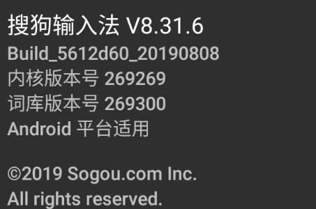

### 2种不同的输入方案

1. uinput
2. adb的输入

[android - ADB Shell Input Events - Stack Overflow](https://stackoverflow.com/questions/7789826/adb-shell-input-events?newreg=249708cb091c4c1796cb7f932c28e999)

### setevent和getevent

uinput可以捕捉

adb无法捕捉

### 游戏按键

uinput 无法操作游戏

adb可以

在安卓系统中，`input keyevent`和 `sendevent`都可以用来模拟用户的输入事件，但它们的工作方式有所不同。

[`input keyevent`命令是Android系统中的一个特殊命令，用于模拟遥控器、键盘、鼠标的各种按键操作](https://blog.csdn.net/weixin_39966398/article/details/110525634)[^1^](https://blog.csdn.net/weixin_39966398/article/details/110525634)[。例如，`input keyevent 51`会模拟按下键盘上的&#34;W&#34;键。这个命令直接生成一个KeyEvent事件，并将其发送到当前活动的窗口](https://zhuanlan.zhihu.com/p/254682529)[^2^](https://zhuanlan.zhihu.com/p/254682529)。

[另一方面，`sendevent`命令可以将原始事件写入到设备节点中，从而实现模拟用户输入的功能](https://blog.csdn.net/weixin_39966398/article/details/110525634)[^1^](https://blog.csdn.net/weixin_39966398/article/details/110525634)[。例如，你提供的 `sendevent`命令序列会模拟按下和释放键盘上的&#34;W&#34;键。然而，这个命令生成的是一个原始的内核事件，这个事件需要经过Android输入系统的处理才能转换为一个KeyEvent或MotionEvent对象](https://zhuanlan.zhihu.com/p/254682529)[^2^](https://zhuanlan.zhihu.com/p/254682529)。

在大多数情况下，这两种方法都可以模拟按键输入。然而，在一些特殊的情况下，如游戏，可能需要特定类型的输入事件。因此，如果游戏只响应KeyEvent事件，那么使用 `input keyevent`命令可能会有所作用，而使用 `sendevent`命令可能不会有任何反应。

总的来说，`input keyevent`和 `sendevent`命令在模拟用户输入时，可能会因为应用程序的不同而产生不同的效果。具体的效果可能取决于应用程序如何处理不同类型的输入事件。希望这个解释对你有所帮助！

### 关于Q键的问题

input-dev-server 注册Q键就可以解决

### 关于组合键

他们执行的操作是 :		shift按下,shift抬起,其他键按下,其他键抬起
其实应该执行的操作是:	shift按下,其他键按下,其他键抬起,shift抬起关于中文输入法

搜狗

[`sendevent` 命令可以直接向设备发送原始事件](https://source.android.com/docs/core/interaction/input/getevent)[^1^](https://source.android.com/docs/core/interaction/input/getevent)[^2^](https://blog.csdn.net/armfpga123/article/details/56020874)[^3^](https://blog.csdn.net/kevinx_xu/article/details/23536003)[。这些事件是由硬件设备（如触摸屏或按键）产生的，然后由 Linux 内核的输入子系统处理](https://source.android.com/docs/core/interaction/input/getevent)[^1^](https://source.android.com/docs/core/interaction/input/getevent)[^2^](https://blog.csdn.net/armfpga123/article/details/56020874)[^3^](https://blog.csdn.net/kevinx_xu/article/details/23536003)[。使用 `sendevent` 命令，你可以模拟这些硬件事件，就像真正的硬件设备一样](https://source.android.com/docs/core/interaction/input/getevent)[^1^](https://source.android.com/docs/core/interaction/input/getevent)[^2^](https://blog.csdn.net/armfpga123/article/details/56020874)[^3^](https://blog.csdn.net/kevinx_xu/article/details/23536003)。

[然而，`sendevent` 命令的使用相对复杂，因为你需要知道每个事件的确切参数](https://source.android.com/docs/core/interaction/input/getevent)[^1^](https://source.android.com/docs/core/interaction/input/getevent)[^2^](https://blog.csdn.net/armfpga123/article/details/56020874)[^3^](https://blog.csdn.net/kevinx_xu/article/details/23536003)[。这些参数包括设备路径、事件类型、事件代码和事件值](https://source.android.com/docs/core/interaction/input/getevent)[^1^](https://source.android.com/docs/core/interaction/input/getevent)[^2^](https://blog.csdn.net/armfpga123/article/details/56020874)[^3^](https://blog.csdn.net/kevinx_xu/article/details/23536003)[。你可以使用 `getevent` 命令来获取这些参数](https://source.android.com/docs/core/interaction/input/getevent)[^1^](https://source.android.com/docs/core/interaction/input/getevent)[^4^](https://source.android.com/docs/core/interaction/input/getevent?hl=ja)。

总的来说，`input` 命令和 `sendevent` 命令都可以在 Android 系统中模拟用户输入，但它们的使用方式和适用场景有所不同。希望这些信息对你有所帮助！

# Android getevent，sendevent，input keyevent

[Android getevent，sendevent，input keyevent-腾讯云开发者社区-腾讯云 (tencent.com)](https://cloud.tencent.com/developer/article/1603776)

[All Android Key Events for usage with adb shell (github.com)](https://gist.github.com/arjunv/2bbcca9a1a1c127749f8dcb6d36fb0bc)[All Android Key Events for usage with adb shell (github.com)](https://gist.github.com/arjunv/2bbcca9a1a1c127749f8dcb6d36fb0bc)

### Input

1. [ **事件生成** ：当用户在物理键盘或软键盘上按下一个键时，会生成一个 `KeyEvent`](https://developer.android.com/reference/android/view/KeyEvent)[^1^](https://developer.android.com/reference/android/view/KeyEvent)[^2^](https://minimum-viable-product.github.io/marshmallow-docs/reference/android/view/KeyEvent.html)[。这个 `KeyEvent` 包含了关于按键事件的所有信息，包括按键的代码，按键的动作（如按下或释放），以及其他相关的信息](https://developer.android.com/reference/android/view/KeyEvent)[^1^](https://developer.android.com/reference/android/view/KeyEvent)[^2^](https://minimum-viable-product.github.io/marshmallow-docs/reference/android/view/KeyEvent.html)。
2. [ **事件分发** ：生成的 `KeyEvent` 首先会被发送到当前活动的 `Activity`](https://blog.csdn.net/txksnail/article/details/103638638)[^3^](https://blog.csdn.net/txksnail/article/details/103638638)[。`Activity` 会调用 `dispatchKeyEvent` 方法将 `KeyEvent` 分发到视图层级](https://developer.android.com/reference/android/view/KeyEvent)[^3^](https://blog.csdn.net/txksnail/article/details/103638638)[。如果 `ViewGroup` 的 `dispatchKeyEvent` 返回 `false`，则 `KeyEvent` 会被交给 `Activity` 处理](https://blog.csdn.net/txksnail/article/details/103638638)[^3^](https://blog.csdn.net/txksnail/article/details/103638638)。
3. [ **事件处理** ：`KeyEvent` 会被发送到能够处理它的视图（如 `Button` 或 `EditText`）](https://stackoverflow.com/questions/2452937/key-event-handling-process)[^4^](https://stackoverflow.com/questions/2452937/key-event-handling-process)[。视图可以选择处理这个事件，或者将它传递给下一个事件处理器](https://developer.android.com/reference/android/view/KeyEvent)[^4^](https://stackoverflow.com/questions/2452937/key-event-handling-process)[。例如，`EditText` 会在接收到 `KeyEvent` 后更新其显示的文本](https://stackoverflow.com/questions/2452937/key-event-handling-process)[^4^](https://stackoverflow.com/questions/2452937/key-event-handling-process)。
4. [ **事件响应** ：最后，视图会根据 `KeyEvent` 的内容执行相应的操作](https://developer.android.com/reference/android/view/KeyEvent)[^5^](https://developer.android.com/develop/ui/views/touch-and-input/keyboard-input/commands)[。例如，如果 `KeyEvent` 表示用户按下了 `Enter` 键，那么 `Button` 可能会触发点击事件，而 `EditText` 可能会插入一个新行](https://developer.android.com/develop/ui/views/touch-and-input/keyboard-input/commands)[^5^](https://developer.android.com/develop/ui/views/touch-and-input/keyboard-input/commands)。
5. [ **事件生成** ：`KeyEvent` 的定义通常可以在 `frameworks/base/core/java/android/view/KeyEvent.java` 中找到](https://developer.android.com/reference/android/view/KeyEvent)[^1^](https://developer.android.com/reference/android/view/KeyEvent)。
6. [ **事件分发** ：事件分发主要由 `Activity` 和 `ViewGroup` 类处理，这些类的源码通常位于 `frameworks/base/core/java/android/app/Activity.java` 和 `frameworks/base/core/java/android/view/ViewGroup.java`](https://medium.com/@samirdubey/discovering-androids-source-traversing-the-aosp-s-file-structure-7ad239823cc9)[^2^](https://medium.com/@samirdubey/discovering-androids-source-traversing-the-aosp-s-file-structure-7ad239823cc9)。
7. [ **事件处理** ：事件处理通常在具体的 `View` 类中进行，例如 `Button` 或 `EditText`，这些类的源码通常位于 `frameworks/base/core/java/android/widget/` 目录下](https://source.android.com/docs/core/interaction/input/keyboard-devices)[^3^](https://source.android.com/docs/core/interaction/input/keyboard-devices)。
8. [ **事件响应** ：事件响应也通常在具体的 `View` 类中进行，例如 `Button` 或 `EditText`，这些类的源码通常位于](https://source.android.com/docs/core/interaction/input/keyboard-devices)

### setEvent

当你在 Android 设备上使用 `setevent` 命令输入 `w` 时，会触发以下的事件处理流程：

1. [ **事件生成** ：`setevent` 命令会生成一个对应的 `KeyEvent`](https://developer.android.com/reference/android/view/InputEvent)[^1^](https://developer.android.com/reference/android/view/InputEvent)[。这个 `KeyEvent` 包含了关于按键事件的所有信息，包括按键的代码，按键的动作（如按下或释放），以及其他相关的信息](https://developer.android.com/reference/android/view/InputEvent)[^1^](https://developer.android.com/reference/android/view/InputEvent)。
2. [ **事件分发** ：生成的 `KeyEvent` 首先会被发送到当前活动的 `Activity`](https://developer.android.com/reference/android/view/InputEvent)[^2^](https://developer.android.com/develop/ui/views/touch-and-input/input-events)[。`Activity` 会调用 `dispatchKeyEvent` 方法将 `KeyEvent` 分发到视图层级](https://developer.android.com/develop/ui/views/touch-and-input/input-events)[^2^](https://developer.android.com/develop/ui/views/touch-and-input/input-events)[。如果 `ViewGroup` 的 `dispatchKeyEvent` 返回 `false`，则 `KeyEvent` 会被交给 `Activity` 处理](https://developer.android.com/reference/android/view/InputEvent)[^2^](https://developer.android.com/develop/ui/views/touch-and-input/input-events)。
3. [ **事件处理** ：`KeyEvent` 会被发送到能够处理它的视图（如 `Button` 或 `EditText`）](https://developer.android.com/reference/android/view/InputEvent)[^2^](https://developer.android.com/develop/ui/views/touch-and-input/input-events)[。视图可以选择处理这个事件，或者将它传递给下一个事件处理器](https://developer.android.com/reference/android/view/InputEvent)[^2^](https://developer.android.com/develop/ui/views/touch-and-input/input-events)[。例如，`EditText` 会在接收到 `KeyEvent` 后更新其显示的文本](https://developer.android.com/reference/android/view/InputEvent)[^2^](https://developer.android.com/develop/ui/views/touch-and-input/input-events)。
4. [ **事件响应** ：最后，视图会根据 `KeyEvent` 的内容执行相应的操作](https://developer.android.com/reference/android/view/InputEvent)[^2^](https://developer.android.com/develop/ui/views/touch-and-input/input-events)[。例如，如果 `KeyEvent` 表示用户按下了 `Enter` 键，那么 `Button` 可能会触发点击事件，而 `EditText` 可能会插入一个新行](https://developer.android.com/develop/ui/views/touch-and-input/input-events)[^2^](https://developer.android.com/develop/ui/views/touch-and-input/input-events)。

在 Android 开源项目（AOSP）的源码中，处理键盘事件的各个部分通常位于以下目录：

* [ **事件生成** ：`KeyEvent` 的定义通常可以在 `frameworks/base/core/java/android/view/KeyEvent.java` 中找到](https://developer.android.com/reference/android/view/InputEvent)[^1^](https://developer.android.com/reference/android/view/InputEvent)。
* [ **事件分发** ：事件分发主要由 `Activity` 和 `ViewGroup` 类处理，这些类的源码通常位于 `frameworks/base/core/java/android/app/Activity.java` 和 `frameworks/base/core/java/android/view/ViewGroup.java`](https://developer.android.com/develop/ui/views/touch-and-input/input-events)[^2^](https://developer.android.com/develop/ui/views/touch-and-input/input-events)。
* [ **事件处理** ：事件处理通常在具体的 `View` 类中进行，例如 `Button` 或 `EditText`，这些类的源码通常位于 `frameworks/base/core/java/android/widget/` 目录下](https://developer.android.com/develop/ui/views/touch-and-input/input-events)[^2^](https://developer.android.com/develop/ui/views/touch-and-input/input-events)。
* [ **事件响应** ：事件响应也通常在具体的 `View` 类中进行，例如 `Button` 或 `EditText`，这些类的源码通常位于 `frameworks/base/core/java/android/widget/` 目录下](https://developer.android.com/develop/ui/views/touch-and-input/input-events)[^2^](https://developer.android.com/develop/ui/views/touch-and-input/input-events)。

### 详细区别

**你**

**安卓input keyevent输入w键，是怎么达到部分游戏前进的呢？**

**Copilot**

**在安卓系统中，键盘的每个按键都会生成一个特定的键值，这个键值被称为**KeyEvent** [**2]。**当你在键盘上按下一个键（例如**，'**W'键**），**系统就会生成一个与之对应的**KeyEvent** [**1]。** **

**在游戏中，通常会有一段代码来监听这些**KeyEvent**。当监听到某个特定的**KeyEvent**（例如，'W'键对应的**KeyEvent**）时，游戏就会执行相应的操作，如使角色前进 [3]。**

**具体来说，'W'键在安卓系统中的键值定义如下 [1]：**

**#define KEY_W 17**

**这意味着当你在键盘上按下'W'键时，系统会生成一个键值为17的**KeyEvent** [**1]。** **

**然后，游戏中的代码会监听这个键值为17的**KeyEvent**，并在监听到它时执行使角色前进的操作 [3]。**

**因此，通过**input **keyevent**输入'W'键，就可以在支持键盘操作的游戏中使角色前进 [3]。这就是**input **keyevent**输入'W'键在部分游戏中可以达到前进效果的原理。希望这个解释对你有所帮助！**

**源: 与必应的对话， 2024/5/7**

1. [KeyEvent - Android中文版 - API参考文档](https://www.apiref.com/android-zh/android/view/KeyEvent.html)
2. [Android input键值从底层到应用层映射流程与修改方法 ...](https://blog.csdn.net/k663514387/article/details/107983328)
3. [Android--KeyEvent的理解和简单使用_keyevent中的含义 ...](https://blog.csdn.net/qq_43616001/article/details/104436994)
4. [KeyEvent - Android中文版 - 开发文档 - 码工具](https://www.matools.com/doc/android/android/view/KeyEvent.html)
5. [Android Input系统(1) Input事件的产生与传递-CSDN博客](https://blog.csdn.net/SHH_1064994894/article/details/131857421)

**你**

**sendevent**同样输入w键，游戏没有反应，但是输入法确实显示w** **

**Copilot**

**sendevent**命令在Android系统中用于模拟用户输入，它直接向设备节点写入原始事件 [1]。这些原始事件（raw event）经过event hub处理后，产生最终的手势事件 [1]。** **

**然而，**sendevent**命令模拟的输入事件可能不会被所有应用程序识别。这是因为**sendevent**产生的是较低级别的原始事件，而某些应用程序（如某些游戏）可能只响应更高级别的事件（如**KeyEvent**或**MotionEvent**） [**4]。** **

**因此，即使你使用**sendevent**命令输入了'W'键，游戏可能仍然无法响应，因为它可能没有被设计为响应这种类型的事件。但是，输入法可以显示'W'，因为输入法通常会响应所有类型的输入事件。**

**如果你想在游戏中模拟按键输入，可能需要使用其他方法，如使用具有这种功能的特殊工具或API。希望这个解释对你有所帮助！**

**源: 与必应的对话， 2024/5/7**

1. [Android自动化 -- sendevent/getevent 用法 - CSDN博客](https://blog.csdn.net/jgw2008/article/details/79724439)
2. [Android Input系统(1) Input事件的产生与传递-CSDN博客](https://blog.csdn.net/SHH_1064994894/article/details/131857421)
3. [Android getevent/sendevent/input 详解 - CSDN博客](https://blog.csdn.net/weixin_39966398/article/details/110525634)
4. [Send/SendRaw/SendInput/SendPlay/SendEvent：发送按键 ...](https://ahkcn.github.io/docs/commands/Send.htm)
5. [https://blog.csdn.net/wy2963/article/details/70308302](https://blog.csdn.net/wy2963/article/details/70308302)

**你**

**感谢您如此博学，您可以再详细讲解这2种输入方式产生的事件的不同吗？**

**Copilot**

**当然可以。**input **keyevent**和**sendevent**都是Android系统中用于模拟用户输入的命令，但它们在处理输入事件时的方式有所不同。** **

1. **input **keyevent**input **keyevent**命令模拟的是键盘事件，也就是**KeyEvent**。当你使用**input **keyevent**命令输入一个按键（例如，'W'键）时，系统会生成一个与该按键对应的**KeyEvent**。这个**KeyEvent**会被发送到当前的前台应用程序。** **
2. **在游戏中，通常会有一段代码来监听这些**KeyEvent**。当监听到某个特定的**KeyEvent**时，游戏就会执行相应的操作，如使角色前进。因此，通过**input **keyevent**输入'W'键，就可以在支持键盘操作的游戏中使角色前进。** **
3. **sendevent**sendevent**命令模拟的是原始输入事件，也就是**Raw Event**。这些原始事件会被发送到设备的事件驱动程序，然后由事件驱动程序将这些事件转换为手势事件。**
4. **但是，**sendevent**命令模拟的输入事件可能不会被所有应用程序识别。这是因为**sendevent**产生的是较低级别的原始事件，而某些应用程序（如某些游戏）可能只响应更高级别的事件（如**KeyEvent**或**MotionEvent**）。**

**总的来说，**input **keyevent**和**sendevent**都可以模拟用户输入，但它们在处理输入事件的方式和级别上有所不同。这就是为什么在某些情况下，**input **keyevent**可以达到预期的效果，而**sendevent**则不能的原因。希望这个解释对你有所帮助！**

**你**

**再向您请教一下sendevent产生的是较低级别的原始事件具体是什么事件？**

**Copilot**

**sendevent**命令在Android系统中用于模拟用户输入，它直接向设备节点写入原始事件 [1]。这些原始事件（raw event）经过event hub处理后，产生最终的手势事件 [1]。** **

**原始事件是由内核提供的最原始的事件，包括按键事件、触摸屏事件等 [2]。每个原始事件都由四个元素组成：设备节点、事件类型、键码类别和具体的数值 [2]。**

**例如，一个按键事件的原始事件可能如下 [2]：**

**/dev/input/event0: 0001 0066 00000001**

**其中，**

* **/dev/input/event0**是设备节点；** **
* **0001**是事件类型，对应于**EV_KEY**，表示这是一个按键事件；** **
* **0066**是键码类别，对应于**KEY_HOME**，表示这是一个Home键的事件；** **
* **00000001**是具体的数值，表示按键被按下。** **

**sendevent**命令就是将这样的原始事件写入到设备节点中，从而实现模拟用户输入的功能 [1]。** **

**需要注意的是，**sendevent**命令模拟的输入事件可能不会被所有应用程序识别。这是因为**sendevent**产生的是较低级别的原始事件，而某些应用程序（如某些游戏）可能只响应更高级别的事件（如**KeyEvent**或**MotionEvent**） [**4]。** **

**希望这个解释对你有所帮助！**

**源: 与必应的对话， 2024/5/7**

1. [Android自动化 -- sendevent/getevent 用法 - CSDN博客](https://blog.csdn.net/jgw2008/article/details/79724439)
2. [Android getevent/sendevent/input 详解 - CSDN博客](https://blog.csdn.net/weixin_39966398/article/details/110525634)
3. [5.1.1getevent与sendevent工具 · 深入理解Android 卷III · 看云](https://www.kancloud.cn/alex_wsc/android-deep3/416415)
4. [Android 下收发input事件的工具 getevent 和 sendevent ...](https://blog.csdn.net/hellowxwworld/article/details/10733567)
5. [034android初级篇之android的getevent/sendevent命令 - 腾讯云](https://cloud.tencent.com/developer/article/1348270)
6. [https://blog.csdn.net/wy2963/article/details/70308302](https://blog.csdn.net/wy2963/article/details/70308302)

### setevent背后流程

[android input(一) 初始化及InputReader流程_adb inputreader-CSDN博客](https://blog.csdn.net/zhzhangnews/article/details/91490097?spm=1001.2101.3001.6650.9&utm_medium=distribute.pc_relevant.none-task-blog-2%7Edefault%7EBlogOpenSearchComplete%7ERate-9-91490097-blog-137638800.235%5Ev43%5Epc_blog_bottom_relevance_base7&depth_1-utm_source=distribute.pc_relevant.none-task-blog-2%7Edefault%7EBlogOpenSearchComplete%7ERate-9-91490097-blog-137638800.235%5Ev43%5Epc_blog_bottom_relevance_base7&utm_relevant_index=10)
