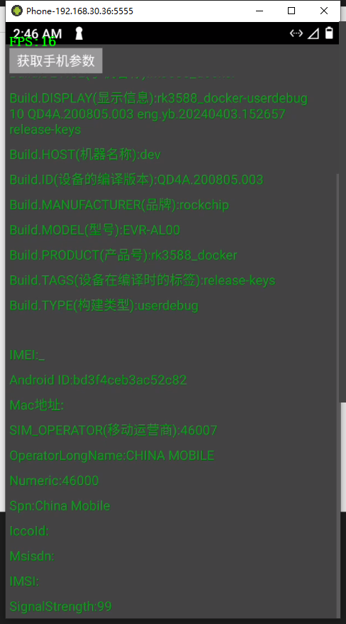
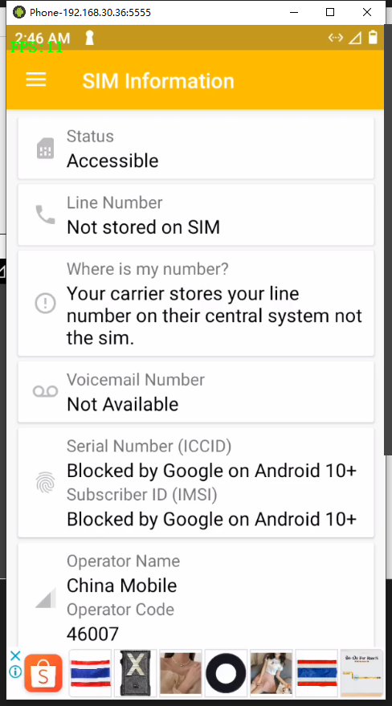
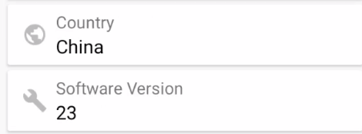
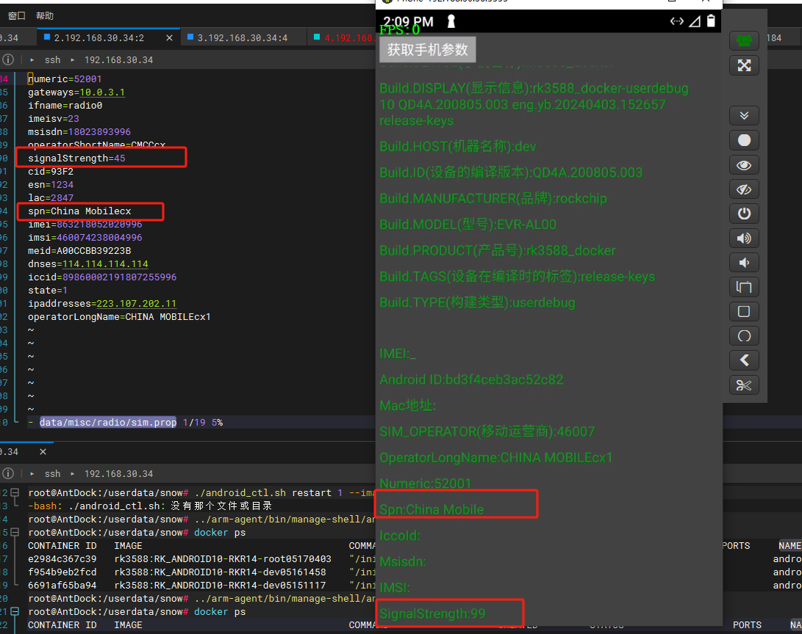

- sim卡拔掉
- 语言
- 外网环境

### SIM

##### after

data/misc/radio/sim.prop

[对于泰国的AIS手机卡，`operatorShortName`和 `operatorLongName`通常代表运营商的简称和全称。对于AIS，这些值可能是&#34;AIS&#34;和&#34;Advanced Info Service&#34;。然而，这些值可能会根据具体的手机卡和服务套餐有所不同](https://zhuanlan.zhihu.com/p/678301132)[^1^](https://zhuanlan.zhihu.com/p/678301132)[^2^](https://zh.wikipedia.org/wiki/AIS%E9%80%9A%E4%BF%A1)。

`spn`（Service Provider Name）通常是运营商为其服务设定的名称。对于AIS，这个值可能就是"AIS"。

`numeric`是一个标识符，用于唯一标识移动网络运营商。每个国家和地区的运营商都有一个唯一的 `numeric`值。对于泰国的AIS，这个值可能是"52001"，但这个值可能会根据具体的网络和地区有所不同。

### 要求

1. 运营商
2. 关闭root
3. 时区和语言
4. sim
5. 24小时制

persist.sys.timezone=Asia/Shanghai

当前任务

1. 51的那几个参数
2. url的哪些参数
