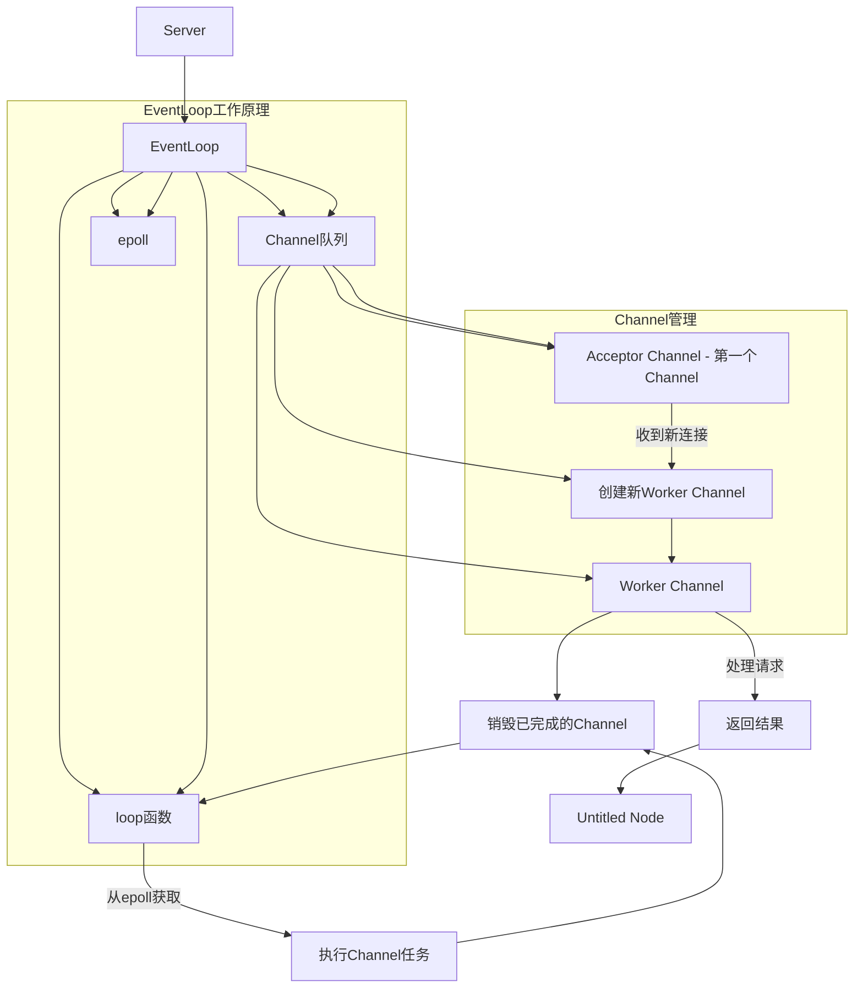

## 其实就是单Reactor单线程

- 一个Server有一个eventloop，

- 一个eventloop有一个channal队列和epell和循环函数loop，作用就是不停从epoll获取channel，不停执行channel的任务。 

- server初始化时，
  - 生成一个channel叫Acceptor，任务是负责收到新连接，创建新的channel， 
  - 新的channel叫woker，负责接受信息处理信息返回结果 如此，一个事件驱动的雏形就出现了

> Acceptor也是Eventloop的channal队列中的一个channal，并且还是第一个channal，
>
> 任务是负责收到新连接，创建新的channel，所有的channel都是她创建的， 
>
> Eventloop在不停执行channel的任务，很多channel执行完了就会销毁，而Acceptor又会不断创建channel。因此构成Eventloop

[(56 封私信 / 90 条消息) 如何深刻理解Reactor和Proactor？ - 知乎](https://www.zhihu.com/question/26943938/answer/1856426252)

## 单Reactor多线程

多了，线程池，所有channel任务都交给线程池

## 多Reactor多线程

**因为一个 Reactor 对象承担所有事件的监听和响应，而且只在主线程中运行，在面对瞬间高并发的场景时，容易成为性能的瓶颈的地方**。

主线程中的 MainReactor 对象通过 select 监控连接建立事件，收到事件后通过 Acceptor 对象中的 accept 获取连接，将新的连接分配给某个子线程；

子线程中的 SubReactor 对象将 MainReactor 对象分配的连接加入 select 继续进行监听，并创建一个 Handler 用于处理连接的响应事件。

### 具体差异

具体差异表现在主进程中仅仅用来初始化 socket，并没有创建 mainReactor 来 accept 连接，而是由子进程的 Reactor 来 accept 连接，通过锁来控制一次只有一个子进程进行 accept（防止出现惊群现象），子进程 accept 新连接后就放到自己的 Reactor 进行处理，不会再分配给其他子进程。

