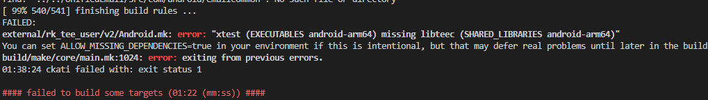
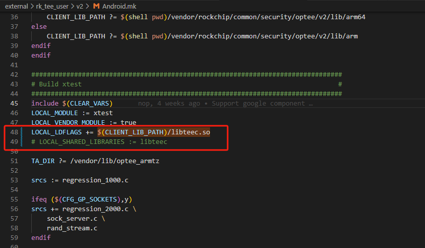
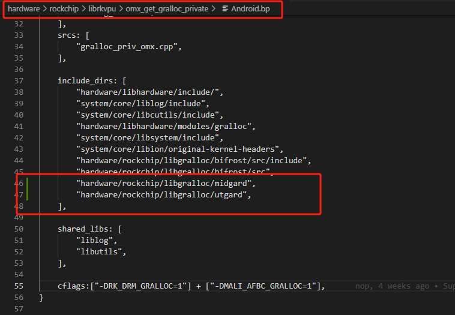
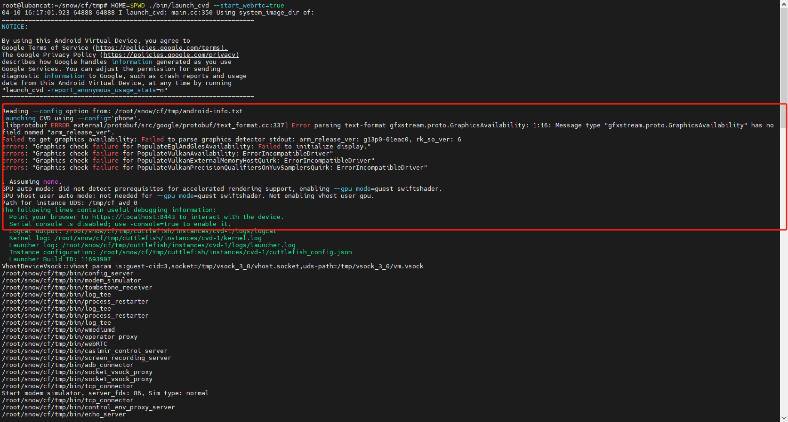
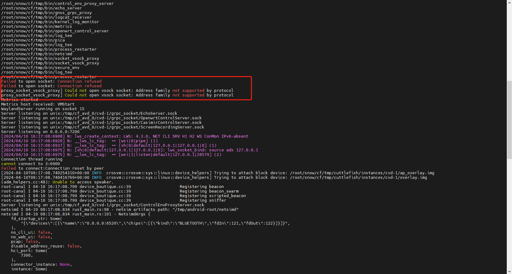
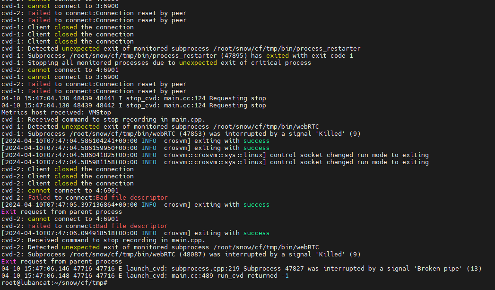

[开始使用  |  Android 开源项目  |  Android Open Source Project](https://source.android.com/docs/devices/cuttlefish/get-started?hl=zh-cn)

[编完 aosp 还在刷机？云安卓了解一下，来试试网页版模拟器吧！ - 掘金 (juejin.cn)](https://juejin.cn/post/7160930401844723720)

[android-cuttlefish/docker/README.md at main · google/android-cuttlefish (github.com)](https://github.com/google/android-cuttlefish/blob/main/docker/README.md)

Cuttlefish 是一个 Android 模拟器，通常用于在开发过程中模拟 Android 设备。一般来说，它需要一个具有图形界面的环境来运行，并且通常在类似于 Ubuntu 的桌面 Linux 系统上使用。

如果你的服务器没有桌面环境，直接在服务器上安装和运行 Cuttlefish 是不现实的，因为 Cuttlefish 需要图形界面的支持才能正常工作。

另一方面，在一个运行着 Ubuntu 的 Docker 容器中安装和运行 Cuttlefish 也是不可行的，因为 Docker 容器默认不支持图形界面应用的运行。

如果你想在一个没有桌面环境的服务器上运行 Android 模拟器，你可以考虑使用更轻量级的模拟器，比如 Genymotion 或者使用基于命令行的 Android 模拟器。

### rk3588 Cuttlefish方案

- [安卓逆向环境指北 rk3588 orangepi5b macM1 cuttlefish redroid - FW_ltlly - 博客园 (cnblogs.com)](https://www.cnblogs.com/FW-ltlly/p/18014692)
- [开始使用  |  Android 开源项目  |  Android Open Source Project](https://source.android.com/docs/devices/cuttlefish/get-started?hl=zh-cn)

报错：libwww-perl : Depends: libfile-listing-perl but it is not going to be installed

解决方法：sudo apt install libfile-listing-perl

带cf表示是cuttlefish的镜像

aosp-main-throttled 分支是arm cf 主线

aosp-android13-gsi 等分支的cf arm64也可以跑

总思路：

- cf跑安卓
- cf集成sim模块和4G
- cf集成面具

### 问题



改依赖动态库改成链接动态库

链接库文件和依赖预构建动态库的区别在于它们在编译和运行时的处理方式不同：

1. **链接库文件**：

   - **编译时**：在编译时，链接库文件会被静态地链接到可执行文件中。这意味着库的代码会被复制到最终的可执行文件中，使得可执行文件变得更大。
   - **运行时**：在运行时，可执行文件不需要外部的库文件支持，因为所有需要的代码已经被静态地链接到可执行文件中。这样的好处是，可执行文件更加独立，不会受到外部库文件版本变化的影响。但缺点是，可执行文件的体积会比较大，而且无法动态更新库文件。
2. **依赖预构建动态库**：

   - **编译时**：在编译时，会指定程序需要依赖某个动态库，但实际上并不将该库的代码复制到可执行文件中。编译器会留下一些信息，告诉操作系统在运行时需要加载哪些库。
   - **运行时**：在程序运行时，操作系统会根据编译时留下的信息，动态地加载相应的库文件。这样可以减小可执行文件的大小，因为不需要将所有库的代码都复制到可执行文件中。同时，动态链接库可以在不影响可执行文件的情况下更新和替换，使得程序更加灵活。

综上所述，静态链接库会使得可执行文件体积增大，但独立性强；动态链接库可以减小可执行文件大小，并且更易于更新和维护。选择使用哪种方式取决于项目的需求和考虑的因素。



snowchar02_




### 如何开启rk3588的虚拟化和KVM


[看起来你在运行 Cuttlefish 时遇到了一些问题。错误信息显示 “VM manager crosvm is not supported on this machine”，这意味着你的机器不支持 crosvm 虚拟机管理器](https://github.com/google/crosvm)[^1^](https://github.com/google/crosvm)。

[Cuttlefish 是一个 Android 虚拟设备，它依赖于 KVM（Kernel-based Virtual Machine）进行虚拟化](https://android.googlesource.com/device/google/cuttlefish/+/d4657eaa04664c2a0b484ef4d18d967aec044efc)[^2^](https://android.googlesource.com/device/google/cuttlefish/+/d4657eaa04664c2a0b484ef4d18d967aec044efc)[。而 crosvm 是基于 Linux 的 KVM 虚拟机监视器，主要用于运行 Linux 客户机，作为在 ChromeOS 平台上运行本地应用程序的安全边界](https://github.com/google/crosvm)[^1^](https://github.com/google/crosvm)。

你可以检查一下你的机器是否支持 KVM 虚拟化。在终端中运行以下命令：

```bash
grep -c -w "vmx|svm" /proc/cpuinfo
```

[这个命令应该返回一个非零值，表示你的机器支持 KVM 虚拟化](https://blog.csdn.net/lmaritime/article/details/120426792)[^3^](https://blog.csdn.net/lmaritime/article/details/120426792)[^2^](https://android.googlesource.com/device/google/cuttlefish/+/d4657eaa04664c2a0b484ef4d18d967aec044efc)。

[Cuttlefish virtual android device deployment_cuttlefish-orchestration_0.9.29_amd64.deb-CSDN博客](https://blog.csdn.net/lmaritime/article/details/120426792)

### Cuttlefish问题汇总

##### GPU驱动错误，目前走的是软件渲染



这个报错信息表明在启动 Cuttlefish 时出现了一些图形相关的问题，主要是关于图形检测器无法正确解析 `gfxstream.proto.GraphicsAvailability` 中的字段 `arm_release_ver`，以及一些与 Vulkan 支持相关的错误。

具体来说，报错信息中提到了以下问题：

- Message type "gfxstream.proto.GraphicsAvailability" has no field named "arm_release_ver"：这表示在解析 `gfxstream.proto.GraphicsAvailability` 消息类型时，找不到名为 `arm_release_ver` 的字段，可能是因为字段名称有变化或缺少定义。
- Graphics check failure for PopulateEglAndGlesAvailability: Failed to initialize display：这表明在初始化显示时出现了错误，可能是由于缺少必要的图形库或配置问题导致的。
- Graphics check failure for PopulateVulkanAvailability: ErrorIncompatibleDriver：这表明 Vulkan 支持存在不兼容的驱动程序，可能需要更新或更改驱动程序以解决此问题。

尽管出现了这些错误，但是您设备还是运行起来了，这可能是因为在出现这些错误后，系统选择了备用的图形渲染模式（`guest_swiftshader`），以便继续运行。

如果您的设备正常运行且没有明显的图形相关问题，您可以继续使用。但如果您希望解决这些错误，可以尝试以下方法：

- 检查图形库和驱动程序是否正确安装和配置。
- 更新图形驱动程序并确保其与 Cuttlefish 兼容。
- 检查是否需要更新 Cuttlefish 版本以解决已知的问题。


##### 启动时出现的部分网络和sock报错



这些报错信息表明在启动 Cuttlefish 过程中遇到了与网络和套接字相关的问题。具体来说，报错信息中包含以下内容：

- `Failed to open socket: Connection refused`：这表示在尝试打开套接字时遇到了连接拒绝的问题，可能是因为目标地址无法访问或端口未打开等原因。
- `proxy_socket_vsock_proxy] Could not open vsock socket: Address family not supported by protocol`：这表示无法打开 vsock 套接字，可能是因为当前系统不支持 vsock 协议。

这些问题可能会影响到网络和虚拟机间的通信，但通常不会影响设备的正常运行。如果您的设备已经启动并且正常工作，可以暂时忽略这些报错信息。

如果您希望解决这些问题，可以尝试以下方法：

- 确保网络配置正确，包括确保目标地址和端口可访问。
- 检查是否需要在系统中启用 vsock 协议支持。

如果问题仍然存在或者影响到了您的使用，建议查看更详细的日志以进一步了解问题的原因，并尝试解决。


##### 无法连接6900端口的报错


这些报错信息表明在连接到端口 `6900` 时出现了连接重置或无错误信息的问题。这可能是由于网络连接不稳定或端口未正确打开导致的。您可以尝试以下方法来解决问题：

1. **检查网络连接**：确保网络连接稳定，没有被防火墙或其他网络配置阻止。
2. **检查端口配置**：确保端口 `6900` 没有被其他程序占用，并且已正确配置。
3. **重新启动 Cuttlefish**：尝试重新启动 Cuttlefish 看看问题是否会消失。
4. **检查日志**：查看更详细的日志以了解问题的根本原因。您可以查看 `./cuttlefish_logs` 目录下的日志文件。

如果问题仍然存在，请尝试在稳定的网络环境中重新启动 Cuttlefish，并确保端口配置正确。如果问题持续存在，请查看更详细的日志以获取更多信息，并尝试根据日志中的信息解决问题。


这些报错信息主要涉及到网络连接和套接字相关的问题，具体解释如下：

1. `UDP send of 20 bytes to host stun.l.google.com:19302 failed with error 0 : [0x00000016] Invalid argument`：尝试向 `stun.l.google.com` 的 `19302` 端口发送 UDP 数据包时，出现了无效参数的错误。这可能是由于参数设置不正确或网络环境问题引起的。
2. `UDP send of 20 bytes to host stun.l.google.com:19302 failed with error 0 : [0x00000065] Network unreachable`：尝试向 `stun.l.google.com` 的 `19302` 端口发送 UDP 数据包时，出现了网络不可达的错误。这可能是由于网络配置问题或目标主机不可达导致的。
3. `Binding request timed out from [0:0:0:x:x:x:x:x]:15550 (lo)`：在本地网络接口 (`lo`) 上发送绑定请求时超时。这可能是由于网络问题或本地环境配置不正确导致的。
4. `proxy_adb] cannot connect to 3:5555`：无法连接到指定的主机和端口。这可能是由于目标主机未启动或网络连接问题引起的。

综合这些信息看，可能存在网络配置、参数设置或目标主机不可达等问题。建议您检查网络配置是否正确，确保目标主机和端口可达，并尝试重新启动 Cuttlefish 以解决问题。如果问题仍然存在，请进一步查看日志以获取更多信息。


##### cuttlefish无法多开虚拟机的的问题




---

概括

1. 开启Kvm和虚拟化[ARMv8架构下修改Linux内核并打开kvm硬件虚拟化支持（平台Firefly-rk3568）_rk3568 支持虚拟-CSDN博客](https://blog.csdn.net/qq_40598297/article/details/121084904)
2. 安装Cuttlefish
3. 下载aosp_cf_x86_64_phone-img-xxxxxx.zip和cvd-host_package.tar.gz并运行

安装Cuttlefish

[开始使用  |  Android 开源项目  |  Android Open Source Project

](https://source.android.com/docs/devices/cuttlefish/get-started?hl=zh-cn)
