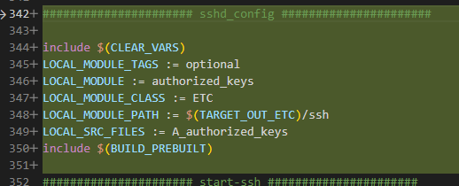

    您是对的，`.rc` 文件中的命令只能操作已经存在于系统镜像中的文件。如果您想要在编译时将某个源码目录中的文件复制到系统的指定目录，您应该使用 Android 的编译系统来完成这个任务。

在 Android 的编译系统中，您可以创建一个模块来安装您的配置文件。这个模块可以是一个 `Android.mk` 或 `Android.bp` 文件，其中包含了如何安装配置文件的指令。

以下是一个使用 `Android.mk` 的例子：

```makefile
include $(CLEAR_VARS)

LOCAL_MODULE := my_config
LOCAL_SRC_FILES := path/to/my_config.conf
LOCAL_MODULE_CLASS := ETC
LOCAL_MODULE_PATH := $(TARGET_OUT)/path/to/destination
LOCAL_MODULE_TAGS := optional

include $(BUILD_PREBUILT)
```

在这个例子中，`path/to/my_config.conf` 是源码目录中配置文件的路径，`$(TARGET_OUT)/path/to/destination` 是您希望在系统中放置配置文件的目录。

如果您正在使用 `Android.bp`，您可以创建一个 `prebuilt_etc` 模块，如下所示：

```json
prebuilt_etc {
    name: "my_config",
    src: "path/to/my_config.conf",
    sub_dir: "path/to/destination",
    owner: "root",
    group: "root",
    mode: "0644",
}
```

在这个例子中，`path/to/my_config.conf` 是源码目录中配置文件的路径，`path/to/destination` 是您希望在系统中放置配置文件的目录。

这样，在编译系统构建系统镜像时，就会将您的配置文件复制到指定的目录中。希望这个答案对您有所帮助！


### 示例

Launcher3-aosp-withQuickstep
