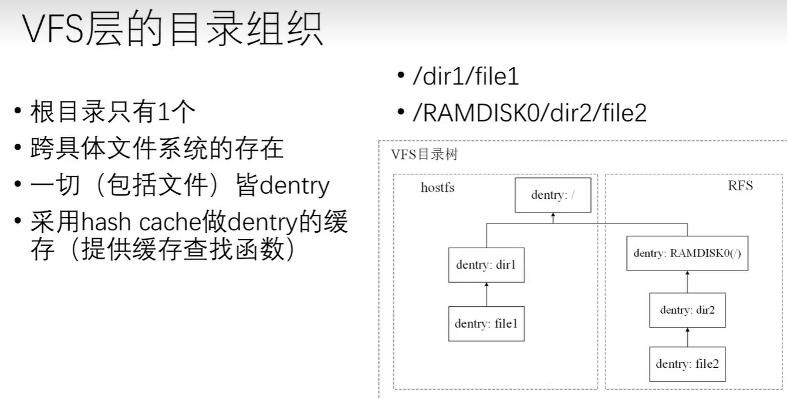
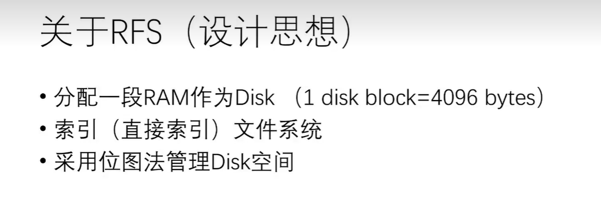

- [第六章. 实验4：文件系统-讲解_哔哩哔哩_bilibili](https://www.bilibili.com/video/BV1Us4y1h7tT/?vd_source=f30dd07ede5a1255c0b1aaf0d2788938)
- [pke-doc: 华中科技大学操作系统实验（riscv-pke）文档 (gitee.com)](https://gitee.com/hustos/pke-doc#https://gitee.com/link?target=https%3A%2F%2Fwww.bilibili.com%2Fvideo%2FBV1Us4y1h7tT)

**寄存器**的容量最小，速度最快，但数据在断电后会丢失。

**存储器**容量比寄存器大，读写速度慢，但数据可以持久保存。

**RAM**可以读写数据，但数据在断电后会丢失；

**ROM**只能读取数据，数据可以长期保存。

HostFS 是一个文件系统的名称，通常用于虚拟化环境中，特别是在虚拟机监视器（VMM）或虚拟机管理器（VMM）中。HostFS 允许虚拟机访问主机操作系统的文件系统，使得虚拟机可以直接与主机文件系统进行交互，如读取、写入文件等操作。

RFS 是一个嵌入式系统中常见的文件系统类型，它是 "ROM File System"（只读存储器文件系统）的缩写。RFS 主要用于嵌入式系统中，特别是那些具有有限资源的系统，例如嵌入式设备、嵌入式系统模块等。

### 安装执行支撑软件

