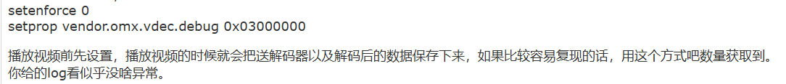

解决方法1：切换成软解

[ouzheyi@fixbug:temporarily disabled av01/vp9 hard decoding (e23a0299) · 提交 · 系统研发部(System Development Division) / android10-rk3588镜像 · GitLab (ntimespace.com)](http://gitlab.ntimespace.com/sdd/android10-rk3588/-/commit/e23a0299348db8f65972ce0f7bae235869bf6728)


如何收集信息？

```
mkdir /data/video
chmod 777 /data/video

```



```
antserver:/ # ls -al /data/video                                                                                                                                               
total 3677
drwxrwxrwx  2 root       root      1024 2024-05-27 17:22 .
drwxrwx--x 48 system     system    1024 2024-05-27 16:44 ..
-rw-------  1 mediacodec camera 3762860 2024-05-27 17:23 dec_in_170_170.bin
-rw-------  1 mediacodec camera       0 2024-05-27 17:23 dec_out_170_170.bin
```


logcat -s MediaCodec

grep mpp


clear

mkdir /data/video
chmod 777 /data/video

setenforce 0

setprop vendor.omx.vdec.debug 0x03000000

setprop mpp_dump_in /data/video/mpp_dec_in.bin

setprop mpp_dump_out /data/video/mpp_dec_out.bin

setprop vendor.mpp_dump_in /data/video/mpp_dec_in.bin

setprop vendor.mpp_dump_out /data/video/mpp_dec_out.bin

setprop mpp_debug 0x600&& setprop vendor.mpp_debug 0x600

ls -al /data/video
