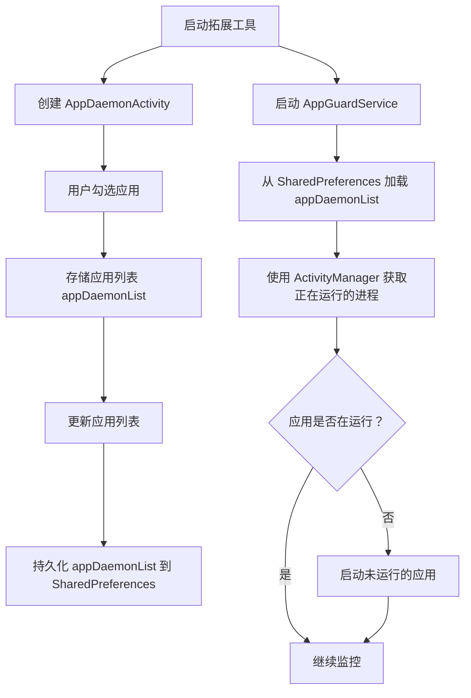
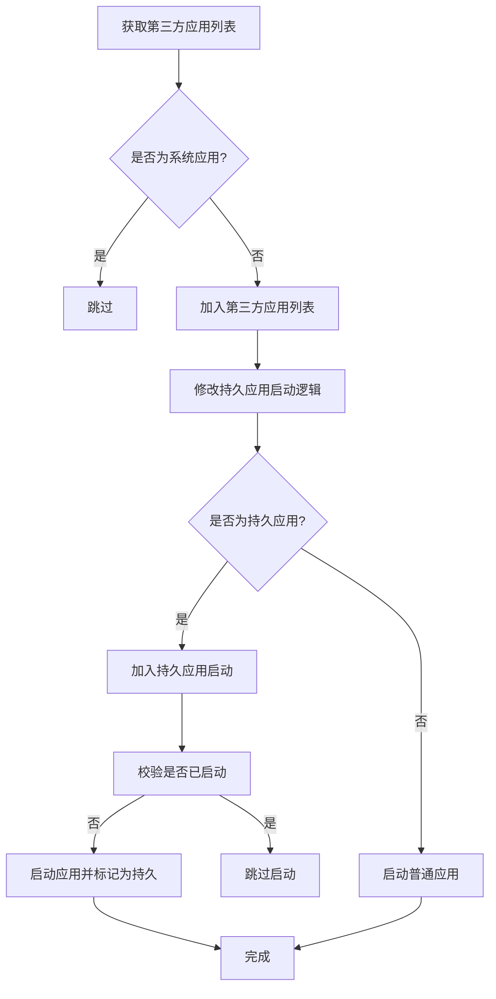
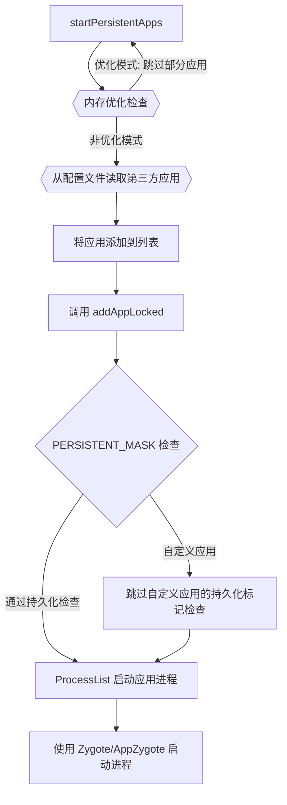

[Android Persistent常驻内存分析_android:persistent="true-CSDN博客](https://blog.csdn.net/u011148116/article/details/106926779/)

frameworks/base/core/java/android/content/pm/PackageParser.java 3581

frameworks/base/services/core/java/com/android/server/am/ActivityManagerService.java   7679

frameworks/base/services/core/java/com/android/server/pm/PackageManagerService.java:9071:

在ActivityManagerService中AMS.startPersistentApps -> AMS.addAppLocked -> AMS.startProcessLocked -> ProcessList.startProcessLocked -> Process.start 调用链最后调用Process.start 通过socket通知zygote fork出新的进程，然后通过ActivityThread中的main方法启动应用。


frameworks/base/services/core/java/com/android/server/am/ActivityManagerService.java:4882:


systemReady

startPersistentApps(PackageManager.MATCH_DIRECT_BOOT_AWARE)

 addAppLocked(app, null, false, null /* ABI override */)

mProcessList.startProcessLocked(app, new HostingRecord("added application",

​          customProcess != null ? customProcess : app.processName),

​          disableHiddenApiChecks, mountExtStorageFull, abiOverride);

frameworks/base/services/core/java/com/android/server/am/ProcessList.java:1858:

boolean startProcessLocked(HostingRecord hostingRecord,

final Process.ProcessStartResult startResult = startProcess(

startResult = Process.start(entryPoint,

startResult = appZygote.getProcess().start(entryPoint,

---------------

final List<ApplicationInfo> apps = AppGlobals.getPackageManager()

**frameworks/base/core/java/android/app/AppGlobals.java**

 return ActivityThread.getPackageManager();

**frameworks/base/core/java/android/app/ActivityThread.java**

ActivityThread am = currentActivityThread();


----

**`startPersistentApps()`**：负责启动系统中所有持久化应用。

**`addAppLocked()`**：将应用添加到系统进程列表中并确保应用可以运行。

**`startProcessLocked()`**：负责异步启动应用进程，实际调用Zygote进程来创建应用进程。

**`startProcess()`**：与Zygote通信，最终启动应用的实际进程。


frameworks/base/services/core/java/com/android/server/am/ActivityManagerService.java


```java
//startPersistentApps(PackageManager.MATCH_DIRECT_BOOT_AWARE);
void startPersistentApps(int matchFlags) {
    if (mFactoryTest == FactoryTest.FACTORY_TEST_LOW_LEVEL) return;

    synchronized (this) {
        try {
            final List<ApplicationInfo> apps = AppGlobals.getPackageManager()
                .getPersistentApplications(STOCK_PM_FLAGS | matchFlags).getList();
            for (ApplicationInfo app : apps) {

                if(("true".equals(SystemProperties.get("ro.mem_optimise.enable", "false"))) 
                   && (!"true".equals(SystemProperties.get("vendor.cts_gts.status", "false")))) {
                    if ((mProcessMap.get(app.processName) != null) || (mServiceMap.get(app.processName) != null)) {
                        if (DEBUG_LOWMEM)
                            Slog.d("xzj", "---low mem mode,system ready skip start persist app= " + app);
                        continue;
                    }
                }

                if (!"android".equals(app.packageName)) {
                    addAppLocked(app, null, false, null /* ABI override */);
                }
            }
        } catch (RemoteException ex) {
        }
    }
}
```

### 1. **`startPersistentApps(int matchFlags)`**

- **作用**：启动系统中所有标记为持久化的应用（即即使应用被杀死，也会重新启动）。

- 工作流程

  ：

  1. 调用`AppGlobals.getPackageManager().getPersistentApplications()`方法获取所有标记为持久化的应用列表。
  2. 遍历应用列表，并根据一些条件（如`ro.mem_optimise.enable`属性）决定是否跳过某些应用。
  3. 对于不需要跳过的应用，调用`addAppLocked()`将应用加入到系统中并启动。

这个函数的目标是确保关键应用始终在后台运行，尤其是在设备启动时或应用崩溃后自动重启。


```java

final ProcessRecord addAppLocked(ApplicationInfo info, String customProcess, boolean isolated,
                                 boolean disableHiddenApiChecks, boolean mountExtStorageFull, String abiOverride) {
    ProcessRecord app;
    if (!isolated) {
        app = getProcessRecordLocked(customProcess != null ? customProcess : info.processName,
                                     info.uid, true);
    } else {
        app = null;
    }

    if (app == null) {
        app = mProcessList.newProcessRecordLocked(info, customProcess, isolated, 0,
                                                  new HostingRecord("added application",
                                                                    customProcess != null ? customProcess : info.processName));
        mProcessList.updateLruProcessLocked(app, false, null);
        updateOomAdjLocked(OomAdjuster.OOM_ADJ_REASON_PROCESS_BEGIN);
    }

    // This package really, really can not be stopped.
    try {
        AppGlobals.getPackageManager().setPackageStoppedState(
            info.packageName, false, UserHandle.getUserId(app.uid));
    } catch (RemoteException e) {
    } catch (IllegalArgumentException e) {
        Slog.w(TAG, "Failed trying to unstop package "
               + info.packageName + ": " + e);
    }

    if ((info.flags & PERSISTENT_MASK) == PERSISTENT_MASK) {
        app.setPersistent(true);
        app.maxAdj = ProcessList.PERSISTENT_PROC_ADJ;
    }
    if (app.thread == null && mPersistentStartingProcesses.indexOf(app) < 0) {
        mPersistentStartingProcesses.add(app);
        mProcessList.startProcessLocked(app, new HostingRecord("added application",
                                                               customProcess != null ? customProcess : app.processName),
                                        disableHiddenApiChecks, mountExtStorageFull, abiOverride);
    }

    return app;
}
```

### 2. **`addAppLocked(ApplicationInfo info, String customProcess, boolean isolated, boolean disableHiddenApiChecks, boolean mountExtStorageFull, String abiOverride)`**

- **作用**：将某个应用的进程添加到系统的进程列表中，并为其分配进程。

- 工作流程

  ：

  1. 首先检查应用是否已经有一个正在运行的`ProcessRecord`，如果没有，则为其创建新的`ProcessRecord`。
  2. 使用`AppGlobals.getPackageManager().setPackageStoppedState()`方法将应用标记为未停止状态，以确保它可以运行。
  3. 如果应用是持久化应用（`PERSISTENT_MASK`标记），则将其标记为持久化并设置进程的优先级。
  4. 如果该应用没有进程线程（`app.thread == null`），则将应用加入`mPersistentStartingProcesses`列表，并通过调用`mProcessList.startProcessLocked()`来启动应用的进程。

这个函数的作用是为给定的应用分配系统资源并启动它。它负责维护应用的进程状态并确保持久化应用能够始终运行。


**frameworks/base/services/core/java/com/android/server/am/ProcessList.java**

```java
@GuardedBy("mService")
boolean startProcessLocked(HostingRecord hostingRecord,
                           String entryPoint,
                           ProcessRecord app, int uid, int[] gids, int runtimeFlags, int mountExternal,
                           String seInfo, String requiredAbi, String instructionSet, String invokeWith,
                           long startTime) {
    app.pendingStart = true;
    app.killedByAm = false;
    app.removed = false;
    app.killed = false;
    if (app.startSeq != 0) {
        Slog.wtf(TAG, "startProcessLocked processName:" + app.processName
                 + " with non-zero startSeq:" + app.startSeq);
    }
    if (app.pid != 0) {
        Slog.wtf(TAG, "startProcessLocked processName:" + app.processName
                 + " with non-zero pid:" + app.pid);
    }
    final long startSeq = app.startSeq = ++mProcStartSeqCounter;
    app.setStartParams(uid, hostingRecord, seInfo, startTime);
    app.setUsingWrapper(invokeWith != null
                        || SystemProperties.get("wrap." + app.processName) != null);
    mPendingStarts.put(startSeq, app);

    if (mService.mConstants.FLAG_PROCESS_START_ASYNC) {
        if (DEBUG_PROCESSES) Slog.i(TAG_PROCESSES,
                                    "Posting procStart msg for " + app.toShortString());
        mService.mProcStartHandler.post(() -> {
            try {
                final Process.ProcessStartResult startResult = startProcess(app.hostingRecord,
                                                                            entryPoint, app, app.startUid, gids, runtimeFlags, mountExternal,
                                                                            app.seInfo, requiredAbi, instructionSet, invokeWith, app.startTime);
                synchronized (mService) {
                    handleProcessStartedLocked(app, startResult, startSeq);
                }
            } catch (RuntimeException e) {
                synchronized (mService) {
                    Slog.e(ActivityManagerService.TAG, "Failure starting process "
                           + app.processName, e);
                    mPendingStarts.remove(startSeq);
                    app.pendingStart = false;
                    mService.forceStopPackageLocked(app.info.packageName,
                                                    UserHandle.getAppId(app.uid),
                                                    false, false, true, false, false, app.userId, "start failure");
                }
            }
        });
        return true;
    } else {
        try {
            final Process.ProcessStartResult startResult = startProcess(hostingRecord,
                                                                        entryPoint, app,
                                                                        uid, gids, runtimeFlags, mountExternal, seInfo, requiredAbi, instructionSet,
                                                                        invokeWith, startTime);
            handleProcessStartedLocked(app, startResult.pid, startResult.usingWrapper,
                                       startSeq, false);
        } catch (RuntimeException e) {
            Slog.e(ActivityManagerService.TAG, "Failure starting process "
                   + app.processName, e);
            app.pendingStart = false;
            mService.forceStopPackageLocked(app.info.packageName, UserHandle.getAppId(app.uid),
                                            false, false, true, false, false, app.userId, "start failure");
        }
        return app.pid > 0;
    }
}
```

- **作用**：这是实际启动进程的核心函数。它根据给定的参数，通过Zygote（Android的进程启动机制）启动新的进程。

- 工作流程

  ：

  1. 设置一些初始状态，包括将应用进程标记为等待启动的状态（`app.pendingStart = true`）。
  2. 检查并确保`app.startSeq`和`app.pid`为0（防止重复启动）。
  3. 设置应用的启动参数，例如UID、GID、启动记录等。
  4. 将启动请求提交给一个异步线程，使用`mService.mProcStartHandler.post()`方法来启动进程。这个异步线程调用`startProcess()`方法向Zygote请求启动新进程。
  5. 如果启动成功，`handleProcessStartedLocked()`会处理启动结果。

该函数的主要目标是调用低层次的Android进程管理组件（例如Zygote）来实际启动应用的进程，并确保启动过程是异步的。

```java
private Process.ProcessStartResult startProcess(HostingRecord hostingRecord, String entryPoint,
                                                ProcessRecord app, int uid, int[] gids, int runtimeFlags, int mountExternal,
                                                String seInfo, String requiredAbi, String instructionSet, String invokeWith,
                                                long startTime) {
    try {
        Trace.traceBegin(Trace.TRACE_TAG_ACTIVITY_MANAGER, "Start proc: " +
                         app.processName);
        checkSlow(startTime, "startProcess: asking zygote to start proc");
        final Process.ProcessStartResult startResult;
        if (hostingRecord.usesWebviewZygote()) {
            startResult = startWebView(entryPoint,
                                       app.processName, uid, uid, gids, runtimeFlags, mountExternal,
                                       app.info.targetSdkVersion, seInfo, requiredAbi, instructionSet,
                                       app.info.dataDir, null, app.info.packageName,
                                       new String[] {PROC_START_SEQ_IDENT + app.startSeq});
        } else if (hostingRecord.usesAppZygote()) {
            final AppZygote appZygote = createAppZygoteForProcessIfNeeded(app);

            startResult = appZygote.getProcess().start(entryPoint,
                                                       app.processName, uid, uid, gids, runtimeFlags, mountExternal,
                                                       app.info.targetSdkVersion, seInfo, requiredAbi, instructionSet,
                                                       app.info.dataDir, null, app.info.packageName,
                                                       /*useUsapPool=*/ false,
                                                       new String[] {PROC_START_SEQ_IDENT + app.startSeq});
        } else {    
            startResult = Process.start(entryPoint,
                                        app.processName, uid, uid, gids, runtimeFlags, mountExternal,
                                        app.info.targetSdkVersion, seInfo, requiredAbi, instructionSet,
                                        app.info.dataDir, invokeWith, app.info.packageName,
                                        new String[] {PROC_START_SEQ_IDENT + app.startSeq});
        }
        SystemTracking.get(mService.mContext).getBuilder()
            .setTraceName(NineDSpaceManager.STATUS_PROCESS_CREATE)
            .putInt("uid", uid)
            .putInt("pid", startResult.pid)
            .send();

        checkSlow(startTime, "startProcess: returned from zygote!");
        return startResult;
    } finally {
        Trace.traceEnd(Trace.TRACE_TAG_ACTIVITY_MANAGER);
    }
}
```

这些函数是Android的进程管理系统中用于启动和管理应用进程的关键部分。每个函数在进程启动、维护和控制方面扮演了不同的角色。下面我详细解释这些函数的作用：

### 1. **`startPersistentApps(int matchFlags)`**

- **作用**：启动系统中所有标记为持久化的应用（即即使应用被杀死，也会重新启动）。

- 工作流程

  ：

  1. 调用`AppGlobals.getPackageManager().getPersistentApplications()`方法获取所有标记为持久化的应用列表。
  2. 遍历应用列表，并根据一些条件（如`ro.mem_optimise.enable`属性）决定是否跳过某些应用。
  3. 对于不需要跳过的应用，调用`addAppLocked()`将应用加入到系统中并启动。

这个函数的目标是确保关键应用始终在后台运行，尤其是在设备启动时或应用崩溃后自动重启。

------

### 2. **`addAppLocked(ApplicationInfo info, String customProcess, boolean isolated, boolean disableHiddenApiChecks, boolean mountExtStorageFull, String abiOverride)`**

- **作用**：将某个应用的进程添加到系统的进程列表中，并为其分配进程。

- 工作流程

  ：

  1. 首先检查应用是否已经有一个正在运行的`ProcessRecord`，如果没有，则为其创建新的`ProcessRecord`。
  2. 使用`AppGlobals.getPackageManager().setPackageStoppedState()`方法将应用标记为未停止状态，以确保它可以运行。
  3. 如果应用是持久化应用（`PERSISTENT_MASK`标记），则将其标记为持久化并设置进程的优先级。
  4. 如果该应用没有进程线程（`app.thread == null`），则将应用加入`mPersistentStartingProcesses`列表，并通过调用`mProcessList.startProcessLocked()`来启动应用的进程。

这个函数的作用是为给定的应用分配系统资源并启动它。它负责维护应用的进程状态并确保持久化应用能够始终运行。

------

### 3. **`startProcessLocked(HostingRecord hostingRecord, String entryPoint, ProcessRecord app, int uid, int[] gids, int runtimeFlags, int mountExternal, String seInfo, String requiredAbi, String instructionSet, String invokeWith, long startTime)`**

- **作用**：这是实际启动进程的核心函数。它根据给定的参数，通过Zygote（Android的进程启动机制）启动新的进程。

- 工作流程

  ：

  1. 设置一些初始状态，包括将应用进程标记为等待启动的状态（`app.pendingStart = true`）。
  2. 检查并确保`app.startSeq`和`app.pid`为0（防止重复启动）。
  3. 设置应用的启动参数，例如UID、GID、启动记录等。
  4. 将启动请求提交给一个异步线程，使用`mService.mProcStartHandler.post()`方法来启动进程。这个异步线程调用`startProcess()`方法向Zygote请求启动新进程。
  5. 如果启动成功，`handleProcessStartedLocked()`会处理启动结果。

该函数的主要目标是调用低层次的Android进程管理组件（例如Zygote）来实际启动应用的进程，并确保启动过程是异步的。

------

### 4. **`startProcess(HostingRecord hostingRecord, String entryPoint, ProcessRecord app, int uid, int[] gids, int runtimeFlags, int mountExternal, String seInfo, String requiredAbi, String instructionSet, String invokeWith, long startTime)`**

- **作用**：这个函数向Zygote进程发送启动新应用进程的请求，是启动流程的最终实现部分。

- 工作流程

  ：

  1. 首先，通过`Trace.traceBegin()`标记启动过程的开始，用于性能跟踪。
  2. 根据`HostingRecord`来决定使用不同的Zygote进行进程启动。通常，Android应用使用的是`AppZygote`，但如果应用需要使用WebView，可能会通过`WebviewZygote`来启动。
  3. 通过调用`Process.start()`或者`appZygote.getProcess().start()`，将请求发送到Zygote进程，从而启动新的应用进程。
  4. 成功后，返回`ProcessStartResult`，其中包含新进程的PID等信息。
  5. 最后，通过`Trace.traceEnd()`结束跟踪。

这个函数的核心目的是与Zygote进程通信并启动应用的实际进程，是应用启动链条中的最后一步。

---



---



---





----

后台应用运行，但是最近任务里没有
比如，dnf，应用宝
解决方法：
获取的不是正在运行的应用

而是切换任务的应用


---

>  pkill -f "$(pm list packages -3 | awk -F: '{print $2}' | tr '\n' '|' | sed 's/|$//')"
>
> 
>
>  ps -ef| grep -E "$(pm list packages -3 | awk -F: '{print $2}' | tr '\n' '|' | sed 's/|$//')"
>
>  

